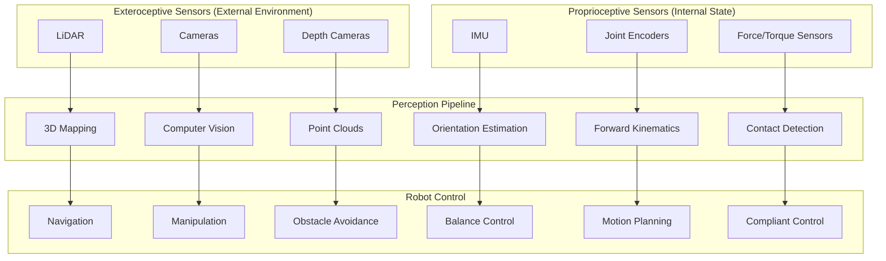
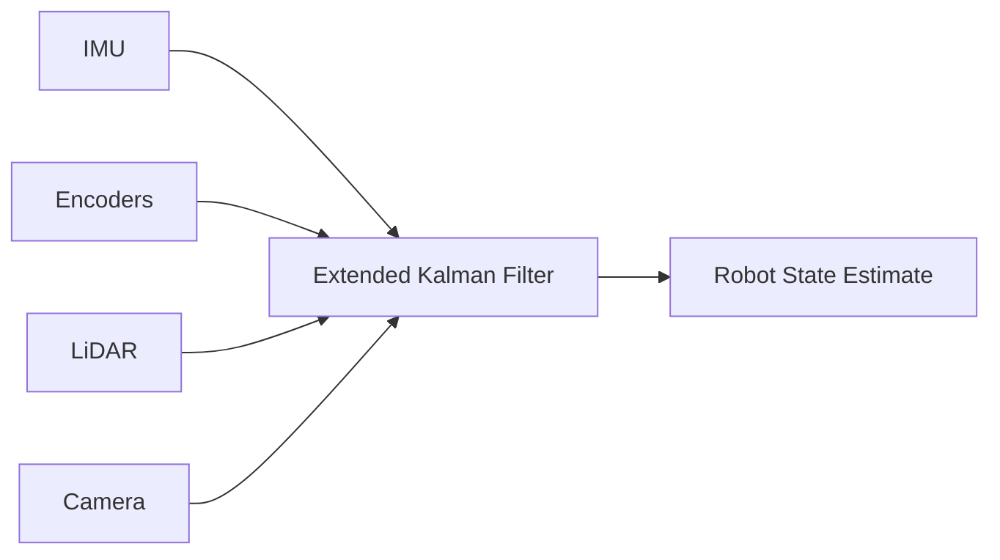

# Sensor Systems Deep Dive

## Introduction

Sensors are the **eyes, ears, and nervous system** of humanoid robots. They provide the data needed for perception, localization, and control. This chapter covers the four critical sensor types mentioned in the course: **LiDAR, Cameras, IMUs, and Force/Torque Sensors**.

## Sensor Overview



---

## 1. LiDAR (Light Detection and Ranging)

### Principle of Operation

LiDAR measures distance by emitting laser pulses and measuring time-of-flight:

```
Distance = (Speed of Light × Time) / 2
```

### Types of LiDAR

| Type | Scan Pattern | Range | Use Case |
|------|--------------|-------|----------|
| **2D LiDAR** | Single plane | 0.1-30m | Floor-level obstacle detection |
| **3D LiDAR** | Multi-plane or rotating | 0.1-100m | Full 3D mapping |
| **Solid-State** | Electronic scanning | 0.1-200m | Automotive, no moving parts |

### Data Format

**2D LiDAR (LaserScan):**
```python
# ROS 2 sensor_msgs/LaserScan
{
    'header': {
        'stamp': timestamp,
        'frame_id': 'laser_link'
    },
    'angle_min': -3.14,      # Start angle (radians)
    'angle_max': 3.14,       # End angle
    'angle_increment': 0.01, # Angular resolution
    'range_min': 0.1,        # Minimum range (meters)
    'range_max': 30.0,       # Maximum range
    'ranges': [2.5, 2.6, ...],  # Distance measurements
    'intensities': [100, 95, ...]  # Reflectivity (optional)
}
```

**3D LiDAR (PointCloud2):**
```python
# ROS 2 sensor_msgs/PointCloud2
# Each point: (x, y, z, intensity)
points = [
    [1.2, 0.5, 0.3, 100],
    [1.3, 0.5, 0.3, 95],
    ...
]
```

### Integration Example

```python
#!/usr/bin/env python3
import rclpy
from rclpy.node import Node
from sensor_msgs.msg import LaserScan
import numpy as np

class LidarProcessor(Node):
    def __init__(self):
        super().__init__('lidar_processor')
        
        self.subscription = self.create_subscription(
            LaserScan,
            '/scan',
            self.lidar_callback,
            10
        )
    
    def lidar_callback(self, msg):
        """Process LiDAR scan data"""
        ranges = np.array(msg.ranges)
        
        # Filter invalid readings
        valid_ranges = ranges[(ranges > msg.range_min) & (ranges < msg.range_max)]
        
        # Detect obstacles
        min_distance = np.min(valid_ranges)
        
        if min_distance < 0.5:  # 50cm threshold
            self.get_logger().warn(f'Obstacle detected at {min_distance:.2f}m')
        
        # Convert to Cartesian coordinates
        angles = np.arange(msg.angle_min, msg.angle_max, msg.angle_increment)
        x = ranges * np.cos(angles)
        y = ranges * np.sin(angles)
        
        # Further processing...
```

### Common LiDAR Models

| Model | Type | Range | Price Range |
|-------|------|-------|-------------|
| **Hokuyo UST-10LX** | 2D | 10m | $1,000 |
| **SICK TiM561** | 2D | 10m | $1,500 |
| **Velodyne VLP-16** | 3D (16 channels) | 100m | $4,000 |
| **Ouster OS1-64** | 3D (64 channels) | 120m | $12,000 |

---

## 2. Cameras

### Types of Cameras

#### RGB Cameras
- **Purpose:** Color vision, object recognition
- **Resolution:** 640x480 to 4K
- **Frame Rate:** 30-120 FPS

#### Depth Cameras
- **Technologies:**
  - **Stereo:** Two cameras, triangulation
  - **Structured Light:** Project pattern, measure distortion
  - **Time-of-Flight (ToF):** Measure light travel time

#### Thermal Cameras
- **Purpose:** Heat detection, night vision
- **Use Cases:** Human detection, equipment monitoring

### Camera Parameters

```python
# Camera intrinsic parameters
camera_matrix = np.array([
    [fx, 0,  cx],  # fx: focal length in x
    [0,  fy, cy],  # fy: focal length in y
    [0,  0,  1 ]   # cx, cy: principal point
])

# Distortion coefficients
dist_coeffs = np.array([k1, k2, p1, p2, k3])
# k1, k2, k3: radial distortion
# p1, p2: tangential distortion
```

### ROS 2 Integration

```python
#!/usr/bin/env python3
import rclpy
from rclpy.node import Node
from sensor_msgs.msg import Image, CameraInfo
from cv_bridge import CvBridge
import cv2
import numpy as np

class CameraProcessor(Node):
    def __init__(self):
        super().__init__('camera_processor')
        
        self.bridge = CvBridge()
        
        # Subscribe to camera topics
        self.image_sub = self.create_subscription(
            Image,
            '/camera/image_raw',
            self.image_callback,
            10
        )
        
        self.info_sub = self.create_subscription(
            CameraInfo,
            '/camera/camera_info',
            self.info_callback,
            10
        )
        
        self.camera_matrix = None
        self.dist_coeffs = None
    
    def info_callback(self, msg):
        """Store camera calibration"""
        self.camera_matrix = np.array(msg.k).reshape(3, 3)
        self.dist_coeffs = np.array(msg.d)
    
    def image_callback(self, msg):
        """Process camera image"""
        # Convert ROS Image to OpenCV format
        cv_image = self.bridge.imgmsg_to_cv2(msg, desired_encoding='bgr8')
        
        # Undistort image
        if self.camera_matrix is not None:
            cv_image = cv2.undistort(
                cv_image,
                self.camera_matrix,
                self.dist_coeffs
            )
        
        # Object detection, etc.
        self.detect_objects(cv_image)
    
    def detect_objects(self, image):
        """Example: Simple color-based detection"""
        hsv = cv2.cvtColor(image, cv2.COLOR_BGR2HSV)
        
        # Detect red objects
        lower_red = np.array([0, 100, 100])
        upper_red = np.array([10, 255, 255])
        mask = cv2.inRange(hsv, lower_red, upper_red)
        
        # Find contours
        contours, _ = cv2.findContours(mask, cv2.RETR_EXTERNAL, cv2.CHAIN_APPROX_SIMPLE)
        
        for contour in contours:
            if cv2.contourArea(contour) > 500:
                x, y, w, h = cv2.boundingRect(contour)
                self.get_logger().info(f'Red object detected at ({x}, {y})')
```

### Recommended Cameras for Humanoids

| Camera | Type | Resolution | FPS | Price |
|--------|------|------------|-----|-------|
| **Intel RealSense D435i** | Depth + RGB + IMU | 1920x1080 | 90 | $350 |
| **Intel RealSense D455** | Depth + RGB | 1920x1080 | 90 | $400 |
| **ZED 2** | Stereo | 2208x1242 | 60 | $450 |
| **Azure Kinect** | ToF + RGB | 3840x2160 | 30 | $400 |

---

## 3. IMU (Inertial Measurement Unit)

### Components

An IMU combines three sensors:

1. **Accelerometer:** Measures linear acceleration (3-axis)
2. **Gyroscope:** Measures angular velocity (3-axis)
3. **Magnetometer:** Measures magnetic field (3-axis, optional)

### Data Format

```python
# ROS 2 sensor_msgs/Imu
{
    'header': {
        'stamp': timestamp,
        'frame_id': 'imu_link'
    },
    'orientation': {  # Quaternion (if computed)
        'x': 0.0, 'y': 0.0, 'z': 0.0, 'w': 1.0
    },
    'angular_velocity': {  # rad/s
        'x': 0.01, 'y': -0.02, 'z': 0.0
    },
    'linear_acceleration': {  # m/s²
        'x': 0.1, 'y': 0.2, 'z': 9.81
    }
}
```

### Orientation Estimation

```python
#!/usr/bin/env python3
import rclpy
from rclpy.node import Node
from sensor_msgs.msg import Imu
import numpy as np
from scipy.spatial.transform import Rotation

class IMUProcessor(Node):
    def __init__(self):
        super().__init__('imu_processor')
        
        self.subscription = self.create_subscription(
            Imu,
            '/imu/data',
            self.imu_callback,
            10
        )
        
        # Complementary filter state
        self.pitch = 0.0
        self.roll = 0.0
        self.alpha = 0.98  # Filter coefficient
        self.dt = 0.01  # 100 Hz
    
    def imu_callback(self, msg):
        """Process IMU data"""
        # Extract data
        ax = msg.linear_acceleration.x
        ay = msg.linear_acceleration.y
        az = msg.linear_acceleration.z
        
        gx = msg.angular_velocity.x
        gy = msg.angular_velocity.y
        
        # Accelerometer-based angle (noisy but no drift)
        accel_pitch = np.arctan2(ay, np.sqrt(ax**2 + az**2))
        accel_roll = np.arctan2(-ax, az)
        
        # Gyroscope integration (drifts but smooth)
        gyro_pitch = self.pitch + gx * self.dt
        gyro_roll = self.roll + gy * self.dt
        
        # Complementary filter (combine both)
        self.pitch = self.alpha * gyro_pitch + (1 - self.alpha) * accel_pitch
        self.roll = self.alpha * gyro_roll + (1 - self.alpha) * accel_roll
        
        # Check for dangerous tilt
        if abs(self.pitch) > 0.5 or abs(self.roll) > 0.5:
            self.get_logger().warn(
                f'High tilt detected! Pitch: {self.pitch:.2f}, Roll: {self.roll:.2f}'
            )
```

### IMU Calibration

```python
def calibrate_imu(self, num_samples=1000):
    """Calibrate IMU by collecting stationary data"""
    gyro_samples = []
    accel_samples = []
    
    for i in range(num_samples):
        # Collect data while robot is stationary
        gyro_samples.append([gx, gy, gz])
        accel_samples.append([ax, ay, az])
    
    # Calculate biases
    gyro_bias = np.mean(gyro_samples, axis=0)
    accel_bias = np.mean(accel_samples, axis=0)
    accel_bias[2] -= 9.81  # Remove gravity from Z
    
    return gyro_bias, accel_bias
```

### Recommended IMUs

| IMU | DOF | Rate | Price |
|-----|-----|------|-------|
| **BNO055** | 9-DOF | 100 Hz | $30 |
| **MPU-9250** | 9-DOF | 1000 Hz | $15 |
| **VectorNav VN-100** | 9-DOF | 800 Hz | $500 |
| **Xsens MTi-30** | 9-DOF | 2000 Hz | $2,000 |

---

## 4. Force/Torque Sensors

### Purpose

Measure forces and torques at contact points:
- **Feet:** Ground reaction forces for balance
- **Hands:** Grasp force control
- **Joints:** Collision detection

### Data Format

```python
# ROS 2 geometry_msgs/WrenchStamped
{
    'header': {...},
    'wrench': {
        'force': {  # Newtons
            'x': 10.5, 'y': -2.3, 'z': 150.0
        },
        'torque': {  # Newton-meters
            'x': 0.5, 'y': 0.3, 'z': -0.1
        }
    }
}
```

### Integration Example

```python
#!/usr/bin/env python3
import rclpy
from rclpy.node import Node
from geometry_msgs.msg import WrenchStamped
import numpy as np

class ForceProcessor(Node):
    def __init__(self):
        super().__init__('force_processor')
        
        # Subscribe to force sensors in feet
        self.left_foot_sub = self.create_subscription(
            WrenchStamped,
            '/left_foot/force',
            lambda msg: self.force_callback(msg, 'left'),
            10
        )
        
        self.right_foot_sub = self.create_subscription(
            WrenchStamped,
            '/right_foot/force',
            lambda msg: self.force_callback(msg, 'right'),
            10
        )
        
        self.left_force = np.zeros(3)
        self.right_force = np.zeros(3)
    
    def force_callback(self, msg, foot):
        """Process force sensor data"""
        force = np.array([
            msg.wrench.force.x,
            msg.wrench.force.y,
            msg.wrench.force.z
        ])
        
        if foot == 'left':
            self.left_force = force
        else:
            self.right_force = force
        
        # Calculate Center of Pressure (CoP)
        total_force_z = self.left_force[2] + self.right_force[2]
        
        if total_force_z > 10:  # Robot is standing
            # Check balance
            force_imbalance = abs(self.left_force[2] - self.right_force[2])
            
            if force_imbalance > 100:  # Newtons
                self.get_logger().warn(
                    f'Force imbalance detected: {force_imbalance:.1f}N'
                )
```

---

## Sensor Fusion

Combining multiple sensors for robust perception:



### Example: IMU + Encoder Fusion

```python
class SensorFusion(Node):
    def __init__(self):
        super().__init__('sensor_fusion')
        
        # State: [x, y, theta, vx, vy, omega]
        self.state = np.zeros(6)
        self.covariance = np.eye(6)
        
        # Subscribe to sensors
        self.imu_sub = self.create_subscription(Imu, '/imu/data', self.imu_callback, 10)
        self.odom_sub = self.create_subscription(Odometry, '/odom', self.odom_callback, 10)
        
        # Publish fused estimate
        self.state_pub = self.create_publisher(Odometry, '/fused_odom', 10)
    
    def imu_callback(self, msg):
        """Update with IMU measurement"""
        # Extract angular velocity
        omega_z = msg.angular_velocity.z
        
        # Kalman filter update
        # ...
    
    def odom_callback(self, msg):
        """Update with encoder odometry"""
        # Extract position and velocity
        # ...
        
        # Kalman filter update
        # ...
```

---

## Summary

- **LiDAR:** 3D mapping and obstacle detection
- **Cameras:** Visual perception and object recognition
- **IMU:** Orientation and balance control
- **Force/Torque:** Contact detection and compliant control
- **Sensor Fusion:** Combines multiple sensors for robust state estimation

Proper sensor integration is critical for humanoid robot perception and control.

---

## Further Reading

- [ROS 2 Sensor Messages](https://docs.ros2.org/latest/api/sensor_msgs/)
- [Intel RealSense Documentation](https://dev.intelrealsense.com/)
- [IMU Sensor Fusion](https://ahrs.readthedocs.io/)
- [LiDAR SLAM](https://github.com/TixiaoShan/LIO-SAM)
