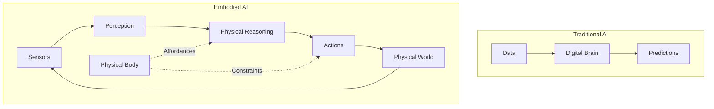

# Embodiment Hypothesis & Physical Reasoning

## Introduction

The **Embodiment Hypothesis** posits that intelligence is fundamentally shaped by physical interaction with the world. For humanoid robots, this means that cognition emerges from the interplay between sensors, actuators, and the environment. This chapter explores how physical embodiment enables reasoning about the world in ways that pure digital AI cannot.

## The Embodiment Hypothesis



### Core Principles

1. **Intelligence requires a body** - Cognition emerges from sensorimotor interaction
2. **The body shapes thought** - Physical constraints influence reasoning
3. **Action enables perception** - Movement is necessary for understanding
4. **Environment is part of cognition** - Intelligence is distributed across brain-body-world

---

## Physical Reasoning Capabilities

### 1. Affordances

**Definition:** Affordances are action possibilities that objects offer to an agent based on its physical form.

**Example:** A humanoid robot perceives:
- A chair as "sittable" (has legs and torso)
- A door handle as "graspable" (has hands)
- Stairs as "climbable" (has legs)

**Implementation:**

```python
#!/usr/bin/env python3
"""
Affordance detection for humanoid robots
"""

import rclpy
from rclpy.node import Node
from sensor_msgs.msg import PointCloud2
from vision_msgs.msg import Detection3DArray
import numpy as np

class AffordanceDetector(Node):
    """
    Detects affordances in the environment based on robot's physical capabilities.
    """
    
    def __init__(self):
        super().__init__('affordance_detector')
        
        # Robot physical capabilities
        self.capabilities = {
            'max_reach': 0.8,  # meters
            'max_grasp_width': 0.15,  # meters
            'max_step_height': 0.3,  # meters
            'body_width': 0.4,  # meters
        }
        
        # Subscribe to object detections
        self.detection_sub = self.create_subscription(
            Detection3DArray,
            '/object_detections',
            self.detection_callback,
            10
        )
        
        # Publish affordances
        self.affordance_pub = self.create_publisher(
            AffordanceArray,  # Custom message
            '/affordances',
            10
        )
        
        self.get_logger().info('Affordance Detector initialized')
    
    def detection_callback(self, msg):
        """Analyze detected objects for affordances"""
        affordances = []
        
        for detection in msg.detections:
            obj_affordances = self.compute_affordances(detection)
            affordances.extend(obj_affordances)
        
        # Publish affordances
        self.publish_affordances(affordances)
    
    def compute_affordances(self, detection):
        """
        Compute affordances for a detected object.
        
        Args:
            detection: Object detection with 3D bounding box
            
        Returns:
            list: List of affordances
        """
        affordances = []
        
        # Extract object properties
        position = detection.bbox.center.position
        size = detection.bbox.size
        object_class = detection.results[0].id
        
        # Distance to object
        distance = np.sqrt(position.x**2 + position.y**2)
        
        # Check graspability
        if self.is_graspable(size, distance):
            affordances.append({
                'type': 'grasp',
                'object': object_class,
                'position': position,
                'confidence': 0.9
            })
        
        # Check sittability (for chairs)
        if object_class == 'chair' and self.is_sittable(size, position):
            affordances.append({
                'type': 'sit',
                'object': object_class,
                'position': position,
                'confidence': 0.85
            })
        
        # Check climbability (for stairs)
        if object_class == 'stairs' and self.is_climbable(size):
            affordances.append({
                'type': 'climb',
                'object': object_class,
                'position': position,
                'confidence': 0.8
            })
        
        return affordances
    
    def is_graspable(self, size, distance):
        """Check if object is graspable"""
        # Within reach
        if distance > self.capabilities['max_reach']:
            return False
        
        # Size appropriate for grasping
        max_dim = max(size.x, size.y, size.z)
        if max_dim > self.capabilities['max_grasp_width']:
            return False
        
        return True
    
    def is_sittable(self, size, position):
        """Check if object is sittable"""
        # Height appropriate (40-50cm)
        if not (0.4 < size.z < 0.5):
            return False
        
        # Wide enough
        if size.x < self.capabilities['body_width']:
            return False
        
        return True
    
    def is_climbable(self, size):
        """Check if stairs are climbable"""
        # Step height within capability
        step_height = size.z / 10  # Assume 10 steps
        
        if step_height > self.capabilities['max_step_height']:
            return False
        
        return True

def main(args=None):
    rclpy.init(args=args)
    detector = AffordanceDetector()
    rclpy.spin(detector)
    detector.destroy_node()
    rclpy.shutdown()

if __name__ == '__main__':
    main()
```

---

### 2. Intuitive Physics

Humanoid robots must understand basic physics to interact safely and effectively.

**Key Concepts:**
- **Gravity:** Objects fall down
- **Support:** Objects need support to stay up
- **Containment:** Objects can be inside containers
- **Stability:** Balance and center of mass

**Example: Predicting Object Behavior**

```python
class PhysicsPredictor(Node):
    """
    Predicts physical outcomes of actions.
    """
    
    def predict_stability(self, object_pose, support_surface):
        """
        Predict if object will be stable when placed.
        
        Args:
            object_pose: Desired object pose
            support_surface: Surface to place on
            
        Returns:
            bool: True if stable, False otherwise
        """
        # Check if center of mass is over support polygon
        com = self.get_center_of_mass(object_pose)
        support_polygon = self.get_support_polygon(support_surface)
        
        if self.point_in_polygon(com, support_polygon):
            return True
        else:
            self.get_logger().warn('Object will be unstable!')
            return False
    
    def predict_fall_trajectory(self, object_state):
        """
        Predict where object will land if dropped.
        
        Args:
            object_state: Current object state (position, velocity)
            
        Returns:
            tuple: (landing_position, landing_time)
        """
        # Simple ballistic trajectory
        g = 9.81  # m/s²
        h = object_state.position.z
        vz = object_state.velocity.z
        
        # Time to hit ground: h = vz*t + 0.5*g*t²
        t = (-vz + np.sqrt(vz**2 + 2*g*h)) / g
        
        # Horizontal displacement
        x = object_state.position.x + object_state.velocity.x * t
        y = object_state.position.y + object_state.velocity.y * t
        
        return (x, y, 0.0), t
```

---

### 3. Causal Reasoning

Understanding cause-effect relationships through physical interaction.

**Example: Learning Tool Use**

```python
class CausalReasoner(Node):
    """
    Learns causal relationships through interaction.
    """
    
    def __init__(self):
        super().__init__('causal_reasoner')
        
        # Causal model: action -> effect
        self.causal_model = {
            'push': {'effect': 'move', 'direction': 'away'},
            'pull': {'effect': 'move', 'direction': 'toward'},
            'lift': {'effect': 'elevate', 'direction': 'up'},
            'press': {'effect': 'activate', 'direction': None}
        }
        
        # Experience buffer
        self.experiences = []
    
    def predict_effect(self, action, object_type):
        """
        Predict effect of action on object.
        
        Args:
            action: Action to perform
            object_type: Type of object
            
        Returns:
            dict: Predicted effect
        """
        if action in self.causal_model:
            effect = self.causal_model[action].copy()
            
            # Modify based on object properties
            if object_type == 'heavy':
                effect['magnitude'] = 'small'
            elif object_type == 'light':
                effect['magnitude'] = 'large'
            
            return effect
        
        return None
    
    def learn_from_experience(self, action, object_type, observed_effect):
        """
        Update causal model based on experience.
        
        Args:
            action: Action performed
            object_type: Object acted upon
            observed_effect: Observed outcome
        """
        self.experiences.append({
            'action': action,
            'object': object_type,
            'effect': observed_effect
        })
        
        # Update model if prediction was wrong
        predicted = self.predict_effect(action, object_type)
        
        if predicted != observed_effect:
            self.get_logger().info(
                f'Learning: {action} on {object_type} -> {observed_effect}'
            )
            # Update causal model...
```

---

## Sensorimotor Contingencies

**Definition:** Lawful relationships between actions and sensory changes.

**Example:** When robot turns head left, visual scene shifts right.

```python
class SensorimotorLearner(Node):
    """
    Learns sensorimotor contingencies through exploration.
    """
    
    def __init__(self):
        super().__init__('sensorimotor_learner')
        
        # Contingency model: motor_command -> sensory_change
        self.contingencies = {}
        
        # Subscribe to joint commands and sensor data
        self.joint_sub = self.create_subscription(
            JointState, '/joint_commands', self.joint_callback, 10
        )
        self.camera_sub = self.create_subscription(
            Image, '/camera/image', self.camera_callback, 10
        )
        
        self.last_image = None
        self.last_joint_state = None
    
    def learn_contingency(self, motor_command, sensory_change):
        """
        Learn relationship between motor command and sensory change.
        
        Args:
            motor_command: Joint command executed
            sensory_change: Observed change in sensors
        """
        # Store contingency
        key = self.discretize_command(motor_command)
        
        if key not in self.contingencies:
            self.contingencies[key] = []
        
        self.contingencies[key].append(sensory_change)
        
        # Learn statistical relationship
        # (e.g., head_left -> visual_shift_right)
    
    def predict_sensory_change(self, motor_command):
        """
        Predict sensory change from motor command.
        
        Args:
            motor_command: Planned motor command
            
        Returns:
            Predicted sensory change
        """
        key = self.discretize_command(motor_command)
        
        if key in self.contingencies:
            # Return average of past observations
            return np.mean(self.contingencies[key], axis=0)
        
        return None
```

---

## Embodied Cognition in Practice

### Active Perception

Moving to gather information, not just processing passive input.

**Example: Head Movement for Better View**

```python
class ActivePerception(Node):
    """
    Actively moves sensors to improve perception.
    """
    
    def improve_object_view(self, object_position):
        """
        Move head to get better view of object.
        
        Args:
            object_position: 3D position of object
        """
        # Calculate required head orientation
        head_pan, head_tilt = self.calculate_head_angles(object_position)
        
        # Move head
        self.move_head(head_pan, head_tilt)
        
        # Wait for movement
        time.sleep(0.5)
        
        # Now perception is improved
        improved_detection = self.detect_object()
        
        return improved_detection
```

---

## Summary

- **Embodiment shapes intelligence** - Physical form influences cognition
- **Affordances** - Action possibilities perceived through body
- **Intuitive physics** - Understanding physical laws through interaction
- **Causal reasoning** - Learning cause-effect through experience
- **Sensorimotor contingencies** - Lawful action-perception relationships
- **Active perception** - Moving to gather information

Embodied AI fundamentally differs from digital AI by grounding intelligence in physical interaction with the world.

---

## Further Reading

- [The Embodied Mind](https://mitpress.mit.edu/books/embodied-mind) - Varela, Thompson, Rosch
- [How the Body Shapes the Mind](https://academic.oup.com/book/3654) - Shaun Gallagher
- [Affordances in Robotics](https://ieeexplore.ieee.org/document/8967572)
- [Sensorimotor Contingencies](https://www.sciencedirect.com/science/article/pii/S0376635701001162)
