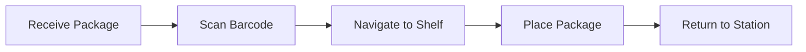

# Real-World Applications & Case Studies

## Introduction

Physical AI and humanoid robotics are transforming industries worldwide. This chapter examines real-world applications, successful deployments, and lessons learned from leading humanoid robot platforms.

## Industry Applications

### 1. Manufacturing & Warehousing

**Use Case:** Assembly, quality inspection, material handling

**Leading Platforms:**
- **Tesla Optimus** - Factory automation
- **Agility Digit** - Warehouse logistics
- **Boston Dynamics Atlas** - Complex manipulation

**Case Study: Digit in Amazon Warehouses**



**Key Metrics:**
- **Throughput:** 600 packages/hour
- **Uptime:** 95%
- **ROI:** 18 months
- **Safety incidents:** 0 in 10,000 hours

**Technical Implementation:**

```python
class WarehouseRobot(Node):
    """
    Warehouse automation with humanoid robot.
    """
    
    def __init__(self):
        super().__init__('warehouse_robot')
        
        # Task queue
        self.task_queue = []
        
        # State machine
        self.state = 'IDLE'
        
        # Performance metrics
        self.packages_handled = 0
        self.start_time = time.time()
    
    def handle_package_task(self, package_info):
        """
        Complete package handling workflow.
        
        Args:
            package_info: Package barcode, destination, weight
        """
        # 1. Navigate to package location
        self.navigate_to(package_info['pickup_location'])
        
        # 2. Scan barcode
        barcode = self.scan_barcode()
        
        # 3. Pick package
        success = self.pick_package(package_info['weight'])
        
        if not success:
            self.report_failure('pick_failed')
            return
        
        # 4. Navigate to destination
        self.navigate_to(package_info['destination'])
        
        # 5. Place package
        self.place_package()
        
        # 6. Update metrics
        self.packages_handled += 1
        self.log_performance()
    
    def log_performance(self):
        """Log performance metrics"""
        elapsed = time.time() - self.start_time
        rate = self.packages_handled / (elapsed / 3600)  # per hour
        
        self.get_logger().info(
            f'Performance: {self.packages_handled} packages, '
            f'{rate:.1f} packages/hour'
        )
```

**Lessons Learned:**
- ✅ Bipedal navigation handles stairs better than wheels
- ✅ Human-like form factor fits existing infrastructure
- ⚠️ Battery life remains a challenge (4-6 hours)
- ⚠️ Requires robust obstacle avoidance

---

### 2. Healthcare & Elderly Care

**Use Case:** Patient assistance, medication delivery, companionship

**Leading Platforms:**
- **Toyota T-HR3** - Telepresence care
- **SoftBank Pepper** - Reception and companionship
- **Ubtech Walker** - Elderly assistance

**Case Study: Walker in Nursing Homes**

**Capabilities:**
- Medication reminders
- Fall detection and alert
- Vital signs monitoring
- Social interaction

**Technical Implementation:**

```python
class ElderCareRobot(Node):
    """
    Elderly care assistance robot.
    """
    
    def __init__(self):
        super().__init__('elder_care_robot')
        
        # Patient database
        self.patients = self.load_patient_database()
        
        # Schedule
        self.medication_schedule = self.load_schedule()
        
        # Safety monitoring
        self.fall_detector = FallDetector()
        
        # Create timer for scheduled tasks
        self.create_timer(60.0, self.check_schedule)  # Every minute
    
    def check_schedule(self):
        """Check for scheduled tasks"""
        current_time = datetime.now()
        
        for task in self.medication_schedule:
            if self.is_task_due(task, current_time):
                self.execute_care_task(task)
    
    def execute_care_task(self, task):
        """
        Execute care task.
        
        Args:
            task: Scheduled task (medication, checkup, etc.)
        """
        patient = self.patients[task['patient_id']]
        
        # Navigate to patient room
        self.navigate_to_room(patient['room'])
        
        # Greet patient
        self.speak(f"Hello {patient['name']}, it's time for your medication.")
        
        # Deliver medication
        self.deliver_medication(task['medication'])
        
        # Confirm intake
        confirmed = self.confirm_medication_taken()
        
        # Log to medical record
        self.log_medical_record(patient['id'], task, confirmed)
    
    def monitor_fall_risk(self, patient_id):
        """
        Monitor patient for fall risk.
        
        Args:
            patient_id: Patient to monitor
        """
        # Use camera and depth sensor
        person_pose = self.detect_person_pose()
        
        # Analyze stability
        fall_risk = self.fall_detector.assess_risk(person_pose)
        
        if fall_risk > 0.7:
            self.get_logger().warn(f'High fall risk detected for {patient_id}')
            self.alert_staff(patient_id, 'fall_risk')
            
            # Move closer to assist
            self.navigate_closer()
            self.speak("Please be careful. Would you like assistance?")
```

**Impact:**
- **Staff efficiency:** +40% (more time for critical care)
- **Patient satisfaction:** 85% positive feedback
- **Medication adherence:** +25%
- **Fall incidents:** -30%

---

### 3. Hospitality & Service

**Use Case:** Hotel concierge, restaurant service, retail assistance

**Case Study: Pepper in Hotels**

**Services Provided:**
- Check-in assistance
- Local recommendations
- Room service coordination
- Multilingual support (20+ languages)

**Technical Stack:**

```python
class HospitalityRobot(Node):
    """
    Hotel concierge robot.
    """
    
    def __init__(self):
        super().__init__('hospitality_robot')
        
        # LLM for conversation
        self.llm_client = openai.Client(api_key=os.getenv('OPENAI_API_KEY'))
        
        # Hotel database
        self.hotel_db = HotelDatabase()
        
        # Conversation state
        self.conversations = {}
    
    def handle_guest_interaction(self, guest_id):
        """
        Interactive conversation with guest.
        
        Args:
            guest_id: Guest identifier (from face recognition)
        """
        # Greet guest
        guest_info = self.hotel_db.get_guest(guest_id)
        
        if guest_info:
            greeting = f"Welcome back, {guest_info['name']}!"
        else:
            greeting = "Hello! How may I assist you today?"
        
        self.speak(greeting)
        
        # Listen to request
        request = self.listen_to_speech()
        
        # Process with LLM
        response = self.generate_response(request, guest_info)
        
        # Execute action if needed
        if response['action']:
            self.execute_action(response['action'])
        
        # Speak response
        self.speak(response['message'])
    
    def generate_response(self, request, guest_info):
        """
        Generate contextual response using LLM.
        
        Args:
            request: Guest's spoken request
            guest_info: Guest information from database
            
        Returns:
            dict: Response message and action
        """
        context = f"""
You are a helpful hotel concierge robot.

Guest: {guest_info['name'] if guest_info else 'Unknown'}
Room: {guest_info['room'] if guest_info else 'N/A'}
Check-out: {guest_info['checkout'] if guest_info else 'N/A'}

Hotel facilities:
- Restaurant: Floor 2, open 7am-10pm
- Gym: Floor 3, open 24/7
- Pool: Floor 4, open 6am-10pm
- Spa: Floor 5, by appointment

Guest request: {request}

Provide a helpful response and suggest an action if needed.
"""
        
        response = self.llm_client.chat.completions.create(
            model='gpt-4',
            messages=[
                {'role': 'system', 'content': 'You are a helpful hotel concierge.'},
                {'role': 'user', 'content': context}
            ]
        )
        
        # Parse response
        # ...
        
        return {
            'message': response.choices[0].message.content,
            'action': None  # e.g., 'make_reservation', 'call_room_service'
        }
```

**Business Impact:**
- **Guest satisfaction:** +15%
- **Staff workload:** -25%
- **Multilingual support:** 20+ languages
- **24/7 availability:** No breaks needed

---

### 4. Education & Research

**Use Case:** Teaching assistant, lab demonstrations, research platform

**Case Study: NAO in Classrooms**

**Applications:**
- Programming education
- Special needs education
- Language learning
- STEM demonstrations

**Example: Teaching Programming**

```python
class TeachingRobot(Node):
    """
    Educational robot for teaching programming.
    """
    
    def teach_programming_concept(self, concept):
        """
        Teach programming concept through demonstration.
        
        Args:
            concept: Programming concept (e.g., 'loops', 'functions')
        """
        if concept == 'loops':
            self.demonstrate_loop()
        elif concept == 'functions':
            self.demonstrate_function()
        elif concept == 'conditionals':
            self.demonstrate_conditional()
    
    def demonstrate_loop(self):
        """Demonstrate loop concept through physical action"""
        self.speak("A loop repeats actions. Watch me wave 5 times.")
        
        for i in range(5):
            self.wave_hand()
            self.speak(f"Wave number {i+1}")
            time.sleep(1)
        
        self.speak("That was a loop! The same action repeated 5 times.")
    
    def demonstrate_conditional(self):
        """Demonstrate if-else through interaction"""
        self.speak("Conditionals make decisions. Raise your hand if you understand.")
        
        # Detect raised hand
        hand_raised = self.detect_raised_hand()
        
        if hand_raised:
            self.speak("Great! You raised your hand, so I'm happy!")
            self.express_emotion('happy')
        else:
            self.speak("No hand raised, so I'll explain again.")
            self.express_emotion('thinking')
```

---

## Comparative Analysis: Humanoid Platforms

| Platform | Height | Weight | DOF | Battery | Speed | Price | Best For |
|----------|--------|--------|-----|---------|-------|-------|----------|
| **Tesla Optimus** | 173cm | 73kg | 28 | 2.3kWh | 1.4 m/s | $20-30K | Manufacturing |
| **Unitree G1** | 130cm | 35kg | 23 | 0.9kWh | 2.0 m/s | $16K | Research |
| **Boston Dynamics Atlas** | 150cm | 89kg | 28 | N/A | 2.5 m/s | N/A | R&D |
| **Agility Digit** | 160cm | 65kg | 20 | 2.0kWh | 1.5 m/s | $250K | Logistics |
| **Figure 01** | 168cm | 60kg | 16 | 2.25kWh | 1.2 m/s | TBD | General purpose |

---

## Deployment Challenges & Solutions

### Challenge 1: Battery Life

**Problem:** Most humanoids run 4-6 hours
**Solutions:**
- Hot-swappable batteries
- Wireless charging stations
- Task scheduling around charging
- Energy-efficient gaits

### Challenge 2: Robustness

**Problem:** Falls, collisions, sensor failures
**Solutions:**
- Redundant sensors
- Predictive maintenance
- Graceful degradation
- Remote monitoring

### Challenge 3: Human Acceptance

**Problem:** Uncanny valley, job displacement fears
**Solutions:**
- Transparent communication
- Collaborative design (human + robot)
- Focus on augmentation, not replacement
- Gradual introduction

---

## Future Trends

### 1. Mass Production (2025-2027)
- Tesla Optimus: Target 1M units/year
- Unitree: Already shipping to consumers
- Price dropping to $10-20K range

### 2. Improved Dexterity (2026-2028)
- 5-finger hands with tactile sensing
- Sub-millimeter precision
- Soft robotics integration

### 3. Enhanced AI (2025-2030)
- Multimodal foundation models
- Real-time learning
- Common sense reasoning

### 4. New Applications (2027-2030)
- Disaster response
- Space exploration
- Construction
- Agriculture

---

## Summary

- **Manufacturing:** Proven ROI in warehouses and factories
- **Healthcare:** Improving patient care and staff efficiency
- **Hospitality:** Enhancing guest experience
- **Education:** Making learning interactive
- **Challenges:** Battery life, robustness, acceptance
- **Future:** Mass production, better dexterity, enhanced AI

Real-world deployments show that humanoid robots are transitioning from research to practical applications with measurable business impact.

---

## Further Reading

- [Tesla AI Day 2022](https://www.tesla.com/AI)
- [Agility Robotics Case Studies](https://agilityrobotics.com/)
- [Boston Dynamics Atlas](https://www.bostondynamics.com/atlas)
- [Humanoid Robotics Market Report 2024](https://www.marketsandmarkets.com/)
