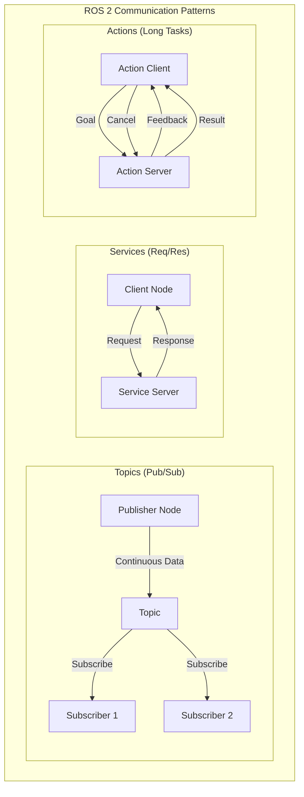

# ROS 2 Communication Patterns Deep Dive

## Introduction

ROS 2 provides three primary communication patterns that enable different types of interactions between nodes: **Topics** (publish-subscribe), **Services** (request-response), and **Actions** (long-running tasks with feedback). Understanding when and how to use each pattern is crucial for building robust robotic systems.

## Architecture Overview



---

## Pattern 1: Topics (Publish-Subscribe)

### When to Use Topics

- **Continuous data streams**: Sensor data, robot state, camera feeds
- **One-to-many communication**: Multiple nodes need the same data
- **Asynchronous communication**: Publisher doesn't wait for subscribers
- **High-frequency updates**: Real-time sensor data (10-100+ Hz)

### How Topics Work

Topics implement a **many-to-many** communication pattern where:
- Publishers send messages to a named topic
- Subscribers receive all messages from topics they subscribe to
- No direct connection between publishers and subscribers
- Messages are fire-and-forget (no acknowledgment)

### Complete Publisher Example

```python
#!/usr/bin/env python3
"""
ROS 2 Publisher Example: Publishing robot sensor data
"""
import rclpy
from rclpy.node import Node
from sensor_msgs.msg import Imu
from geometry_msgs.msg import Vector3
import math
import time

class ImuPublisher(Node):
    """
    Publishes simulated IMU data for a humanoid robot.
    Demonstrates proper ROS 2 publisher implementation.
    """
    
    def __init__(self):
        super().__init__('imu_publisher')
        
        # Create publisher for IMU data
        self.publisher_ = self.create_publisher(
            Imu,                    # Message type
            'humanoid/imu/data',    # Topic name
            10                      # Queue size (QoS depth)
        )
        
        # Create timer for periodic publishing (100 Hz)
        self.timer_period = 0.01  # 10ms = 100Hz
        self.timer = self.create_timer(self.timer_period, self.timer_callback)
        
        # Initialize simulation variables
        self.counter = 0
        self.get_logger().info('IMU Publisher started - Publishing at 100 Hz')
    
    def timer_callback(self):
        """Called periodically to publish IMU data"""
        msg = Imu()
        
        # Set header information
        msg.header.stamp = self.get_clock().now().to_msg()
        msg.header.frame_id = 'imu_link'
        
        # Simulate angular velocity (gyroscope data)
        # Small oscillation to simulate natural robot movement
        msg.angular_velocity.x = 0.01 * math.sin(self.counter * 0.1)
        msg.angular_velocity.y = 0.01 * math.cos(self.counter * 0.1)
        msg.angular_velocity.z = 0.005 * math.sin(self.counter * 0.05)
        
        # Simulate linear acceleration (accelerometer data)
        # Gravity + small noise
        msg.linear_acceleration.x = 0.1 * math.sin(self.counter * 0.2)
        msg.linear_acceleration.y = 0.1 * math.cos(self.counter * 0.2)
        msg.linear_acceleration.z = 9.81  # Gravity
        
        # Publish the message
        self.publisher_.publish(msg)
        
        # Log every 100 messages (once per second at 100Hz)
        if self.counter % 100 == 0:
            self.get_logger().info(f'Publishing IMU data: counter={self.counter}')
        
        self.counter += 1

def main(args=None):
    rclpy.init(args=args)
    imu_publisher = ImuPublisher()
    
    try:
        rclpy.spin(imu_publisher)
    except KeyboardInterrupt:
        pass
    finally:
        imu_publisher.destroy_node()
        rclpy.shutdown()

if __name__ == '__main__':
    main()
```

### Complete Subscriber Example

```python
#!/usr/bin/env python3
"""
ROS 2 Subscriber Example: Processing robot sensor data
"""
import rclpy
from rclpy.node import Node
from sensor_msgs.msg import Imu
import math

class ImuSubscriber(Node):
    """
    Subscribes to IMU data and processes it for robot state estimation.
    Demonstrates proper ROS 2 subscriber implementation.
    """
    
    def __init__(self):
        super().__init__('imu_subscriber')
        
        # Create subscription to IMU topic
        self.subscription = self.create_subscription(
            Imu,                        # Message type
            'humanoid/imu/data',        # Topic name (must match publisher)
            self.imu_callback,          # Callback function
            10                          # Queue size (QoS depth)
        )
        
        # Prevent unused variable warning
        self.subscription
        
        # Initialize state variables
        self.message_count = 0
        self.max_angular_velocity = 0.0
        
        self.get_logger().info('IMU Subscriber started - Waiting for data...')
    
    def imu_callback(self, msg):
        """
        Callback function executed when a message is received.
        
        Args:
            msg (Imu): The received IMU message
        """
        self.message_count += 1
        
        # Calculate magnitude of angular velocity
        angular_vel_magnitude = math.sqrt(
            msg.angular_velocity.x**2 + 
            msg.angular_velocity.y**2 + 
            msg.angular_velocity.z**2
        )
        
        # Track maximum angular velocity
        if angular_vel_magnitude > self.max_angular_velocity:
            self.max_angular_velocity = angular_vel_magnitude
        
        # Calculate magnitude of linear acceleration
        linear_accel_magnitude = math.sqrt(
            msg.linear_acceleration.x**2 + 
            msg.linear_acceleration.y**2 + 
            msg.linear_acceleration.z**2
        )
        
        # Log every 100 messages (once per second at 100Hz)
        if self.message_count % 100 == 0:
            self.get_logger().info(
                f'Received {self.message_count} messages | '
                f'Angular vel: {angular_vel_magnitude:.4f} rad/s | '
                f'Linear accel: {linear_accel_magnitude:.2f} m/s² | '
                f'Max angular vel: {self.max_angular_velocity:.4f} rad/s'
            )
        
        # Example: Detect if robot is falling (high angular velocity)
        if angular_vel_magnitude > 0.5:
            self.get_logger().warn(
                f'High angular velocity detected: {angular_vel_magnitude:.4f} rad/s - '
                'Robot may be unstable!'
            )

def main(args=None):
    rclpy.init(args=args)
    imu_subscriber = ImuSubscriber()
    
    try:
        rclpy.spin(imu_subscriber)
    except KeyboardInterrupt:
        pass
    finally:
        imu_subscriber.destroy_node()
        rclpy.shutdown()

if __name__ == '__main__':
    main()
```

### Running the Publisher-Subscriber Example

```bash
# Terminal 1: Start the publisher
ros2 run my_robot_package imu_publisher

# Terminal 2: Start the subscriber
ros2 run my_robot_package imu_subscriber

# Terminal 3: Inspect the topic
ros2 topic list
ros2 topic info /humanoid/imu/data
ros2 topic echo /humanoid/imu/data --once
ros2 topic hz /humanoid/imu/data

# Visualize the node graph
rqt_graph
```

**Expected Output:**
```
[INFO] [imu_publisher]: IMU Publisher started - Publishing at 100 Hz
[INFO] [imu_publisher]: Publishing IMU data: counter=0
[INFO] [imu_subscriber]: IMU Subscriber started - Waiting for data...
[INFO] [imu_subscriber]: Received 100 messages | Angular vel: 0.0141 rad/s | Linear accel: 9.82 m/s²
```

---

## Pattern 2: Services (Request-Response)

### When to Use Services

- **Synchronous operations**: Client waits for response
- **One-time requests**: Configuration, calculations, state queries
- **Guaranteed response**: Need confirmation of completion
- **Low-frequency operations**: Not real-time critical

### How Services Work

Services implement a **client-server** pattern where:
- Client sends a request and blocks until receiving a response
- Server processes the request and sends back a result
- One-to-one communication (one client per request)
- Suitable for infrequent operations

### Service Definition Example

First, define a custom service type in `srv/SetRobotMode.srv`:

```
# Request
string mode  # "walk", "stand", "sit", "idle"
---
# Response
bool success
string message
```

### Complete Service Server Example

```python
#!/usr/bin/env python3
"""
ROS 2 Service Server Example: Robot mode control
"""
import rclpy
from rclpy.node import Node
from example_interfaces.srv import SetBool  # Using standard service for simplicity
# In practice, you'd use: from my_robot_interfaces.srv import SetRobotMode

class RobotModeServer(Node):
    """
    Service server that controls the humanoid robot's operational mode.
    Demonstrates proper ROS 2 service server implementation.
    """
    
    def __init__(self):
        super().__init__('robot_mode_server')
        
        # Create service server
        self.srv = self.create_service(
            SetBool,                    # Service type
            'set_robot_mode',           # Service name
            self.set_mode_callback      # Callback function
        )
        
        # Initialize robot state
        self.current_mode = "idle"
        self.valid_modes = ["walk", "stand", "sit", "idle"]
        
        self.get_logger().info('Robot Mode Service Server started')
        self.get_logger().info(f'Current mode: {self.current_mode}')
    
    def set_mode_callback(self, request, response):
        """
        Callback function for service requests.
        
        Args:
            request: Service request (SetBool.Request)
            response: Service response (SetBool.Response)
            
        Returns:
            response: Filled response object
        """
        # For this example, True = walk mode, False = idle mode
        requested_mode = "walk" if request.data else "idle"
        
        self.get_logger().info(f'Received request to set mode: {requested_mode}')
        
        # Validate the requested mode
        if requested_mode in self.valid_modes:
            # Simulate mode transition (in real robot, this would control actuators)
            old_mode = self.current_mode
            self.current_mode = requested_mode
            
            response.success = True
            response.message = f'Successfully changed mode from {old_mode} to {requested_mode}'
            
            self.get_logger().info(response.message)
        else:
            response.success = False
            response.message = f'Invalid mode: {requested_mode}. Valid modes: {self.valid_modes}'
            
            self.get_logger().error(response.message)
        
        return response

def main(args=None):
    rclpy.init(args=args)
    robot_mode_server = RobotModeServer()
    
    try:
        rclpy.spin(robot_mode_server)
    except KeyboardInterrupt:
        pass
    finally:
        robot_mode_server.destroy_node()
        rclpy.shutdown()

if __name__ == '__main__':
    main()
```

### Complete Service Client Example

```python
#!/usr/bin/env python3
"""
ROS 2 Service Client Example: Requesting robot mode changes
"""
import rclpy
from rclpy.node import Node
from example_interfaces.srv import SetBool
import sys

class RobotModeClient(Node):
    """
    Service client that requests robot mode changes.
    Demonstrates proper ROS 2 service client implementation.
    """
    
    def __init__(self):
        super().__init__('robot_mode_client')
        
        # Create service client
        self.client = self.create_client(SetBool, 'set_robot_mode')
        
        # Wait for service to be available
        while not self.client.wait_for_service(timeout_sec=1.0):
            self.get_logger().info('Waiting for service to become available...')
        
        self.get_logger().info('Service client ready')
    
    def send_request(self, enable_walk):
        """
        Send a service request to change robot mode.
        
        Args:
            enable_walk (bool): True for walk mode, False for idle mode
        """
        request = SetBool.Request()
        request.data = enable_walk
        
        mode_name = "walk" if enable_walk else "idle"
        self.get_logger().info(f'Sending request to set mode: {mode_name}')
        
        # Call service asynchronously
        future = self.client.call_async(request)
        
        # Wait for response
        rclpy.spin_until_future_complete(self, future)
        
        if future.result() is not None:
            response = future.result()
            if response.success:
                self.get_logger().info(f'✓ {response.message}')
            else:
                self.get_logger().error(f'✗ {response.message}')
        else:
            self.get_logger().error('Service call failed')

def main(args=None):
    rclpy.init(args=args)
    
    # Parse command line argument
    if len(sys.argv) < 2:
        print('Usage: robot_mode_client <walk|idle>')
        return
    
    mode = sys.argv[1].lower()
    enable_walk = (mode == 'walk')
    
    robot_mode_client = RobotModeClient()
    robot_mode_client.send_request(enable_walk)
    
    robot_mode_client.destroy_node()
    rclpy.shutdown()

if __name__ == '__main__':
    main()
```

### Running the Service Example

```bash
# Terminal 1: Start the service server
ros2 run my_robot_package robot_mode_server

# Terminal 2: Call the service from command line
ros2 service list
ros2 service type /set_robot_mode
ros2 service call /set_robot_mode example_interfaces/srv/SetBool "{data: true}"

# Terminal 3: Use the client node
ros2 run my_robot_package robot_mode_client walk
ros2 run my_robot_package robot_mode_client idle
```

---

## Pattern 3: Actions (Long-Running Tasks)

### When to Use Actions

- **Long-running tasks**: Navigation, manipulation, complex behaviors
- **Need feedback**: Progress updates during execution
- **Cancellable operations**: Ability to abort mid-execution
- **Goal-oriented tasks**: Clear start, progress, and completion

### How Actions Work

Actions implement a **goal-oriented** pattern where:
- Client sends a goal to the action server
- Server provides periodic feedback on progress
- Server sends a final result when complete
- Client can cancel the goal at any time

### Action Definition Example

Define a custom action in `action/NavigateToPoint.action`:

```
# Goal
float64 target_x
float64 target_y
float64 target_theta
---
# Result
bool success
float64 final_x
float64 final_y
string message
---
# Feedback
float64 current_x
float64 current_y
float64 distance_remaining
float64 estimated_time_remaining
```

### Complete Action Server Example

```python
#!/usr/bin/env python3
"""
ROS 2 Action Server Example: Humanoid navigation
"""
import rclpy
from rclpy.action import ActionServer
from rclpy.node import Node
from action_tutorials_interfaces.action import Fibonacci  # Using standard action for example
import time
import math

class NavigationActionServer(Node):
    """
    Action server for humanoid robot navigation.
    Demonstrates proper ROS 2 action server implementation.
    """
    
    def __init__(self):
        super().__init__('navigation_action_server')
        
        # Create action server
        self._action_server = ActionServer(
            self,
            Fibonacci,                      # Action type
            'navigate_to_point',            # Action name
            self.execute_callback           # Execution callback
        )
        
        self.get_logger().info('Navigation Action Server started')
    
    def execute_callback(self, goal_handle):
        """
        Execute the navigation goal.
        
        Args:
            goal_handle: Handle to the goal being executed
            
        Returns:
            result: The final result of the action
        """
        self.get_logger().info('Executing navigation goal...')
        
        # Get the goal (in this example, Fibonacci sequence length)
        # In real navigation, this would be target coordinates
        order = goal_handle.request.order
        
        # Initialize feedback message
        feedback_msg = Fibonacci.Feedback()
        feedback_msg.sequence = [0, 1]
        
        # Simulate navigation with feedback
        for i in range(1, order):
            # Check if goal was cancelled
            if goal_handle.is_cancel_requested:
                goal_handle.canceled()
                self.get_logger().info('Goal cancelled')
                result = Fibonacci.Result()
                result.sequence = feedback_msg.sequence
                return result
            
            # Update progress (simulate navigation steps)
            feedback_msg.sequence.append(
                feedback_msg.sequence[i] + feedback_msg.sequence[i-1]
            )
            
            # Publish feedback
            goal_handle.publish_feedback(feedback_msg)
            
            # Log progress
            progress = (i / order) * 100
            self.get_logger().info(f'Navigation progress: {progress:.1f}%')
            
            # Simulate time taken for each step
            time.sleep(0.5)
        
        # Mark goal as succeeded
        goal_handle.succeed()
        
        # Return final result
        result = Fibonacci.Result()
        result.sequence = feedback_msg.sequence
        
        self.get_logger().info('Navigation completed successfully!')
        return result

def main(args=None):
    rclpy.init(args=args)
    navigation_action_server = NavigationActionServer()
    
    try:
        rclpy.spin(navigation_action_server)
    except KeyboardInterrupt:
        pass
    finally:
        navigation_action_server.destroy_node()
        rclpy.shutdown()

if __name__ == '__main__':
    main()
```

### Complete Action Client Example

```python
#!/usr/bin/env python3
"""
ROS 2 Action Client Example: Sending navigation goals
"""
import rclpy
from rclpy.action import ActionClient
from rclpy.node import Node
from action_tutorials_interfaces.action import Fibonacci

class NavigationActionClient(Node):
    """
    Action client for sending navigation goals to humanoid robot.
    Demonstrates proper ROS 2 action client implementation.
    """
    
    def __init__(self):
        super().__init__('navigation_action_client')
        
        # Create action client
        self._action_client = ActionClient(
            self,
            Fibonacci,
            'navigate_to_point'
        )
        
        self.get_logger().info('Navigation Action Client started')
    
    def send_goal(self, target_order):
        """
        Send a navigation goal to the action server.
        
        Args:
            target_order: The goal parameter (Fibonacci order in this example)
        """
        # Wait for action server
        self.get_logger().info('Waiting for action server...')
        self._action_client.wait_for_server()
        
        # Create goal message
        goal_msg = Fibonacci.Goal()
        goal_msg.order = target_order
        
        self.get_logger().info(f'Sending navigation goal: order={target_order}')
        
        # Send goal with callbacks
        self._send_goal_future = self._action_client.send_goal_async(
            goal_msg,
            feedback_callback=self.feedback_callback
        )
        
        self._send_goal_future.add_done_callback(self.goal_response_callback)
    
    def goal_response_callback(self, future):
        """Called when server accepts or rejects the goal"""
        goal_handle = future.result()
        
        if not goal_handle.accepted:
            self.get_logger().error('Goal rejected by server')
            return
        
        self.get_logger().info('Goal accepted by server')
        
        # Get result
        self._get_result_future = goal_handle.get_result_async()
        self._get_result_future.add_done_callback(self.get_result_callback)
    
    def feedback_callback(self, feedback_msg):
        """Called when server sends feedback"""
        feedback = feedback_msg.feedback
        self.get_logger().info(f'Received feedback: {feedback.sequence}')
    
    def get_result_callback(self, future):
        """Called when action is complete"""
        result = future.result().result
        self.get_logger().info(f'Navigation complete! Result: {result.sequence}')
        
        # Shutdown after receiving result
        rclpy.shutdown()

def main(args=None):
    rclpy.init(args=args)
    
    action_client = NavigationActionClient()
    action_client.send_goal(10)  # Navigate with order=10
    
    try:
        rclpy.spin(action_client)
    except KeyboardInterrupt:
        pass

if __name__ == '__main__':
    main()
```

### Running the Action Example

```bash
# Terminal 1: Start the action server
ros2 run my_robot_package navigation_action_server

# Terminal 2: Send a goal using the client
ros2 run my_robot_package navigation_action_client

# Terminal 3: Inspect the action
ros2 action list
ros2 action info /navigate_to_point
ros2 action send_goal /navigate_to_point action_tutorials_interfaces/action/Fibonacci "{order: 5}"
```

---

## Choosing the Right Communication Pattern

| Use Case | Pattern | Reason |
|----------|---------|--------|
| Sensor data streaming | **Topic** | Continuous, high-frequency, one-to-many |
| Camera images | **Topic** | Continuous stream, multiple consumers |
| Robot state | **Topic** | Continuous updates, many subscribers |
| Get current configuration | **Service** | One-time request, need response |
| Set parameter | **Service** | Synchronous operation, confirmation needed |
| Navigate to waypoint | **Action** | Long-running, need feedback, cancellable |
| Pick and place object | **Action** | Multi-step task, progress monitoring |
| Emergency stop | **Service** | Immediate, synchronous, critical |

---

## Quality of Service (QoS) Policies

ROS 2 allows fine-grained control over message delivery through QoS policies:

### Common QoS Profiles

```python
from rclpy.qos import QoSProfile, ReliabilityPolicy, HistoryPolicy, DurabilityPolicy

# Sensor data (best effort, latest only)
sensor_qos = QoSProfile(
    reliability=ReliabilityPolicy.BEST_EFFORT,
    history=HistoryPolicy.KEEP_LAST,
    depth=1
)

# Critical commands (reliable, keep all)
command_qos = QoSProfile(
    reliability=ReliabilityPolicy.RELIABLE,
    history=HistoryPolicy.KEEP_ALL,
    depth=10
)

# Use in publisher
self.publisher_ = self.create_publisher(
    Imu,
    'humanoid/imu/data',
    sensor_qos  # Apply QoS profile
)
```

### QoS Policy Comparison

| Policy | Options | Use Case |
|--------|---------|----------|
| **Reliability** | BEST_EFFORT, RELIABLE | Sensor data vs. Commands |
| **Durability** | VOLATILE, TRANSIENT_LOCAL | Real-time vs. Late joiners |
| **History** | KEEP_LAST, KEEP_ALL | Latest only vs. All messages |
| **Depth** | 1, 10, 100, etc. | Queue size for buffering |

---

## Best Practices

### Topic Best Practices

✅ **DO:**
- Use descriptive topic names: `/robot_name/sensor_type/data`
- Publish at consistent rates
- Use appropriate QoS policies
- Keep messages small and focused

❌ **DON'T:**
- Publish at irregular intervals
- Use generic names like `/data`
- Send large messages at high rates
- Mix unrelated data in one message

### Service Best Practices

✅ **DO:**
- Use for infrequent operations
- Implement timeout handling
- Validate request parameters
- Provide meaningful response messages

❌ **DON'T:**
- Use for high-frequency operations
- Block indefinitely waiting for response
- Use for streaming data
- Ignore error conditions

### Action Best Practices

✅ **DO:**
- Provide regular feedback updates
- Implement cancellation handling
- Set realistic goals
- Report meaningful progress

❌ **DON'T:**
- Use for simple operations
- Ignore cancel requests
- Provide misleading feedback
- Block without updates

---

## Hands-On Exercise

**Challenge:** Create a complete humanoid robot control system using all three patterns:

1. **Topic**: Publish joint states at 50 Hz
2. **Service**: Implement a "calibrate sensors" service
3. **Action**: Create a "walk forward" action with distance feedback

**Solution template provided in the labs directory.**

---

## Summary

- **Topics**: Continuous data streams, asynchronous, many-to-many
- **Services**: One-time requests, synchronous, one-to-one
- **Actions**: Long-running tasks, feedback, cancellable

Understanding these patterns is fundamental to building effective ROS 2 robotic systems. In the next chapter, we'll explore how to define robot structures using URDF for humanoid robots.

---

## Further Reading

- [ROS 2 Concepts Documentation](https://docs.ros.org/en/humble/Concepts.html)
- [ROS 2 QoS Policies](https://docs.ros.org/en/humble/Concepts/About-Quality-of-Service-Settings.html)
- [Action Design Best Practices](https://design.ros2.org/articles/actions.html)
