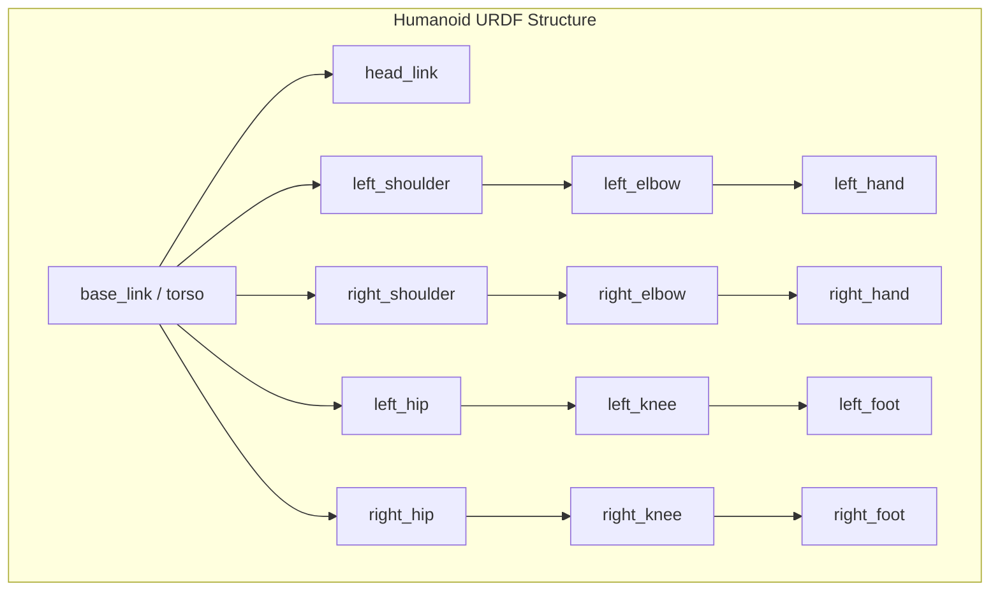

# URDF for Humanoid Robots

## Introduction

The **Unified Robot Description Format (URDF)** is an XML-based format used in ROS to describe the physical structure of a robot. For humanoid robots, URDF defines the kinematic chain from the torso through the limbs, specifying joints, links, sensors, and visual/collision properties. Mastering URDF is essential for simulation, visualization, and control of humanoid systems.

## URDF Structure Overview



---

## Core URDF Elements

### 1. Links (Rigid Bodies)

Links represent rigid body parts of the robot. Each link can have:
- **Visual**: How the link appears (meshes, colors)
- **Collision**: Simplified geometry for collision detection
- **Inertial**: Mass and inertia properties for physics simulation

```xml
<link name="torso">
  <!-- Visual representation -->
  <visual>
    <origin xyz="0 0 0" rpy="0 0 0"/>
    <geometry>
      <box size="0.3 0.2 0.5"/>
    </geometry>
    <material name="blue">
      <color rgba="0.2 0.2 0.8 1.0"/>
    </material>
  </visual>
  
  <!-- Collision geometry (usually simpler than visual) -->
  <collision>
    <origin xyz="0 0 0" rpy="0 0 0"/>
    <geometry>
      <box size="0.3 0.2 0.5"/>
    </geometry>
  </collision>
  
  <!-- Inertial properties for physics simulation -->
  <inertial>
    <origin xyz="0 0 0" rpy="0 0 0"/>
    <mass value="15.0"/>
    <inertia ixx="0.5" ixy="0.0" ixz="0.0"
             iyy="0.5" iyz="0.0"
             izz="0.3"/>
  </inertial>
</link>
```

### 2. Joints (Connections Between Links)

Joints define how links are connected and can move relative to each other.

**Joint Types:**
- `fixed`: No movement (e.g., torso to sensor mount)
- `revolute`: Rotation around axis with limits (e.g., elbow, knee)
- `continuous`: Unlimited rotation (e.g., wheel)
- `prismatic`: Linear motion (e.g., telescoping arm)

```xml
<joint name="left_shoulder_joint" type="revolute">
  <!-- Parent link (fixed reference) -->
  <parent link="torso"/>
  
  <!-- Child link (moves relative to parent) -->
  <child link="left_upper_arm"/>
  
  <!-- Joint origin relative to parent -->
  <origin xyz="0.0 0.15 0.2" rpy="0 0 0"/>
  
  <!-- Axis of rotation -->
  <axis xyz="0 1 0"/>
  
  <!-- Joint limits (in radians) -->
  <limit effort="100.0" velocity="2.0" lower="-1.57" upper="1.57"/>
  
  <!-- Joint dynamics -->
  <dynamics damping="0.7" friction="0.0"/>
</joint>
```

---

## Complete Humanoid URDF Example

Let's build a simplified humanoid robot step by step.

### Step 1: Define the Base Link (Torso)

```xml
<?xml version="1.0"?>
<robot name="simple_humanoid">
  
  <!-- Base link: Torso -->
  <link name="base_link">
    <visual>
      <origin xyz="0 0 0.25" rpy="0 0 0"/>
      <geometry>
        <box size="0.3 0.2 0.5"/>
      </geometry>
      <material name="blue">
        <color rgba="0.2 0.2 0.8 1.0"/>
      </material>
    </visual>
    
    <collision>
      <origin xyz="0 0 0.25" rpy="0 0 0"/>
      <geometry>
        <box size="0.3 0.2 0.5"/>
      </geometry>
    </collision>
    
    <inertial>
      <origin xyz="0 0 0.25" rpy="0 0 0"/>
      <mass value="15.0"/>
      <inertia ixx="0.5" ixy="0.0" ixz="0.0"
               iyy="0.5" iyz="0.0"
               izz="0.3"/>
    </inertial>
  </link>
  
</robot>
```

### Step 2: Add Head

```xml
  <!-- Head link -->
  <link name="head">
    <visual>
      <origin xyz="0 0 0" rpy="0 0 0"/>
      <geometry>
        <sphere radius="0.1"/>
      </geometry>
      <material name="skin">
        <color rgba="0.9 0.7 0.6 1.0"/>
      </material>
    </visual>
    
    <collision>
      <origin xyz="0 0 0" rpy="0 0 0"/>
      <geometry>
        <sphere radius="0.1"/>
      </geometry>
    </collision>
    
    <inertial>
      <mass value="2.0"/>
      <inertia ixx="0.01" ixy="0.0" ixz="0.0"
               iyy="0.01" iyz="0.0"
               izz="0.01"/>
    </inertial>
  </link>
  
  <!-- Neck joint (fixed for simplicity) -->
  <joint name="neck_joint" type="fixed">
    <parent link="base_link"/>
    <child link="head"/>
    <origin xyz="0 0 0.6" rpy="0 0 0"/>
  </joint>
```

### Step 3: Add Arms (Left Arm Example)

```xml
  <!-- Left Upper Arm -->
  <link name="left_upper_arm">
    <visual>
      <origin xyz="0 0 -0.15" rpy="0 0 0"/>
      <geometry>
        <cylinder radius="0.04" length="0.3"/>
      </geometry>
      <material name="gray">
        <color rgba="0.5 0.5 0.5 1.0"/>
      </material>
    </visual>
    
    <collision>
      <origin xyz="0 0 -0.15" rpy="0 0 0"/>
      <geometry>
        <cylinder radius="0.04" length="0.3"/>
      </geometry>
    </collision>
    
    <inertial>
      <mass value="1.5"/>
      <inertia ixx="0.01" ixy="0.0" ixz="0.0"
               iyy="0.01" iyz="0.0"
               izz="0.001"/>
    </inertial>
  </link>
  
  <!-- Left Shoulder Joint -->
  <joint name="left_shoulder_joint" type="revolute">
    <parent link="base_link"/>
    <child link="left_upper_arm"/>
    <origin xyz="0.0 0.15 0.4" rpy="0 0 0"/>
    <axis xyz="0 1 0"/>
    <limit effort="50.0" velocity="2.0" lower="-1.57" upper="1.57"/>
    <dynamics damping="0.7"/>
  </joint>
  
  <!-- Left Forearm -->
  <link name="left_forearm">
    <visual>
      <origin xyz="0 0 -0.125" rpy="0 0 0"/>
      <geometry>
        <cylinder radius="0.03" length="0.25"/>
      </geometry>
      <material name="gray"/>
    </visual>
    
    <collision>
      <origin xyz="0 0 -0.125" rpy="0 0 0"/>
      <geometry>
        <cylinder radius="0.03" length="0.25"/>
      </geometry>
    </collision>
    
    <inertial>
      <mass value="1.0"/>
      <inertia ixx="0.005" ixy="0.0" ixz="0.0"
               iyy="0.005" iyz="0.0"
               izz="0.0005"/>
    </inertial>
  </link>
  
  <!-- Left Elbow Joint -->
  <joint name="left_elbow_joint" type="revolute">
    <parent link="left_upper_arm"/>
    <child link="left_forearm"/>
    <origin xyz="0 0 -0.3" rpy="0 0 0"/>
    <axis xyz="0 1 0"/>
    <limit effort="30.0" velocity="2.0" lower="0.0" upper="2.5"/>
    <dynamics damping="0.5"/>
  </joint>
  
  <!-- Left Hand -->
  <link name="left_hand">
    <visual>
      <origin xyz="0 0 -0.05" rpy="0 0 0"/>
      <geometry>
        <box size="0.08 0.06 0.1"/>
      </geometry>
      <material name="skin"/>
    </visual>
    
    <collision>
      <origin xyz="0 0 -0.05" rpy="0 0 0"/>
      <geometry>
        <box size="0.08 0.06 0.1"/>
      </geometry>
    </collision>
    
    <inertial>
      <mass value="0.3"/>
      <inertia ixx="0.001" ixy="0.0" ixz="0.0"
               iyy="0.001" iyz="0.0"
               izz="0.001"/>
    </inertial>
  </link>
  
  <!-- Left Wrist Joint -->
  <joint name="left_wrist_joint" type="fixed">
    <parent link="left_forearm"/>
    <child link="left_hand"/>
    <origin xyz="0 0 -0.25" rpy="0 0 0"/>
  </joint>
```

### Step 4: Add Legs (Left Leg Example)

```xml
  <!-- Left Thigh -->
  <link name="left_thigh">
    <visual>
      <origin xyz="0 0 -0.2" rpy="0 0 0"/>
      <geometry>
        <cylinder radius="0.06" length="0.4"/>
      </geometry>
      <material name="gray"/>
    </visual>
    
    <collision>
      <origin xyz="0 0 -0.2" rpy="0 0 0"/>
      <geometry>
        <cylinder radius="0.06" length="0.4"/>
      </geometry>
    </collision>
    
    <inertial>
      <mass value="5.0"/>
      <inertia ixx="0.05" ixy="0.0" ixz="0.0"
               iyy="0.05" iyz="0.0"
               izz="0.01"/>
    </inertial>
  </link>
  
  <!-- Left Hip Joint -->
  <joint name="left_hip_joint" type="revolute">
    <parent link="base_link"/>
    <child link="left_thigh"/>
    <origin xyz="0.0 0.1 0.0" rpy="0 0 0"/>
    <axis xyz="0 1 0"/>
    <limit effort="150.0" velocity="1.5" lower="-0.5" upper="2.0"/>
    <dynamics damping="1.0"/>
  </joint>
  
  <!-- Left Shin -->
  <link name="left_shin">
    <visual>
      <origin xyz="0 0 -0.175" rpy="0 0 0"/>
      <geometry>
        <cylinder radius="0.05" length="0.35"/>
      </geometry>
      <material name="gray"/>
    </visual>
    
    <collision>
      <origin xyz="0 0 -0.175" rpy="0 0 0"/>
      <geometry>
        <cylinder radius="0.05" length="0.35"/>
      </geometry>
    </collision>
    
    <inertial>
      <mass value="3.0"/>
      <inertia ixx="0.03" ixy="0.0" ixz="0.0"
               iyy="0.03" iyz="0.0"
               izz="0.005"/>
    </inertial>
  </link>
  
  <!-- Left Knee Joint -->
  <joint name="left_knee_joint" type="revolute">
    <parent link="left_thigh"/>
    <child link="left_shin"/>
    <origin xyz="0 0 -0.4" rpy="0 0 0"/>
    <axis xyz="0 1 0"/>
    <limit effort="100.0" velocity="1.5" lower="-2.5" upper="0.0"/>
    <dynamics damping="0.8"/>
  </joint>
  
  <!-- Left Foot -->
  <link name="left_foot">
    <visual>
      <origin xyz="0.05 0 -0.025" rpy="0 0 0"/>
      <geometry>
        <box size="0.2 0.1 0.05"/>
      </geometry>
      <material name="black">
        <color rgba="0.1 0.1 0.1 1.0"/>
      </material>
    </visual>
    
    <collision>
      <origin xyz="0.05 0 -0.025" rpy="0 0 0"/>
      <geometry>
        <box size="0.2 0.1 0.05"/>
      </geometry>
    </collision>
    
    <inertial>
      <mass value="1.0"/>
      <inertia ixx="0.01" ixy="0.0" ixz="0.0"
               iyy="0.01" iyz="0.0"
               izz="0.01"/>
    </inertial>
  </link>
  
  <!-- Left Ankle Joint -->
  <joint name="left_ankle_joint" type="revolute">
    <parent link="left_shin"/>
    <child link="left_foot"/>
    <origin xyz="0 0 -0.35" rpy="0 0 0"/>
    <axis xyz="0 1 0"/>
    <limit effort="50.0" velocity="1.0" lower="-0.5" upper="0.5"/>
    <dynamics damping="0.5"/>
  </joint>
```

> [!NOTE]
> The right arm and right leg would follow the same pattern with mirrored Y-axis positions. For brevity, they're omitted here but should be included in a complete URDF.

---

## Adding Sensors to URDF

### Camera Sensor

```xml
  <!-- Camera Link -->
  <link name="camera_link">
    <visual>
      <origin xyz="0 0 0" rpy="0 0 0"/>
      <geometry>
        <box size="0.02 0.05 0.02"/>
      </geometry>
      <material name="black"/>
    </visual>
    
    <collision>
      <origin xyz="0 0 0" rpy="0 0 0"/>
      <geometry>
        <box size="0.02 0.05 0.02"/>
      </geometry>
    </collision>
    
    <inertial>
      <mass value="0.1"/>
      <inertia ixx="0.0001" ixy="0.0" ixz="0.0"
               iyy="0.0001" iyz="0.0"
               izz="0.0001"/>
    </inertial>
  </link>
  
  <!-- Camera Joint (attached to head) -->
  <joint name="camera_joint" type="fixed">
    <parent link="head"/>
    <child link="camera_link"/>
    <origin xyz="0.08 0 0" rpy="0 0 0"/>
  </joint>
```

### IMU Sensor

```xml
  <!-- IMU Link -->
  <link name="imu_link">
    <visual>
      <origin xyz="0 0 0" rpy="0 0 0"/>
      <geometry>
        <box size="0.02 0.02 0.01"/>
      </geometry>
      <material name="green">
        <color rgba="0.0 0.8 0.0 1.0"/>
      </material>
    </visual>
    
    <inertial>
      <mass value="0.01"/>
      <inertia ixx="0.00001" ixy="0.0" ixz="0.0"
               iyy="0.00001" iyz="0.0"
               izz="0.00001"/>
    </inertial>
  </link>
  
  <!-- IMU Joint (attached to torso) -->
  <joint name="imu_joint" type="fixed">
    <parent link="base_link"/>
    <child link="imu_link"/>
    <origin xyz="0 0 0.25" rpy="0 0 0"/>
  </joint>
```

---

## Calculating Inertial Properties

Accurate inertial properties are crucial for realistic physics simulation.

### Mass Distribution Guidelines

| Body Part | Typical Mass (70kg humanoid) |
|-----------|------------------------------|
| Torso | 15-20 kg |
| Head | 2-3 kg |
| Upper Arm | 1.5-2 kg |
| Forearm | 1-1.5 kg |
| Hand | 0.3-0.5 kg |
| Thigh | 4-6 kg |
| Shin | 2-4 kg |
| Foot | 0.8-1.2 kg |

### Inertia Tensor Formulas

For common shapes:

**Box (dimensions: x, y, z):**
```
Ixx = (1/12) * m * (y² + z²)
Iyy = (1/12) * m * (x² + z²)
Izz = (1/12) * m * (x² + y²)
```

**Cylinder (radius: r, length: l, axis along z):**
```
Ixx = Iyy = (1/12) * m * (3r² + l²)
Izz = (1/2) * m * r²
```

**Sphere (radius: r):**
```
Ixx = Iyy = Izz = (2/5) * m * r²
```

---

## Using Xacro for Modular URDF

Xacro (XML Macros) allows you to create reusable, parameterized URDF components.

### Basic Xacro Example

```xml
<?xml version="1.0"?>
<robot xmlns:xacro="http://www.ros.org/wiki/xacro" name="humanoid">
  
  <!-- Define constants -->
  <xacro:property name="arm_length" value="0.3"/>
  <xacro:property name="arm_radius" value="0.04"/>
  <xacro:property name="arm_mass" value="1.5"/>
  
  <!-- Macro for creating an arm -->
  <xacro:macro name="arm" params="prefix reflect">
    <link name="${prefix}_upper_arm">
      <visual>
        <origin xyz="0 0 ${-arm_length/2}" rpy="0 0 0"/>
        <geometry>
          <cylinder radius="${arm_radius}" length="${arm_length}"/>
        </geometry>
      </visual>
      
      <inertial>
        <mass value="${arm_mass}"/>
        <inertia ixx="0.01" ixy="0.0" ixz="0.0"
                 iyy="0.01" iyz="0.0"
                 izz="0.001"/>
      </inertial>
    </link>
    
    <joint name="${prefix}_shoulder_joint" type="revolute">
      <parent link="base_link"/>
      <child link="${prefix}_upper_arm"/>
      <origin xyz="0.0 ${reflect*0.15} 0.4" rpy="0 0 0"/>
      <axis xyz="0 1 0"/>
      <limit effort="50.0" velocity="2.0" lower="-1.57" upper="1.57"/>
    </joint>
  </xacro:macro>
  
  <!-- Use the macro for both arms -->
  <xacro:arm prefix="left" reflect="1"/>
  <xacro:arm prefix="right" reflect="-1"/>
  
</robot>
```

### Converting Xacro to URDF

```bash
# Convert xacro to URDF
xacro humanoid.urdf.xacro > humanoid.urdf

# Or use in launch file directly
ros2 launch robot_description display.launch.py model:=humanoid.urdf.xacro
```

---

## Visualizing URDF in RViz

### Launch File for Visualization

```python
# display.launch.py
from launch import LaunchDescription
from launch_ros.actions import Node
from launch.substitutions import Command
import os
from ament_index_python.packages import get_package_share_directory

def generate_launch_description():
    urdf_file = os.path.join(
        get_package_share_directory('my_robot_description'),
        'urdf',
        'humanoid.urdf'
    )
    
    return LaunchDescription([
        # Robot State Publisher
        Node(
            package='robot_state_publisher',
            executable='robot_state_publisher',
            name='robot_state_publisher',
            parameters=[{'robot_description': Command(['cat ', urdf_file])}]
        ),
        
        # Joint State Publisher GUI
        Node(
            package='joint_state_publisher_gui',
            executable='joint_state_publisher_gui',
            name='joint_state_publisher_gui'
        ),
        
        # RViz
        Node(
            package='rviz2',
            executable='rviz2',
            name='rviz2',
            arguments=['-d', os.path.join(
                get_package_share_directory('my_robot_description'),
                'rviz',
                'humanoid.rviz'
            )]
        )
    ])
```

### Running the Visualization

```bash
# Launch the visualization
ros2 launch my_robot_description display.launch.py

# Check the robot description
ros2 param get /robot_state_publisher robot_description

# Verify TF tree
ros2 run tf2_tools view_frames
```

---

## URDF Best Practices for Humanoids

### ✅ DO:

1. **Use consistent naming conventions**
   - `left_*` and `right_*` for bilateral symmetry
   - `*_joint` for joints, `*_link` for links

2. **Set realistic inertial properties**
   - Calculate proper mass distribution
   - Use accurate inertia tensors

3. **Define appropriate joint limits**
   - Match human anatomical constraints
   - Add safety margins for control

4. **Use Xacro for modularity**
   - Create macros for repeated structures
   - Parameterize dimensions and properties

5. **Include collision geometry**
   - Simplified shapes for performance
   - Avoid self-collisions in default pose

### ❌ DON'T:

1. **Don't use zero mass**
   - Causes physics simulation errors
   - Minimum mass: 0.001 kg

2. **Don't create kinematic loops**
   - URDF only supports tree structures
   - Use constraints in simulation instead

3. **Don't ignore joint dynamics**
   - Add damping and friction
   - Prevents unrealistic oscillations

4. **Don't use overly complex collision meshes**
   - Slows down simulation significantly
   - Use primitive shapes when possible

---

## Validating Your URDF

### Command-Line Validation

```bash
# Check URDF syntax
check_urdf humanoid.urdf

# Visualize URDF structure
urdf_to_graphiz humanoid.urdf

# View the generated graph
evince humanoid.pdf
```

### Common URDF Errors

> [!WARNING]
> **Error:** "link has no inertia"
> 
> **Solution:** Add `<inertial>` block with mass and inertia tensor

> [!WARNING]
> **Error:** "joint limit min > max"
> 
> **Solution:** Ensure `lower` < `upper` in joint limits

> [!WARNING]
> **Error:** "parent link not found"
> 
> **Solution:** Define parent link before referencing it in joint

---

## Integration with Gazebo

To use your URDF in Gazebo, add Gazebo-specific tags:

```xml
<gazebo reference="left_foot">
  <material>Gazebo/Black</material>
  <mu1>0.9</mu1>  <!-- Friction coefficient -->
  <mu2>0.9</mu2>
  <kp>1000000.0</kp>  <!-- Contact stiffness -->
  <kd>1.0</kd>  <!-- Contact damping -->
</gazebo>
```

---

## Hands-On Exercise

**Challenge:** Create a complete humanoid URDF with:
1. Torso, head, two arms, two legs
2. At least 12 degrees of freedom (joints)
3. Camera and IMU sensors
4. Proper inertial properties
5. Visualize in RViz
6. Test in Gazebo

**Solution template provided in the labs directory.**

---

## Summary

- URDF defines robot structure using links and joints
- Links have visual, collision, and inertial properties
- Joints connect links with specified motion constraints
- Xacro enables modular, parameterized robot descriptions
- Proper inertial properties are crucial for realistic simulation
- Validation tools help catch errors early

In the next chapter, we'll learn how to build complete ROS 2 packages to organize our robot code and URDF files.

---

## Further Reading

- [URDF Tutorials](http://wiki.ros.org/urdf/Tutorials)
- [Xacro Documentation](http://wiki.ros.org/xacro)
- [Robot State Publisher](https://github.com/ros/robot_state_publisher)
- [Gazebo URDF Extensions](http://gazebosim.org/tutorials?tut=ros_urdf)
