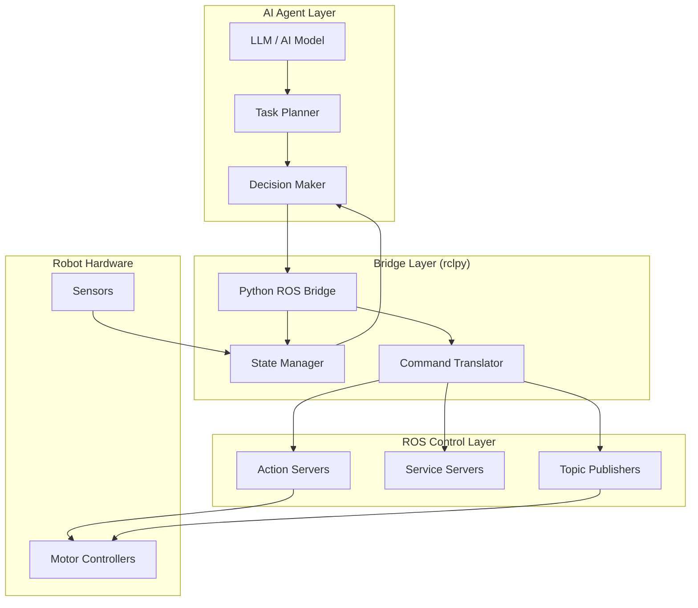

# Bridging Python AI Agents to ROS Controllers

## Introduction

Modern humanoid robots require **intelligent decision-making** combined with **precise physical control**. This chapter shows how to integrate AI agents (using LLMs, reinforcement learning, or classical AI) with ROS 2 controllers using `rclpy`. You'll learn to build systems where AI makes high-level decisions while ROS handles low-level robot control.

## Architecture Overview



---

## Why Bridge AI and ROS?

### AI Agent Strengths:
- High-level reasoning and planning
- Natural language understanding
- Learning from experience
- Handling uncertainty

### ROS Controller Strengths:
- Real-time motor control
- Sensor data processing
- Safety guarantees
- Hardware abstraction

### The Bridge:
- Translates AI decisions to robot actions
- Manages state between AI and hardware
- Handles timing and synchronization
- Provides feedback to AI

---

## Pattern 1: LLM-Based Task Planner

### Use Case: Natural Language Robot Control

"Walk to the kitchen and pick up the cup"

### Implementation

```python
#!/usr/bin/env python3
"""
LLM-based task planner that translates natural language to ROS actions
"""

import rclpy
from rclpy.node import Node
from rclpy.action import ActionClient
from std_msgs.msg import String
from geometry_msgs.msg import PoseStamped
import openai
import json

class LLMTaskPlanner(Node):
    """
    Bridges OpenAI GPT with ROS 2 action servers for humanoid control.
    """
    
    def __init__(self):
        super().__init__('llm_task_planner')
        
        # Parameters
        self.declare_parameter('openai_api_key', '')
        self.declare_parameter('model', 'gpt-4')
        
        api_key = self.get_parameter('openai_api_key').value
        model = self.get_parameter('model').value
        
        # Initialize OpenAI client
        self.client = openai.Client(api_key=api_key)
        self.model = model
        
        # Subscribe to voice commands
        self.command_sub = self.create_subscription(
            String,
            'voice_command',
            self.command_callback,
            10
        )
        
        # Action clients for robot control
        self.nav_client = ActionClient(self, NavigateToPoint, 'navigate_to_point')
        self.manip_client = ActionClient(self, PickObject, 'pick_object')
        
        # Publisher for status updates
        self.status_pub = self.create_publisher(String, 'task_status', 10)
        
        # System prompt for the LLM
        self.system_prompt = """You are a robot task planner. Convert natural language commands into structured robot actions.

Available actions:
1. navigate(x, y, theta) - Move to position
2. pick(object_name) - Pick up an object
3. place(object_name, x, y) - Place object at location
4. wait(duration) - Wait for specified seconds

Respond with JSON array of actions. Example:
{"actions": [
    {"type": "navigate", "x": 5.0, "y": 2.0, "theta": 0.0},
    {"type": "pick", "object": "cup"},
    {"type": "navigate", "x": 0.0, "y": 0.0, "theta": 0.0}
]}"""
        
        self.get_logger().info('LLM Task Planner initialized')
    
    def command_callback(self, msg):
        """Process incoming voice command"""
        command = msg.data
        self.get_logger().info(f'Received command: {command}')
        
        # Get task plan from LLM
        task_plan = self.get_task_plan(command)
        
        if task_plan:
            self.execute_task_plan(task_plan)
        else:
            self.get_logger().error('Failed to generate task plan')
    
    def get_task_plan(self, command):
        """
        Use LLM to convert natural language to structured actions.
        
        Args:
            command (str): Natural language command
            
        Returns:
            dict: Structured task plan
        """
        try:
            response = self.client.chat.completions.create(
                model=self.model,
                messages=[
                    {"role": "system", "content": self.system_prompt},
                    {"role": "user", "content": command}
                ],
                temperature=0.3,  # Lower temperature for more deterministic output
                response_format={"type": "json_object"}
            )
            
            # Parse JSON response
            plan_json = response.choices[0].message.content
            plan = json.loads(plan_json)
            
            self.get_logger().info(f'Generated plan: {plan}')
            return plan
            
        except Exception as e:
            self.get_logger().error(f'LLM error: {str(e)}')
            return None
    
    def execute_task_plan(self, plan):
        """
        Execute the task plan by calling appropriate ROS actions.
        
        Args:
            plan (dict): Task plan with list of actions
        """
        actions = plan.get('actions', [])
        
        for i, action in enumerate(actions):
            action_type = action.get('type')
            
            self.publish_status(f'Executing action {i+1}/{len(actions)}: {action_type}')
            
            if action_type == 'navigate':
                self.execute_navigate(action)
            elif action_type == 'pick':
                self.execute_pick(action)
            elif action_type == 'place':
                self.execute_place(action)
            elif action_type == 'wait':
                self.execute_wait(action)
            else:
                self.get_logger().warn(f'Unknown action type: {action_type}')
    
    def execute_navigate(self, action):
        """Execute navigation action"""
        goal = NavigateToPoint.Goal()
        goal.target_x = action['x']
        goal.target_y = action['y']
        goal.target_theta = action.get('theta', 0.0)
        
        self.get_logger().info(f'Navigating to ({goal.target_x}, {goal.target_y})')
        
        # Send goal and wait for result
        future = self.nav_client.send_goal_async(goal)
        rclpy.spin_until_future_complete(self, future)
        
        goal_handle = future.result()
        if goal_handle.accepted:
            result_future = goal_handle.get_result_async()
            rclpy.spin_until_future_complete(self, result_future)
            
            result = result_future.result().result
            if result.success:
                self.get_logger().info('Navigation completed successfully')
            else:
                self.get_logger().error(f'Navigation failed: {result.message}')
    
    def execute_pick(self, action):
        """Execute pick action"""
        goal = PickObject.Goal()
        goal.object_name = action['object']
        
        self.get_logger().info(f'Picking object: {goal.object_name}')
        
        future = self.manip_client.send_goal_async(goal)
        rclpy.spin_until_future_complete(self, future)
        
        # Handle result...
    
    def publish_status(self, status):
        """Publish task status"""
        msg = String()
        msg.data = status
        self.status_pub.publish(msg)
        self.get_logger().info(status)

def main(args=None):
    rclpy.init(args=args)
    planner = LLMTaskPlanner()
    
    try:
        rclpy.spin(planner)
    except KeyboardInterrupt:
        pass
    finally:
        planner.destroy_node()
        rclpy.shutdown()

if __name__ == '__main__':
    main()
```

---

## Pattern 2: Reinforcement Learning Agent

### Use Case: Learned Locomotion Control

```python
#!/usr/bin/env python3
"""
RL agent for humanoid locomotion integrated with ROS 2
"""

import rclpy
from rclpy.node import Node
from sensor_msgs.msg import JointState, Imu
from std_msgs.msg import Float64MultiArray
import numpy as np
import torch
import torch.nn as nn

class RLLocomotionController(Node):
    """
    Reinforcement learning agent for bipedal walking.
    Trained in simulation, deployed via ROS 2.
    """
    
    def __init__(self):
        super().__init__('rl_locomotion_controller')
        
        # Load trained RL model
        self.declare_parameter('model_path', 'models/locomotion_policy.pth')
        model_path = self.get_parameter('model_path').value
        
        self.policy = self.load_policy(model_path)
        self.policy.eval()  # Set to evaluation mode
        
        # State variables
        self.joint_positions = None
        self.joint_velocities = None
        self.imu_data = None
        self.target_velocity = 0.5  # m/s
        
        # Subscribers for sensor data
        self.joint_sub = self.create_subscription(
            JointState,
            'joint_states',
            self.joint_callback,
            10
        )
        
        self.imu_sub = self.create_subscription(
            Imu,
            'imu/data',
            self.imu_callback,
            10
        )
        
        # Publisher for joint commands
        self.cmd_pub = self.create_publisher(
            Float64MultiArray,
            'joint_commands',
            10
        )
        
        # Control loop timer (50 Hz)
        self.control_timer = self.create_timer(0.02, self.control_loop)
        
        self.get_logger().info('RL Locomotion Controller initialized')
    
    def load_policy(self, model_path):
        """Load trained PyTorch policy network"""
        class PolicyNetwork(nn.Module):
            def __init__(self, state_dim=30, action_dim=12):
                super().__init__()
                self.fc1 = nn.Linear(state_dim, 256)
                self.fc2 = nn.Linear(256, 256)
                self.fc3 = nn.Linear(256, action_dim)
                
            def forward(self, x):
                x = torch.relu(self.fc1(x))
                x = torch.relu(self.fc2(x))
                return torch.tanh(self.fc3(x))
        
        policy = PolicyNetwork()
        policy.load_state_dict(torch.load(model_path))
        return policy
    
    def joint_callback(self, msg):
        """Update joint state"""
        self.joint_positions = np.array(msg.position)
        self.joint_velocities = np.array(msg.velocity)
    
    def imu_callback(self, msg):
        """Update IMU data"""
        self.imu_data = {
            'angular_velocity': np.array([
                msg.angular_velocity.x,
                msg.angular_velocity.y,
                msg.angular_velocity.z
            ]),
            'linear_acceleration': np.array([
                msg.linear_acceleration.x,
                msg.linear_acceleration.y,
                msg.linear_acceleration.z
            ])
        }
    
    def get_observation(self):
        """
        Construct observation vector for RL policy.
        
        Returns:
            np.array: Observation vector
        """
        if self.joint_positions is None or self.imu_data is None:
            return None
        
        # Combine all sensor data into observation
        obs = np.concatenate([
            self.joint_positions,      # 12 joint positions
            self.joint_velocities,     # 12 joint velocities
            self.imu_data['angular_velocity'],  # 3 angular velocities
            self.imu_data['linear_acceleration'],  # 3 linear accelerations
            [self.target_velocity]     # 1 target velocity
        ])
        
        return obs
    
    def control_loop(self):
        """Main control loop - runs at 50 Hz"""
        obs = self.get_observation()
        
        if obs is None:
            return
        
        # Get action from RL policy
        with torch.no_grad():
            obs_tensor = torch.FloatTensor(obs).unsqueeze(0)
            action_tensor = self.policy(obs_tensor)
            action = action_tensor.squeeze(0).numpy()
        
        # Scale actions to joint torque limits
        max_torque = 50.0  # Nm
        joint_torques = action * max_torque
        
        # Publish joint commands
        cmd_msg = Float64MultiArray()
        cmd_msg.data = joint_torques.tolist()
        self.cmd_pub.publish(cmd_msg)
    
    def set_target_velocity(self, velocity):
        """Update target walking velocity"""
        self.target_velocity = velocity
        self.get_logger().info(f'Target velocity set to {velocity} m/s')

def main(args=None):
    rclpy.init(args=args)
    controller = RLLocomotionController()
    
    try:
        rclpy.spin(controller)
    except KeyboardInterrupt:
        pass
    finally:
        controller.destroy_node()
        rclpy.shutdown()

if __name__ == '__main__':
    main()
```

---

## Pattern 3: State Machine with AI Decision Making

### Use Case: Autonomous Behavior Coordination

```python
#!/usr/bin/env python3
"""
State machine that coordinates AI decisions with robot actions
"""

import rclpy
from rclpy.node import Node
from enum import Enum
import openai

class RobotState(Enum):
    IDLE = 0
    PLANNING = 1
    NAVIGATING = 2
    MANIPULATING = 3
    RECOVERING = 4

class AIStateMachine(Node):
    """
    State machine that uses AI for decision-making while
    coordinating ROS actions.
    """
    
    def __init__(self):
        super().__init__('ai_state_machine')
        
        # Initialize AI client
        self.ai_client = openai.Client(api_key='your-key')
        
        # Current state
        self.state = RobotState.IDLE
        self.task_queue = []
        
        # ROS interfaces
        self.setup_ros_interfaces()
        
        # State machine timer (10 Hz)
        self.sm_timer = self.create_timer(0.1, self.state_machine_update)
        
        self.get_logger().info('AI State Machine initialized')
    
    def setup_ros_interfaces(self):
        """Setup ROS publishers, subscribers, action clients"""
        # Implement ROS interface setup
        pass
    
    def state_machine_update(self):
        """Main state machine loop"""
        if self.state == RobotState.IDLE:
            self.handle_idle_state()
        elif self.state == RobotState.PLANNING:
            self.handle_planning_state()
        elif self.state == RobotState.NAVIGATING:
            self.handle_navigating_state()
        elif self.state == RobotState.MANIPULATING:
            self.handle_manipulating_state()
        elif self.state == RobotState.RECOVERING:
            self.handle_recovering_state()
    
    def handle_idle_state(self):
        """Handle IDLE state - wait for new tasks"""
        if self.task_queue:
            self.transition_to(RobotState.PLANNING)
    
    def handle_planning_state(self):
        """Use AI to plan next actions"""
        task = self.task_queue[0]
        
        # Use AI to generate plan
        plan = self.generate_ai_plan(task)
        
        if plan:
            self.execute_plan(plan)
            self.transition_to(RobotState.NAVIGATING)
        else:
            self.get_logger().error('Planning failed')
            self.transition_to(RobotState.RECOVERING)
    
    def generate_ai_plan(self, task):
        """Use AI to generate execution plan"""
        # Implement AI planning logic
        pass
    
    def transition_to(self, new_state):
        """Transition to new state"""
        self.get_logger().info(f'State transition: {self.state.name} -> {new_state.name}')
        self.state = new_state

def main(args=None):
    rclpy.init(args=args)
    sm = AIStateMachine()
    
    try:
        rclpy.spin(sm)
    except KeyboardInterrupt:
        pass
    finally:
        sm.destroy_node()
        rclpy.shutdown()

if __name__ == '__main__':
    main()
```

---

## Best Practices for AI-ROS Integration

### 1. Separate Concerns

```python
class AIDecisionMaker:
    """Pure AI logic - no ROS dependencies"""
    def make_decision(self, state):
        # AI logic here
        pass

class ROSBridge(Node):
    """ROS interface only"""
    def __init__(self):
        super().__init__('ros_bridge')
        self.ai = AIDecisionMaker()
        
    def sensor_callback(self, msg):
        state = self.extract_state(msg)
        decision = self.ai.make_decision(state)
        self.execute_decision(decision)
```

### 2. Handle Timing Carefully

```python
# AI inference might be slow
def control_loop(self):
    if self.ai_result_ready():
        action = self.get_ai_action()
    else:
        # Use last action or safe default
        action = self.last_action
    
    self.execute_action(action)
```

### 3. Implement Safety Checks

```python
def execute_ai_command(self, command):
    # Validate AI output before executing
    if not self.is_safe(command):
        self.get_logger().warn('Unsafe AI command rejected')
        return False
    
    if not self.is_feasible(command):
        self.get_logger().warn('Infeasible AI command')
        return False
    
    # Execute validated command
    self.execute(command)
    return True
```

### 4. Provide Rich Feedback

```python
class FeedbackManager:
    """Collect and format feedback for AI"""
    
    def get_state_summary(self):
        return {
            'robot_pose': self.get_pose(),
            'joint_states': self.get_joints(),
            'sensor_data': self.get_sensors(),
            'task_progress': self.get_progress(),
            'errors': self.get_errors()
        }
```

---

## Complete Integration Example

```python
#!/usr/bin/env python3
"""
Complete example: AI-driven humanoid robot controller
"""

import rclpy
from rclpy.node import Node
from rclpy.action import ActionClient
import openai
import json

class HumanoidAIController(Node):
    """
    Complete AI-ROS integration for humanoid robot control.
    Combines LLM planning, RL locomotion, and ROS actions.
    """
    
    def __init__(self):
        super().__init__('humanoid_ai_controller')
        
        # Initialize components
        self.llm_planner = LLMPlanner(self)
        self.rl_controller = RLController(self)
        self.safety_monitor = SafetyMonitor(self)
        
        # ROS interfaces
        self.setup_ros_interfaces()
        
        # Main control loop
        self.create_timer(0.05, self.control_loop)  # 20 Hz
        
        self.get_logger().info('Humanoid AI Controller ready')
    
    def control_loop(self):
        """Main control loop"""
        # 1. Check safety
        if not self.safety_monitor.is_safe():
            self.emergency_stop()
            return
        
        # 2. Get high-level plan from LLM (if needed)
        if self.needs_replanning():
            plan = self.llm_planner.get_plan()
            self.current_plan = plan
        
        # 3. Execute current action with RL controller
        if self.current_plan:
            action = self.current_plan.get_current_action()
            self.rl_controller.execute(action)
        
        # 4. Update state and provide feedback
        self.update_state()

def main(args=None):
    rclpy.init(args=args)
    controller = HumanoidAIController()
    
    try:
        rclpy.spin(controller)
    except KeyboardInterrupt:
        pass
    finally:
        controller.destroy_node()
        rclpy.shutdown()

if __name__ == '__main__':
    main()
```

---

## Summary

- AI agents provide high-level intelligence
- ROS 2 handles low-level robot control
- `rclpy` bridges the two layers
- Separate concerns for maintainability
- Implement safety checks
- Handle timing differences
- Provide rich feedback to AI

This integration enables truly intelligent humanoid robots that can understand natural language, learn from experience, and execute complex physical tasks.

---

## Further Reading

- [OpenAI API Documentation](https://platform.openai.com/docs)
- [PyTorch for Robotics](https://pytorch.org/tutorials/)
- [ROS 2 Action Servers](https://docs.ros.org/en/humble/Tutorials/Intermediate/Writing-an-Action-Server-Client/Py.html)
- [Stable Baselines3 (RL)](https://stable-baselines3.readthedocs.io/)
