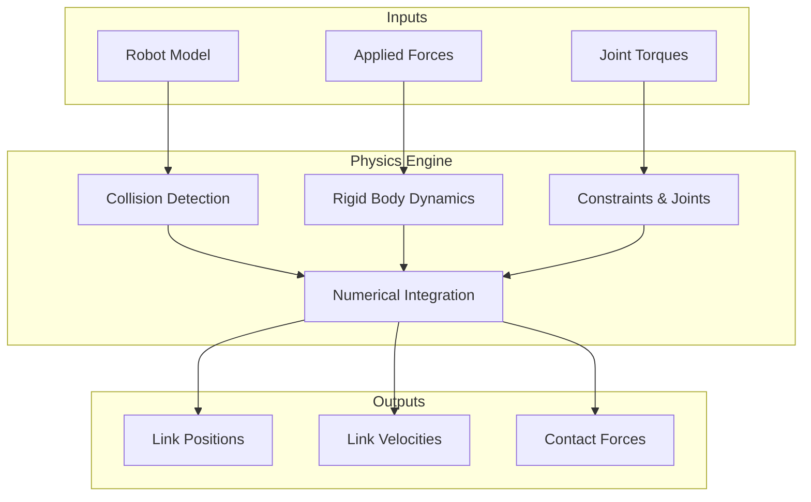

# Physics Simulation Fundamentals

## Introduction

Physics simulation is the backbone of robot development, enabling testing and training without hardware. Understanding physics engines is crucial for creating realistic digital twins. This chapter covers the fundamentals of physics simulation for humanoid robots.

## Physics Engine Overview



---

## Core Physics Concepts

### 1. Rigid Body Dynamics

**Newton's Second Law:**
```
F = ma  (Force = mass × acceleration)
τ = Iα  (Torque = inertia × angular acceleration)
```

**Implementation in Gazebo:**

```python
#!/usr/bin/env python3
import rclpy
from rclpy.node import Node
from gazebo_msgs.srv import ApplyBodyWrench
from geometry_msgs.msg import Wrench, Point

class PhysicsController(Node):
    """
    Apply forces and torques to robot in simulation.
    """
    
    def __init__(self):
        super().__init__('physics_controller')
        
        # Service client for applying forces
        self.wrench_client = self.create_client(
            ApplyBodyWrench,
            '/gazebo/apply_body_wrench'
        )
        
        self.get_logger().info('Physics Controller initialized')
    
    def apply_force(self, body_name, force, duration=1.0):
        """
        Apply force to a link.
        
        Args:
            body_name: Name of the link
            force: Force vector [x, y, z] in Newtons
            duration: Duration to apply force (seconds)
        """
        request = ApplyBodyWrench.Request()
        request.body_name = body_name
        request.reference_frame = 'world'
        
        # Set force
        request.wrench = Wrench()
        request.wrench.force.x = force[0]
        request.wrench.force.y = force[1]
        request.wrench.force.z = force[2]
        
        # Set duration
        request.duration.sec = int(duration)
        request.duration.nanosec = int((duration % 1) * 1e9)
        
        # Apply
        future = self.wrench_client.call_async(request)
        rclpy.spin_until_future_complete(self, future)
        
        if future.result().success:
            self.get_logger().info(f'Applied force to {body_name}')
        else:
            self.get_logger().error(f'Failed to apply force: {future.result().status_message}')
    
    def apply_torque(self, body_name, torque, duration=1.0):
        """
        Apply torque to a link.
        
        Args:
            body_name: Name of the link
            torque: Torque vector [x, y, z] in Nm
            duration: Duration (seconds)
        """
        request = ApplyBodyWrench.Request()
        request.body_name = body_name
        request.reference_frame = 'world'
        
        # Set torque
        request.wrench = Wrench()
        request.wrench.torque.x = torque[0]
        request.wrench.torque.y = torque[1]
        request.wrench.torque.z = torque[2]
        
        request.duration.sec = int(duration)
        request.duration.nanosec = int((duration % 1) * 1e9)
        
        future = self.wrench_client.call_async(request)
        rclpy.spin_until_future_complete(self, future)

def main(args=None):
    rclpy.init(args=args)
    controller = PhysicsController()
    
    # Example: Apply upward force to torso
    controller.apply_force('torso', [0, 0, 100], duration=0.5)
    
    controller.destroy_node()
    rclpy.shutdown()

if __name__ == '__main__':
    main()
```

---

### 2. Collision Detection

**Collision Shapes:**
- **Primitive:** Box, sphere, cylinder (fast)
- **Mesh:** Complex geometry (slow but accurate)
- **Convex hull:** Simplified mesh (balanced)

**Configuring Collisions:**

```xml
<link name="torso">
  <!-- Visual (what you see) -->
  <visual>
    <geometry>
      <mesh filename="package://robot_description/meshes/torso.dae"/>
    </geometry>
  </visual>
  
  <!-- Collision (simplified for performance) -->
  <collision>
    <geometry>
      <box size="0.3 0.2 0.5"/>
    </geometry>
  </collision>
</link>
```

**Collision Filtering:**

```xml
<gazebo reference="left_foot">
  <collision>
    <surface>
      <contact>
        <collide_bitmask>0x01</collide_bitmask>
      </contact>
    </surface>
  </collision>
</gazebo>

<gazebo reference="right_foot">
  <collision>
    <surface>
      <contact>
        <collide_bitmask>0x01</collide_bitmask>
      </contact>
    </surface>
  </collision>
</gazebo>

<!-- Prevent feet from colliding with each other -->
<gazebo>
  <collision>
    <surface>
      <contact>
        <collide_without_contact_bitmask>0x02</collide_without_contact_bitmask>
      </contact>
    </surface>
  </collision>
</gazebo>
```

---

### 3. Contact Dynamics

**Contact Parameters:**
- **Friction:** Resistance to sliding
- **Restitution:** Bounciness (0 = no bounce, 1 = perfect bounce)
- **Stiffness:** Contact spring constant
- **Damping:** Contact damping

**Configuration:**

```xml
<gazebo reference="left_foot">
  <collision>
    <surface>
      <friction>
        <ode>
          <mu>0.9</mu>   <!-- Friction coefficient -->
          <mu2>0.9</mu2>
        </ode>
      </friction>
      <contact>
        <ode>
          <kp>1000000.0</kp>  <!-- Stiffness -->
          <kd>1.0</kd>         <!-- Damping -->
          <max_vel>0.01</max_vel>
          <min_depth>0.001</min_depth>
        </ode>
      </contact>
      <bounce>
        <restitution_coefficient>0.0</restitution_coefficient>
      </bounce>
    </surface>
  </collision>
</gazebo>
```

---

### 4. Numerical Integration

**Common Methods:**
- **Euler:** Simple, fast, unstable
- **Runge-Kutta (RK4):** More accurate, slower
- **Symplectic:** Energy-conserving

**Gazebo Configuration:**

```xml
<physics type="ode">
  <max_step_size>0.001</max_step_size>  <!-- 1ms timestep -->
  <real_time_factor>1.0</real_time_factor>
  <real_time_update_rate>1000.0</real_time_update_rate>
  
  <ode>
    <solver>
      <type>quick</type>  <!-- or 'world' for more accuracy -->
      <iters>50</iters>
      <sor>1.3</sor>
    </solver>
    <constraints>
      <cfm>0.0</cfm>
      <erp>0.2</erp>
      <contact_max_correcting_vel>100.0</contact_max_correcting_vel>
      <contact_surface_layer>0.001</contact_surface_layer>
    </constraints>
  </ode>
</physics>
```

---

## Tuning Physics for Stability

### Problem: Robot Falls Through Floor

**Causes:**
- Timestep too large
- Contact stiffness too low
- Collision mesh issues

**Solutions:**

```xml
<!-- Reduce timestep -->
<max_step_size>0.0005</max_step_size>  <!-- 0.5ms instead of 1ms -->

<!-- Increase contact stiffness -->
<kp>10000000.0</kp>  <!-- 10x higher -->

<!-- Ensure proper collision geometry -->
<collision>
  <geometry>
    <box size="0.2 0.1 0.05"/>  <!-- Proper size -->
  </geometry>
</collision>
```

### Problem: Simulation Too Slow

**Causes:**
- Complex collision meshes
- Too many contacts
- Small timestep

**Solutions:**

```xml
<!-- Simplify collision geometry -->
<collision>
  <geometry>
    <box size="..."/>  <!-- Use primitives instead of meshes -->
  </geometry>
</collision>

<!-- Increase timestep (carefully) -->
<max_step_size>0.002</max_step_size>

<!-- Reduce solver iterations -->
<iters>20</iters>  <!-- Instead of 50 -->
```

### Problem: Robot Unstable/Jittery

**Causes:**
- Joint damping too low
- Contact parameters not tuned
- Numerical instability

**Solutions:**

```xml
<!-- Increase joint damping -->
<joint name="knee_joint">
  <dynamics damping="1.0" friction="0.1"/>  <!-- Higher damping -->
</joint>

<!-- Tune contact parameters -->
<kd>10.0</kd>  <!-- Higher damping -->
<erp>0.2</erp>  <!-- Error reduction parameter -->
```

---

## Physics Engine Comparison

| Engine | Simulator | Speed | Accuracy | Features |
|--------|-----------|-------|----------|----------|
| **ODE** | Gazebo Classic | Fast | Medium | Good for rigid bodies |
| **Bullet** | Gazebo, PyBullet | Fast | Medium | Soft bodies, cloth |
| **DART** | Gazebo | Medium | High | Precise contact |
| **PhysX** | Isaac Sim | Very Fast | High | GPU acceleration |
| **MuJoCo** | MuJoCo | Fast | Very High | Optimal control |

---

## Advanced: Custom Physics Plugin

```cpp
// Gazebo plugin for custom physics
#include <gazebo/gazebo.hh>
#include <gazebo/physics/physics.hh>

namespace gazebo
{
  class CustomPhysicsPlugin : public WorldPlugin
  {
    public: void Load(physics::WorldPtr _world, sdf::ElementPtr _sdf)
    {
      // Get physics engine
      this->world = _world;
      this->physics = _world->Physics();
      
      // Set custom parameters
      this->physics->SetGravity(ignition::math::Vector3d(0, 0, -9.81));
      
      // Connect to update event
      this->updateConnection = event::Events::ConnectWorldUpdateBegin(
        std::bind(&CustomPhysicsPlugin::OnUpdate, this));
    }
    
    private: void OnUpdate()
    {
      // Custom physics logic every timestep
      // E.g., apply custom forces, modify contacts, etc.
    }
    
    private: physics::WorldPtr world;
    private: physics::PhysicsEnginePtr physics;
    private: event::ConnectionPtr updateConnection;
  };
  
  GZ_REGISTER_WORLD_PLUGIN(CustomPhysicsPlugin)
}
```

---

## Summary

- **Rigid body dynamics:** F=ma, τ=Iα
- **Collision detection:** Primitive shapes for performance
- **Contact dynamics:** Friction, restitution, stiffness
- **Numerical integration:** Timestep crucial for stability
- **Tuning:** Balance accuracy vs. speed
- **Engine choice:** Depends on application needs

Understanding physics simulation fundamentals enables creating realistic digital twins for effective robot development.

---

## Further Reading

- [Gazebo Physics](http://gazebosim.org/tutorials?cat=physics)
- [ODE Documentation](https://www.ode.org/)
- [Bullet Physics](https://pybullet.org/)
- [MuJoCo Documentation](https://mujoco.readthedocs.io/)
