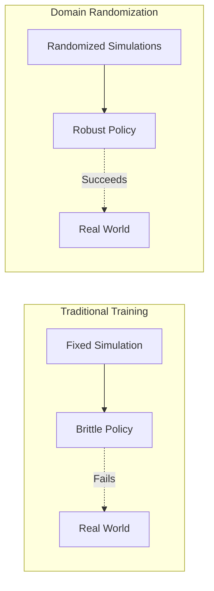

# Domain Randomization Techniques

## Introduction

**Domain Randomization** is a technique to train robust policies by exposing them to a wide variety of simulated conditions. By randomizing physics parameters, visual appearance, and sensor noise, policies learn to handle the variability of the real world.

## Core Concept



**Key Insight:** If a policy works across many randomized simulations, it's likely to work in the real world (which is just one more variation).

---

## What to Randomize

### 1. Physics Parameters

```python
import random
import numpy as np

class PhysicsRandomizer:
    """
    Randomizes physics parameters in simulation.
    """
    
    def __init__(self):
        # Randomization ranges
        self.ranges = {
            'gravity': (9.5, 10.2),
            'friction': (0.5, 1.5),
            'mass_scale': (0.9, 1.1),
            'joint_damping_scale': (0.8, 1.2),
            'timestep': (0.0008, 0.0012)
        }
    
    def randomize_all(self):
        """Randomize all physics parameters"""
        params = {}
        
        for param, (min_val, max_val) in self.ranges.items():
            params[param] = random.uniform(min_val, max_val)
        
        return params
    
    def apply_to_gazebo(self, params):
        """Apply randomized parameters to Gazebo"""
        # Set gravity
        self.set_gravity(params['gravity'])
        
        # Scale all link masses
        self.scale_masses(params['mass_scale'])
        
        # Scale joint damping
        self.scale_joint_damping(params['joint_damping_scale'])
        
        # Set friction for all surfaces
        self.set_friction(params['friction'])
```

### 2. Visual Appearance

```python
class VisualRandomizer:
    """
    Randomizes visual appearance of objects and environment.
    """
    
    def randomize_colors(self):
        """Randomize object colors"""
        for obj in self.scene_objects:
            # Random RGB
            r = random.uniform(0, 1)
            g = random.uniform(0, 1)
            b = random.uniform(0, 1)
            
            self.set_object_color(obj, (r, g, b, 1.0))
    
    def randomize_textures(self):
        """Randomize surface textures"""
        texture_library = [
            'wood', 'metal', 'plastic', 'concrete', 'carpet'
        ]
        
        for surface in self.surfaces:
            texture = random.choice(texture_library)
            self.set_surface_texture(surface, texture)
    
    def randomize_lighting(self):
        """Randomize lighting conditions"""
        # Ambient light intensity
        ambient = random.uniform(0.3, 0.8)
        self.set_ambient_light(ambient)
        
        # Directional light angle
        azimuth = random.uniform(0, 2*np.pi)
        elevation = random.uniform(0, np.pi/2)
        self.set_sun_angle(azimuth, elevation)
        
        # Light color temperature
        temp = random.uniform(3000, 6500)  # Kelvin
        self.set_light_temperature(temp)
```

### 3. Sensor Noise

```python
class SensorRandomizer:
    """
    Adds realistic noise to sensor data.
    """
    
    def randomize_camera(self, image):
        """Add camera noise"""
        # Gaussian noise
        noise = np.random.normal(0, 5, image.shape)
        noisy_image = np.clip(image + noise, 0, 255)
        
        # Random exposure
        exposure = random.uniform(0.8, 1.2)
        noisy_image = np.clip(noisy_image * exposure, 0, 255)
        
        # Random blur
        if random.random() < 0.3:
            kernel_size = random.choice([3, 5])
            noisy_image = cv2.GaussianBlur(noisy_image, (kernel_size, kernel_size), 0)
        
        return noisy_image.astype(np.uint8)
    
    def randomize_imu(self, imu_data):
        """Add IMU noise"""
        # Gyroscope noise (rad/s)
        gyro_noise = np.random.normal(0, 0.01, 3)
        imu_data['angular_velocity'] += gyro_noise
        
        # Accelerometer noise (m/s²)
        accel_noise = np.random.normal(0, 0.1, 3)
        imu_data['linear_acceleration'] += accel_noise
        
        # Random bias drift
        if random.random() < 0.1:
            bias = np.random.normal(0, 0.005, 3)
            imu_data['angular_velocity'] += bias
        
        return imu_data
    
    def randomize_lidar(self, ranges):
        """Add LiDAR noise"""
        # Gaussian noise on ranges
        noise = np.random.normal(0, 0.01, len(ranges))
        noisy_ranges = ranges + noise
        
        # Random dropouts
        dropout_prob = 0.05
        dropout_mask = np.random.random(len(ranges)) > dropout_prob
        noisy_ranges = noisy_ranges * dropout_mask
        
        # Clip to valid range
        noisy_ranges = np.clip(noisy_ranges, 0.1, 30.0)
        
        return noisy_ranges
```

---

## Complete Domain Randomization System

```python
#!/usr/bin/env python3
"""
Complete domain randomization system for training robust policies.
"""

import rclpy
from rclpy.node import Node
from gazebo_msgs.srv import SetPhysicsProperties, SetModelState
import random
import numpy as np

class DomainRandomizationManager(Node):
    """
    Manages all aspects of domain randomization.
    """
    
    def __init__(self):
        super().__init__('domain_randomization_manager')
        
        # Randomizers
        self.physics_randomizer = PhysicsRandomizer()
        self.visual_randomizer = VisualRandomizer()
        self.sensor_randomizer = SensorRandomizer()
        
        # Randomization schedule
        self.declare_parameter('randomize_every_n_episodes', 1)
        self.randomize_interval = self.get_parameter('randomize_every_n_episodes').value
        
        self.episode_count = 0
        
        # Service clients
        self.setup_service_clients()
        
        self.get_logger().info('Domain Randomization Manager initialized')
    
    def setup_service_clients(self):
        """Setup Gazebo service clients"""
        self.physics_client = self.create_client(
            SetPhysicsProperties,
            '/gazebo/set_physics_properties'
        )
        
        self.model_state_client = self.create_client(
            SetModelState,
            '/gazebo/set_model_state'
        )
    
    def on_episode_start(self):
        """Called at the start of each training episode"""
        self.episode_count += 1
        
        if self.episode_count % self.randomize_interval == 0:
            self.randomize_environment()
    
    def randomize_environment(self):
        """Randomize all aspects of the environment"""
        self.get_logger().info(f'Randomizing environment (episode {self.episode_count})')
        
        # 1. Randomize physics
        physics_params = self.physics_randomizer.randomize_all()
        self.apply_physics_params(physics_params)
        
        # 2. Randomize visual appearance
        self.visual_randomizer.randomize_colors()
        self.visual_randomizer.randomize_textures()
        self.visual_randomizer.randomize_lighting()
        
        # 3. Randomize object positions
        self.randomize_object_positions()
        
        # 4. Randomize robot initial state
        self.randomize_robot_state()
        
        self.get_logger().info('Environment randomization complete')
    
    def apply_physics_params(self, params):
        """Apply physics parameters to Gazebo"""
        request = SetPhysicsProperties.Request()
        
        # Set gravity
        request.gravity.z = -params['gravity']
        
        # Set timestep
        request.time_step = params['timestep']
        
        # Set solver parameters
        request.max_update_rate = 1000.0
        
        # Call service
        future = self.physics_client.call_async(request)
        rclpy.spin_until_future_complete(self, future)
        
        if future.result().success:
            self.get_logger().info(f'Applied physics params: {params}')
    
    def randomize_object_positions(self):
        """Randomize positions of objects in scene"""
        objects = ['box_1', 'box_2', 'cylinder_1']
        
        for obj_name in objects:
            # Random position within bounds
            x = random.uniform(-2.0, 2.0)
            y = random.uniform(-2.0, 2.0)
            z = random.uniform(0.5, 1.5)
            
            # Random orientation
            yaw = random.uniform(0, 2*np.pi)
            
            self.set_model_pose(obj_name, x, y, z, 0, 0, yaw)
    
    def randomize_robot_state(self):
        """Randomize robot's initial state"""
        # Random position
        x = random.uniform(-0.5, 0.5)
        y = random.uniform(-0.5, 0.5)
        
        # Random orientation
        yaw = random.uniform(-np.pi/4, np.pi/4)
        
        self.set_model_pose('humanoid_robot', x, y, 1.0, 0, 0, yaw)
    
    def set_model_pose(self, model_name, x, y, z, roll, pitch, yaw):
        """Set model pose in Gazebo"""
        request = SetModelState.Request()
        request.model_state.model_name = model_name
        
        # Position
        request.model_state.pose.position.x = x
        request.model_state.pose.position.y = y
        request.model_state.pose.position.z = z
        
        # Orientation (convert RPY to quaternion)
        from scipy.spatial.transform import Rotation
        quat = Rotation.from_euler('xyz', [roll, pitch, yaw]).as_quat()
        request.model_state.pose.orientation.x = quat[0]
        request.model_state.pose.orientation.y = quat[1]
        request.model_state.pose.orientation.z = quat[2]
        request.model_state.pose.orientation.w = quat[3]
        
        # Call service
        future = self.model_state_client.call_async(request)
        rclpy.spin_until_future_complete(self, future)

def main(args=None):
    rclpy.init(args=args)
    manager = DomainRandomizationManager()
    
    # Simulate training loop
    for episode in range(100):
        manager.on_episode_start()
        # ... training code ...
        time.sleep(1)  # Simulate episode
    
    manager.destroy_node()
    rclpy.shutdown()

if __name__ == '__main__':
    main()
```

---

## Automatic Domain Randomization (ADR)

**Concept:** Automatically adjust randomization ranges based on policy performance.

```python
class AutomaticDomainRandomization:
    """
    Automatically adjusts randomization ranges.
    """
    
    def __init__(self):
        # Initial ranges
        self.ranges = {
            'gravity': {'min': 9.8, 'max': 9.8, 'delta': 0.1},
            'friction': {'min': 0.8, 'max': 0.8, 'delta': 0.1},
        }
        
        # Performance threshold
        self.success_threshold = 0.9
        
        # History
        self.performance_history = []
    
    def update_ranges(self, success_rate):
        """
        Update randomization ranges based on performance.
        
        Args:
            success_rate: Success rate in current randomization range
        """
        if success_rate > self.success_threshold:
            # Policy is doing well, increase randomization
            for param in self.ranges:
                self.ranges[param]['min'] -= self.ranges[param]['delta']
                self.ranges[param]['max'] += self.ranges[param]['delta']
            
            self.get_logger().info('Increased randomization ranges')
        else:
            # Policy struggling, decrease randomization
            for param in self.ranges:
                self.ranges[param]['min'] += self.ranges[param]['delta'] / 2
                self.ranges[param]['max'] -= self.ranges[param]['delta'] / 2
            
            self.get_logger().info('Decreased randomization ranges')
```

---

## Best Practices

### ✅ DO:

1. **Start Conservative**
   - Begin with small randomization ranges
   - Gradually increase as policy improves

2. **Randomize What Matters**
   - Focus on parameters that vary in reality
   - Don't randomize everything blindly

3. **Monitor Performance**
   - Track success rate vs. randomization level
   - Use ADR for automatic tuning

4. **Test Systematically**
   - Ablation studies to find important parameters
   - Measure sim-to-real gap

### ❌ DON'T:

1. **Don't Over-Randomize**
   - Too much randomization makes learning impossible
   - Policy may become overly conservative

2. **Don't Ignore Correlations**
   - Some parameters are correlated (e.g., mass and friction)
   - Randomize them together

3. **Don't Forget Validation**
   - Always validate on real robot
   - Simulation is not reality

---

## Summary

- **Domain randomization** trains robust policies
- **Randomize:** Physics, visuals, sensors, initial conditions
- **ADR:** Automatically adjusts ranges based on performance
- **Balance:** Too little = brittle, too much = can't learn
- **Validate:** Always test on real hardware

Domain randomization is a powerful technique for bridging the sim-to-real gap.

---

## Further Reading

- [Domain Randomization for Transferring Deep Neural Networks](https://arxiv.org/abs/1703.06907)
- [Automatic Domain Randomization](https://arxiv.org/abs/1910.07113)
- [Sim-to-Real Transfer in Robotics](https://arxiv.org/abs/1812.07252)
