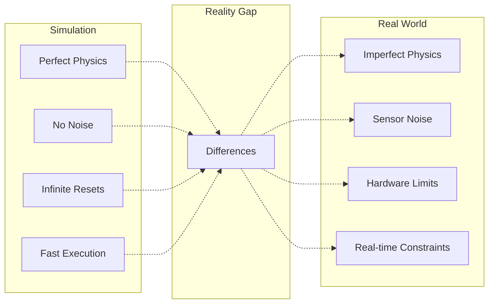
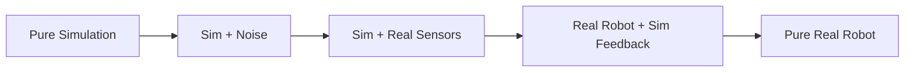

# Sim-to-Real Transfer

## Introduction

**Sim-to-Real Transfer** is the process of deploying robot controllers trained in simulation to real hardware. This is one of the most critical challenges in Physical AI - bridging the **reality gap** between perfect simulations and the messy real world. This chapter covers techniques to minimize this gap and successfully transfer learned behaviors.

## The Reality Gap



### Common Sources of Reality Gap

| Aspect | Simulation | Reality | Impact |
|--------|-----------|---------|---------|
| **Physics** | Simplified models | Complex dynamics | High |
| **Sensors** | Perfect data | Noisy, delayed | High |
| **Actuators** | Instant response | Delays, backlash | Medium |
| **Environment** | Controlled | Variable | Medium |
| **Timing** | Flexible | Real-time | High |

---

## Strategy 1: Domain Randomization

### Concept

Randomize simulation parameters during training so the policy learns to be robust to variations.

### Implementation in Gazebo

```python
#!/usr/bin/env python3
"""
Domain randomization for Gazebo simulation
"""

import rclpy
from rclpy.node import Node
from gazebo_msgs.srv import SetPhysicsProperties, SetModelState
from geometry_msgs.msg import Vector3
import random

class DomainRandomizer(Node):
    """
    Randomizes physics and environment parameters in Gazebo.
    """
    
    def __init__(self):
        super().__init__('domain_randomizer')
        
        # Service clients
        self.physics_client = self.create_client(
            SetPhysicsProperties,
            '/gazebo/set_physics_properties'
        )
        
        # Randomization parameters
        self.gravity_range = (9.5, 10.0)  # m/s²
        self.friction_range = (0.5, 1.5)
        self.mass_scale_range = (0.9, 1.1)
        
        # Randomize every episode
        self.create_timer(30.0, self.randomize_environment)
        
        self.get_logger().info('Domain Randomizer initialized')
    
    def randomize_environment(self):
        """Randomize simulation parameters"""
        # 1. Randomize gravity
        gravity = random.uniform(*self.gravity_range)
        self.set_gravity(gravity)
        
        # 2. Randomize friction
        friction = random.uniform(*self.friction_range)
        self.set_friction(friction)
        
        # 3. Randomize robot mass
        mass_scale = random.uniform(*self.mass_scale_range)
        self.scale_robot_mass(mass_scale)
        
        # 4. Randomize lighting (visual randomization)
        self.randomize_lighting()
        
        self.get_logger().info(
            f'Randomized: gravity={gravity:.2f}, '
            f'friction={friction:.2f}, mass_scale={mass_scale:.2f}'
        )
    
    def set_gravity(self, gravity_z):
        """Set gravity in simulation"""
        request = SetPhysicsProperties.Request()
        request.gravity = Vector3(x=0.0, y=0.0, z=-gravity_z)
        
        future = self.physics_client.call_async(request)
        # Handle response...
    
    def set_friction(self, friction):
        """Set surface friction coefficients"""
        # Implementation depends on Gazebo version
        pass
    
    def scale_robot_mass(self, scale):
        """Scale robot link masses"""
        # Implementation: modify URDF inertial properties
        pass
    
    def randomize_lighting(self):
        """Randomize lighting conditions"""
        # Change ambient light, shadows, etc.
        pass

def main(args=None):
    rclpy.init(args=args)
    randomizer = DomainRandomizer()
    rclpy.spin(randomizer)
    randomizer.destroy_node()
    rclpy.shutdown()

if __name__ == '__main__':
    main()
```

### What to Randomize

**Physics Parameters:**
- Gravity (±5%)
- Friction coefficients (±50%)
- Link masses (±10%)
- Joint damping (±30%)
- Contact parameters

**Visual Parameters:**
- Lighting intensity and direction
- Textures and colors
- Camera exposure and gain
- Background scenes

**Sensor Parameters:**
- Gaussian noise on measurements
- Sensor delays (0-50ms)
- Dropout/missing data
- Calibration offsets

---

## Strategy 2: System Identification

### Concept

Measure real robot parameters and update simulation to match reality.

### Implementation

```python
#!/usr/bin/env python3
"""
System identification for sim-to-real transfer
"""

import numpy as np
from scipy.optimize import minimize
import rclpy
from rclpy.node import Node

class SystemIdentifier(Node):
    """
    Identifies real robot parameters by comparing
    simulation predictions with real measurements.
    """
    
    def __init__(self):
        super().__init__('system_identifier')
        
        # Collect real robot data
        self.real_trajectories = []
        self.sim_trajectories = []
        
        self.get_logger().info('System Identifier initialized')
    
    def identify_parameters(self):
        """
        Optimize simulation parameters to match real data.
        """
        # Initial parameter guess
        initial_params = {
            'link_mass': 1.5,
            'joint_damping': 0.5,
            'friction_coef': 0.8
        }
        
        # Optimization
        result = minimize(
            self.objective_function,
            x0=list(initial_params.values()),
            method='Nelder-Mead',
            options={'maxiter': 100}
        )
        
        # Extract optimized parameters
        optimized_params = {
            'link_mass': result.x[0],
            'joint_damping': result.x[1],
            'friction_coef': result.x[2]
        }
        
        self.get_logger().info(f'Identified parameters: {optimized_params}')
        return optimized_params
    
    def objective_function(self, params):
        """
        Objective: minimize difference between sim and real.
        
        Args:
            params: [link_mass, joint_damping, friction_coef]
            
        Returns:
            float: Error metric
        """
        # Run simulation with these parameters
        sim_traj = self.run_simulation(params)
        
        # Compare with real trajectory
        error = np.mean((sim_traj - self.real_trajectories[0])**2)
        
        return error
    
    def run_simulation(self, params):
        """Run simulation with given parameters"""
        # Update simulation parameters
        # Run trajectory
        # Return simulated trajectory
        pass
    
    def collect_real_data(self):
        """Collect trajectory data from real robot"""
        # Execute predefined trajectory on real robot
        # Record joint positions, velocities, torques
        pass

def main(args=None):
    rclpy.init(args=args)
    identifier = SystemIdentifier()
    
    # Collect data
    identifier.collect_real_data()
    
    # Identify parameters
    params = identifier.identify_parameters()
    
    identifier.destroy_node()
    rclpy.shutdown()

if __name__ == '__main__':
    main()
```

---

## Strategy 3: Progressive Transfer

### Concept

Gradually transition from simulation to reality through intermediate steps.

### Implementation Pipeline



**Step 1:** Train in perfect simulation
**Step 2:** Add realistic noise and delays
**Step 3:** Use real sensor data with simulated actuators
**Step 4:** Use real robot with simulation safety net
**Step 5:** Deploy fully on real robot

---

## Strategy 4: Residual Learning

### Concept

Learn a correction policy that adapts simulation-trained policy to reality.

```python
class ResidualPolicy:
    """
    Combines simulation-trained policy with learned residual.
    """
    
    def __init__(self, sim_policy, residual_policy):
        self.sim_policy = sim_policy
        self.residual_policy = residual_policy
    
    def get_action(self, observation):
        # Get base action from simulation policy
        base_action = self.sim_policy(observation)
        
        # Get correction from residual policy
        residual = self.residual_policy(observation)
        
        # Combine
        final_action = base_action + residual
        
        return final_action
```

**Training:**
1. Train base policy in simulation
2. Deploy to real robot and collect data
3. Train residual policy to correct errors
4. Iterate

---

## Validation Strategies

### 1. Staged Validation

```python
class SimToRealValidator:
    """
    Validates sim-to-real transfer in stages.
    """
    
    def validate_stage_1_kinematics(self):
        """Test if robot reaches commanded positions"""
        test_positions = self.generate_test_positions()
        
        for pos in test_positions:
            sim_result = self.simulate_motion(pos)
            real_result = self.execute_real_motion(pos)
            
            error = np.linalg.norm(sim_result - real_result)
            
            if error > self.threshold:
                self.log_error(f'Kinematic error: {error}')
                return False
        
        return True
    
    def validate_stage_2_dynamics(self):
        """Test if robot follows dynamic trajectories"""
        # Test with varying speeds and accelerations
        pass
    
    def validate_stage_3_task(self):
        """Test if robot completes actual task"""
        # Execute full task and measure success rate
        pass
```

### 2. Safety Checks

```python
class SafetyMonitor:
    """
    Monitors robot during sim-to-real transfer.
    """
    
    def __init__(self):
        self.joint_limits = self.load_joint_limits()
        self.torque_limits = self.load_torque_limits()
        self.emergency_stop = False
    
    def check_safety(self, state, action):
        """
        Check if action is safe to execute.
        
        Returns:
            bool: True if safe, False otherwise
        """
        # Check joint limits
        if not self.check_joint_limits(state.positions):
            self.get_logger().error('Joint limit violation!')
            return False
        
        # Check torque limits
        if not self.check_torque_limits(action):
            self.get_logger().error('Torque limit violation!')
            return False
        
        # Check stability (e.g., IMU readings)
        if not self.check_stability(state.imu):
            self.get_logger().error('Unstable state detected!')
            return False
        
        return True
    
    def emergency_stop_robot(self):
        """Immediately stop all robot motion"""
        self.emergency_stop = True
        # Send zero torque commands
        # Engage brakes if available
```

---

## Best Practices

### ✅ DO:

1. **Start Simple**
   - Test basic movements first
   - Gradually increase complexity
   - Validate each stage

2. **Use Domain Randomization**
   - Randomize physics parameters
   - Add sensor noise
   - Vary environmental conditions

3. **Implement Safety Checks**
   - Joint limit monitoring
   - Torque limiting
   - Emergency stop capability

4. **Collect Real Data**
   - Record all real robot experiments
   - Use for system identification
   - Build dataset for residual learning

5. **Iterate**
   - Sim-to-real is iterative
   - Update simulation based on real data
   - Retrain policies with better sim

### ❌ DON'T:

1. **Don't Skip Validation**
   - Always validate in stages
   - Don't deploy untested policies

2. **Don't Ignore Differences**
   - Document all sim-real discrepancies
   - Update simulation accordingly

3. **Don't Rush**
   - Sim-to-real takes time
   - Safety is paramount

---

## Case Study: Humanoid Walking Transfer

### Problem
Policy trained in Isaac Sim for bipedal walking fails on real Unitree G1.

### Solution Process

**1. Identify Discrepancies**
```python
# Compare simulation vs reality
sim_step_height = 0.15  # m
real_step_height = 0.08  # m  <- Significant difference!

sim_step_time = 0.5  # s
real_step_time = 0.7  # s  <- Slower in reality
```

**2. Update Simulation**
- Increase joint damping (0.5 → 1.2)
- Add actuator delays (0ms → 20ms)
- Reduce max joint velocities

**3. Retrain with Randomization**
```python
# Add randomization ranges
joint_damping: [0.8, 1.5]
actuator_delay: [10ms, 30ms]
ground_friction: [0.6, 1.2]
```

**4. Progressive Deployment**
- Stage 1: Standing balance ✓
- Stage 2: Weight shifting ✓
- Stage 3: Single steps ✓
- Stage 4: Continuous walking ✓

**Result:** 85% success rate on real robot (vs 95% in sim)

---

## Tools and Frameworks

### Isaac Sim Domain Randomization

```python
from omni.isaac.core.utils.extensions import enable_extension
enable_extension("omni.isaac.dr")

from omni.isaac.dr import DomainRandomization

dr = DomainRandomization()
dr.randomize_physics_material(
    prim_path="/World/Ground",
    friction_range=(0.5, 1.5),
    restitution_range=(0.0, 0.3)
)
```

### Gazebo System Identification

```bash
# Record bag file of real robot
ros2 bag record /joint_states /imu/data

# Replay in simulation and compare
ros2 bag play real_robot.bag
```

---

## Summary

- Sim-to-real transfer bridges simulation and reality
- Domain randomization increases policy robustness
- System identification matches sim to real parameters
- Progressive transfer reduces risk
- Validation and safety are critical
- Iteration is key to success

Successful sim-to-real transfer enables rapid development in simulation while deploying to real robots safely and effectively.

---

## Further Reading

- [Sim-to-Real Transfer in Deep RL](https://arxiv.org/abs/1703.06907)
- [Domain Randomization for Transferring Deep Neural Networks](https://arxiv.org/abs/1703.06907)
- [Learning Dexterous In-Hand Manipulation](https://arxiv.org/abs/1808.00177) (OpenAI)
- [Isaac Sim Domain Randomization](https://docs.omniverse.nvidia.com/isaacsim/latest/features/domain_randomization.html)
