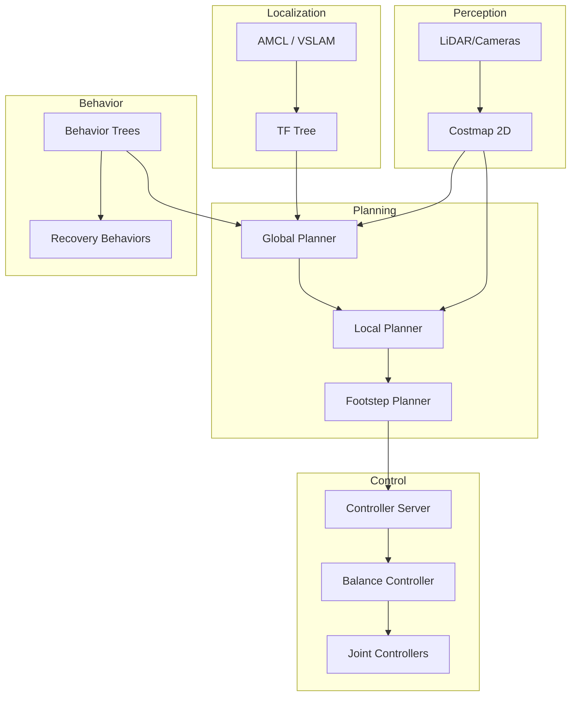

# Nav2 for Bipedal Navigation

## Introduction

**Nav2** (Navigation2) is the ROS 2 navigation stack that enables autonomous robot navigation. While originally designed for wheeled robots, Nav2 can be adapted for **bipedal humanoid robots** with special considerations for balance, footstep planning, and dynamic stability. This chapter shows how to configure Nav2 for humanoid locomotion.

## Nav2 Architecture for Humanoids



---

## Key Differences: Wheeled vs. Bipedal Navigation

| Aspect | Wheeled Robots | Bipedal Humanoids |
|--------|----------------|-------------------|
| **Motion** | Continuous | Discrete footsteps |
| **Stability** | Static | Dynamic |
| **Planning** | Path planning | Footstep planning |
| **Control** | Velocity commands | Joint trajectories |
| **Recovery** | Rotate in place | Complex balancing |
| **Speed** | Constant | Variable (gait-dependent) |

---

## Nav2 Installation and Setup

### 1. Install Nav2

```bash
# Install Nav2 packages
sudo apt install ros-humble-navigation2 ros-humble-nav2-bringup

# Install additional dependencies
sudo apt install ros-humble-slam-toolbox
sudo apt install ros-humble-robot-localization
```

### 2. Create Nav2 Configuration Package

```bash
cd ~/ros2_ws/src
ros2 pkg create --build-type ament_python humanoid_navigation \
  --dependencies rclpy nav2_msgs geometry_msgs tf2_ros

cd humanoid_navigation
mkdir -p config maps launch
```

---

## Configuring Nav2 for Humanoids

### 1. Robot Footprint

Define the robot's footprint (ground contact area):

`config/humanoid_footprint.yaml`:

```yaml
footprint: [
  [0.15, 0.10],   # Front-right
  [0.15, -0.10],  # Front-left
  [-0.15, -0.10], # Back-left
  [-0.15, 0.10]   # Back-right
]

# For circular approximation
robot_radius: 0.20  # meters
```

### 2. Costmap Configuration

`config/costmap_common.yaml`:

```yaml
costmap_common_params:
  footprint: "[[0.15, 0.10], [0.15, -0.10], [-0.15, -0.10], [-0.15, 0.10]]"
  robot_radius: 0.20
  
  # Obstacle layer
  obstacle_layer:
    enabled: True
    observation_sources: scan
    scan:
      topic: /scan
      max_obstacle_height: 2.0
      min_obstacle_height: 0.0
      obstacle_max_range: 5.0
      obstacle_min_range: 0.0
      raytrace_max_range: 6.0
      raytrace_min_range: 0.0
      clearing: True
      marking: True
      data_type: "LaserScan"
  
  # Inflation layer (larger for humanoids - need more clearance)
  inflation_layer:
    enabled: True
    inflation_radius: 0.55  # Larger than wheeled robots
    cost_scaling_factor: 3.0
  
  # Static layer
  static_layer:
    enabled: True
    map_topic: /map
```

### 3. Global Costmap

`config/global_costmap.yaml`:

```yaml
global_costmap:
  global_costmap:
    ros__parameters:
      update_frequency: 1.0
      publish_frequency: 1.0
      global_frame: map
      robot_base_frame: base_link
      use_sim_time: False
      
      resolution: 0.05
      track_unknown_space: True
      
      plugins: ["static_layer", "obstacle_layer", "inflation_layer"]
      
      static_layer:
        plugin: "nav2_costmap_2d::StaticLayer"
        map_subscribe_transient_local: True
      
      obstacle_layer:
        plugin: "nav2_costmap_2d::ObstacleLayer"
        enabled: True
        observation_sources: scan
        scan:
          topic: /scan
          max_obstacle_height: 2.0
          clearing: True
          marking: True
          data_type: "LaserScan"
      
      inflation_layer:
        plugin: "nav2_costmap_2d::InflationLayer"
        cost_scaling_factor: 3.0
        inflation_radius: 0.55
```

### 4. Local Costmap

`config/local_costmap.yaml`:

```yaml
local_costmap:
  local_costmap:
    ros__parameters:
      update_frequency: 5.0  # Higher for dynamic stability
      publish_frequency: 2.0
      global_frame: odom
      robot_base_frame: base_link
      use_sim_time: False
      rolling_window: True
      width: 3
      height: 3
      resolution: 0.05
      
      plugins: ["obstacle_layer", "inflation_layer"]
      
      obstacle_layer:
        plugin: "nav2_costmap_2d::ObstacleLayer"
        enabled: True
        observation_sources: scan
        scan:
          topic: /scan
          max_obstacle_height: 2.0
          clearing: True
          marking: True
          data_type: "LaserScan"
      
      inflation_layer:
        plugin: "nav2_costmap_2d::InflationLayer"
        cost_scaling_factor: 3.0
        inflation_radius: 0.55
```

---

## Planner Configuration

### Global Planner (NavFn)

`config/planner_server.yaml`:

```yaml
planner_server:
  ros__parameters:
    expected_planner_frequency: 1.0  # Lower for humanoids
    use_sim_time: False
    
    planner_plugins: ["GridBased"]
    
    GridBased:
      plugin: "nav2_navfn_planner/NavfnPlanner"
      tolerance: 0.15  # Larger tolerance for humanoids
      use_astar: True
      allow_unknown: True
```

### Local Planner (DWB)

`config/controller_server.yaml`:

```yaml
controller_server:
  ros__parameters:
    controller_frequency: 10.0  # Lower than wheeled robots
    min_x_velocity_threshold: 0.01
    min_y_velocity_threshold: 0.01
    min_theta_velocity_threshold: 0.01
    
    progress_checker_plugin: "progress_checker"
    goal_checker_plugins: ["goal_checker"]
    controller_plugins: ["FollowPath"]
    
    progress_checker:
      plugin: "nav2_controller::SimpleProgressChecker"
      required_movement_radius: 0.3  # Larger for humanoids
      movement_time_allowance: 20.0  # More time for walking
    
    goal_checker:
      plugin: "nav2_controller::SimpleGoalChecker"
      xy_goal_tolerance: 0.15  # Larger tolerance
      yaw_goal_tolerance: 0.2
      stateful: True
    
    FollowPath:
      plugin: "dwb_core::DWBLocalPlanner"
      
      # Velocity limits (much slower than wheeled robots)
      min_vel_x: 0.0
      max_vel_x: 0.5  # 0.5 m/s max walking speed
      min_vel_y: 0.0
      max_vel_y: 0.0  # No lateral movement for humanoids
      max_vel_theta: 0.5  # Slow turning
      min_speed_xy: 0.0
      max_speed_xy: 0.5
      min_speed_theta: 0.0
      
      # Acceleration limits (conservative for stability)
      acc_lim_x: 0.3
      acc_lim_y: 0.0
      acc_lim_theta: 0.5
      decel_lim_x: -0.3
      decel_lim_y: 0.0
      decel_lim_theta: -0.5
      
      # Trajectory generation
      vx_samples: 10
      vy_samples: 1  # No lateral movement
      vtheta_samples: 20
      sim_time: 2.0  # Longer prediction horizon
      
      # Scoring
      path_distance_bias: 32.0
      goal_distance_bias: 24.0
      occdist_scale: 0.01
      forward_point_distance: 0.325
      stop_time_buffer: 0.5  # More buffer for humanoids
      
      # Oscillation prevention
      oscillation_reset_dist: 0.05
      oscillation_reset_angle: 0.2
```

---

## Footstep Planner Integration

For true bipedal navigation, integrate a footstep planner:

```python
#!/usr/bin/env python3
"""
Footstep planner for humanoid navigation
"""

import rclpy
from rclpy.node import Node
from nav_msgs.msg import Path
from geometry_msgs.msg import PoseStamped, Pose2D
import numpy as np

class FootstepPlanner(Node):
    """
    Converts Nav2 path to footstep sequence for humanoid.
    """
    
    def __init__(self):
        super().__init__('footstep_planner')
        
        # Parameters
        self.declare_parameter('step_length', 0.3)  # meters
        self.declare_parameter('step_width', 0.2)   # meters
        self.declare_parameter('step_height', 0.05) # meters
        
        self.step_length = self.get_parameter('step_length').value
        self.step_width = self.get_parameter('step_width').value
        self.step_height = self.get_parameter('step_height').value
        
        # Subscribe to Nav2 global path
        self.path_sub = self.create_subscription(
            Path,
            '/plan',
            self.path_callback,
            10
        )
        
        # Publish footstep sequence
        self.footstep_pub = self.create_publisher(
            FootstepArray,  # Custom message type
            '/footsteps',
            10
        )
        
        self.get_logger().info('Footstep Planner initialized')
    
    def path_callback(self, path_msg):
        """Convert path to footsteps"""
        footsteps = self.generate_footsteps(path_msg)
        self.publish_footsteps(footsteps)
    
    def generate_footsteps(self, path):
        """
        Generate footstep sequence from path.
        
        Args:
            path (Path): Nav2 path message
            
        Returns:
            list: List of footstep poses
        """
        footsteps = []
        current_foot = 'left'  # Start with left foot
        
        # Simplify path to waypoints
        waypoints = self.simplify_path(path)
        
        for i in range(len(waypoints) - 1):
            start = waypoints[i]
            end = waypoints[i + 1]
            
            # Calculate number of steps needed
            distance = self.distance(start, end)
            num_steps = int(np.ceil(distance / self.step_length))
            
            # Generate steps along segment
            for step in range(num_steps):
                # Interpolate position
                t = (step + 1) / num_steps
                x = start.x + t * (end.x - start.x)
                y = start.y + t * (end.y - start.y)
                
                # Alternate feet
                if current_foot == 'left':
                    y_offset = self.step_width / 2
                    current_foot = 'right'
                else:
                    y_offset = -self.step_width / 2
                    current_foot = 'left'
                
                # Create footstep
                footstep = Footstep()
                footstep.x = x
                footstep.y = y + y_offset
                footstep.theta = self.calculate_heading(start, end)
                footstep.foot = current_foot
                
                footsteps.append(footstep)
        
        return footsteps
    
    def simplify_path(self, path):
        """Simplify path to key waypoints"""
        # Douglas-Peucker algorithm or similar
        # For now, just downsample
        waypoints = []
        for i in range(0, len(path.poses), 5):
            waypoints.append(path.poses[i].pose.position)
        return waypoints
    
    def distance(self, p1, p2):
        """Calculate 2D distance"""
        return np.sqrt((p2.x - p1.x)**2 + (p2.y - p1.y)**2)
    
    def calculate_heading(self, p1, p2):
        """Calculate heading angle"""
        return np.arctan2(p2.y - p1.y, p2.x - p1.x)

def main(args=None):
    rclpy.init(args=args)
    planner = FootstepPlanner()
    rclpy.spin(planner)
    planner.destroy_node()
    rclpy.shutdown()

if __name__ == '__main__':
    main()
```

---

## Launch File

`launch/humanoid_navigation.launch.py`:

```python
from launch import LaunchDescription
from launch_ros.actions import Node
from launch.actions import IncludeLaunchDescription
from launch.launch_description_sources import PythonLaunchDescriptionSource
from ament_index_python.packages import get_package_share_directory
import os

def generate_launch_description():
    pkg_share = get_package_share_directory('humanoid_navigation')
    nav2_bringup_dir = get_package_share_directory('nav2_bringup')
    
    # Configuration files
    params_file = os.path.join(pkg_share, 'config', 'nav2_params.yaml')
    map_file = os.path.join(pkg_share, 'maps', 'office.yaml')
    
    return LaunchDescription([
        # Map Server
        Node(
            package='nav2_map_server',
            executable='map_server',
            name='map_server',
            output='screen',
            parameters=[{'yaml_filename': map_file}]
        ),
        
        # AMCL (Localization)
        Node(
            package='nav2_amcl',
            executable='amcl',
            name='amcl',
            output='screen',
            parameters=[params_file]
        ),
        
        # Planner Server
        Node(
            package='nav2_planner',
            executable='planner_server',
            name='planner_server',
            output='screen',
            parameters=[params_file]
        ),
        
        # Controller Server
        Node(
            package='nav2_controller',
            executable='controller_server',
            name='controller_server',
            output='screen',
            parameters=[params_file]
        ),
        
        # Behavior Server
        Node(
            package='nav2_behaviors',
            executable='behavior_server',
            name='behavior_server',
            output='screen',
            parameters=[params_file]
        ),
        
        # BT Navigator
        Node(
            package='nav2_bt_navigator',
            executable='bt_navigator',
            name='bt_navigator',
            output='screen',
            parameters=[params_file]
        ),
        
        # Lifecycle Manager
        Node(
            package='nav2_lifecycle_manager',
            executable='lifecycle_manager',
            name='lifecycle_manager_navigation',
            output='screen',
            parameters=[{
                'autostart': True,
                'node_names': [
                    'map_server',
                    'amcl',
                    'planner_server',
                    'controller_server',
                    'behavior_server',
                    'bt_navigator'
                ]
            }]
        ),
        
        # Footstep Planner (custom)
        Node(
            package='humanoid_navigation',
            executable='footstep_planner',
            name='footstep_planner',
            output='screen',
            parameters=[{
                'step_length': 0.3,
                'step_width': 0.2,
                'step_height': 0.05
            }]
        ),
    ])
```

---

## Running Navigation

```bash
# 1. Launch the robot (simulation or real)
ros2 launch humanoid_robot robot_bringup.launch.py

# 2. Launch navigation
ros2 launch humanoid_navigation humanoid_navigation.launch.py

# 3. Launch RViz with Nav2 panel
ros2 launch nav2_bringup rviz_launch.py

# 4. Set initial pose in RViz (2D Pose Estimate)
# 5. Set navigation goal (2D Goal Pose)
```

---

## Best Practices for Humanoid Navigation

### ✅ DO:

1. **Conservative Parameters**
   - Lower max velocities (0.3-0.5 m/s)
   - Larger inflation radius
   - More time allowances

2. **Balance Monitoring**
   - Integrate IMU feedback
   - Emergency stop on instability
   - Recovery behaviors for balance

3. **Footstep Planning**
   - Use dedicated footstep planner
   - Validate footsteps for stability
   - Consider terrain

4. **Safety First**
   - Test in simulation first
   - Start with simple environments
   - Gradual speed increases

### ❌ DON'T:

1. **Don't Use Wheeled Robot Parameters**
   - Too fast, too aggressive
   - Will cause falls

2. **Don't Ignore Balance**
   - Nav2 doesn't know about bipedal stability
   - Need additional balance controller

3. **Don't Skip Validation**
   - Validate each footstep
   - Check for obstacles in foot placement

---

## Summary

- Nav2 can be adapted for humanoid robots
- Requires conservative parameters
- Footstep planning is essential
- Balance control must be integrated
- Safety monitoring is critical

Nav2 provides a solid foundation for humanoid navigation when properly configured and integrated with bipedal-specific controllers.

---

## Further Reading

- [Nav2 Documentation](https://navigation.ros.org/)
- [Humanoid Footstep Planning](https://ieeexplore.ieee.org/document/8593885)
- [Bipedal Locomotion Framework](https://github.com/ami-iit/bipedal-locomotion-framework)
- [Nav2 Tutorials](https://navigation.ros.org/tutorials/index.html)
