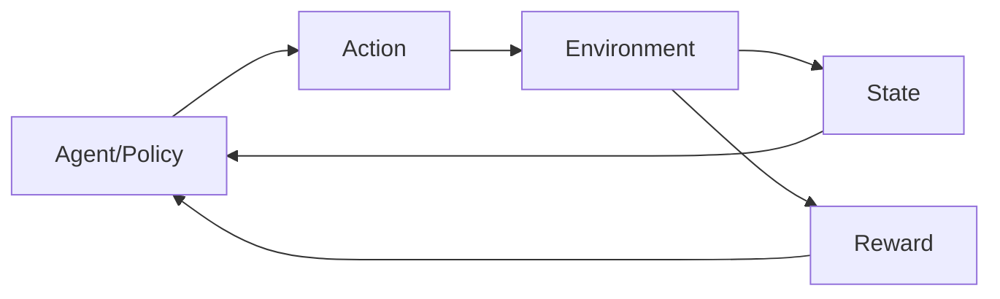

# Reinforcement Learning for Robot Control

## Introduction

**Reinforcement Learning (RL)** enables robots to learn complex behaviors through trial and error. This chapter covers RL fundamentals and practical implementation for humanoid robot control using modern frameworks.

## RL Fundamentals



**Key Components:**
- **Agent:** The learning algorithm (neural network policy)
- **Environment:** The robot and its world (simulation or real)
- **State:** Sensor observations (joint positions, IMU, camera, etc.)
- **Action:** Motor commands (joint torques or velocities)
- **Reward:** Feedback signal (task progress, penalties for falling, etc.)

---

## PPO for Humanoid Locomotion

**Proximal Policy Optimization (PPO)** is the most popular RL algorithm for robotics.

### Complete Implementation

```python
#!/usr/bin/env python3
"""
PPO training for humanoid walking using Stable Baselines3
"""

import gym
from gym import spaces
import numpy as np
import rclpy
from rclpy.node import Node
from sensor_msgs.msg import JointState, Imu
from std_msgs.msg import Float64MultiArray

from stable_baselines3 import PPO
from stable_baselines3.common.vec_env import DummyVecEnv, SubprocVecEnv
from stable_baselines3.common.callbacks import CheckpointCallback

class HumanoidWalkEnv(gym.Env, Node):
    """
    Gym environment for humanoid walking.
    """
    
    def __init__(self):
        gym.Env.__init__(self)
        Node.__init__(self, 'humanoid_walk_env')
        
        # Action space: 12 joint torques
        self.action_space = spaces.Box(
            low=-50.0,
            high=50.0,
            shape=(12,),
            dtype=np.float32
        )
        
        # Observation space: 30 dimensions
        # - 12 joint positions
        # - 12 joint velocities
        # - 3 IMU angular velocities
        # - 3 IMU linear accelerations
        self.observation_space = spaces.Box(
            low=-np.inf,
            high=np.inf,
            shape=(30,),
            dtype=np.float32
        )
        
        # State variables
        self.joint_positions = np.zeros(12)
        self.joint_velocities = np.zeros(12)
        self.imu_angular_vel = np.zeros(3)
        self.imu_linear_accel = np.zeros(3)
        self.base_position = np.zeros(3)
        
        # Target velocity
        self.target_velocity = 0.5  # m/s forward
        
        # Episode tracking
        self.episode_steps = 0
        self.max_episode_steps = 1000
        
        # ROS interfaces
        self.setup_ros_interfaces()
        
        self.get_logger().info('Humanoid Walk Environment initialized')
    
    def setup_ros_interfaces(self):
        """Setup ROS publishers and subscribers"""
        # Subscribe to joint states
        self.joint_sub = self.create_subscription(
            JointState,
            '/joint_states',
            self.joint_callback,
            10
        )
        
        # Subscribe to IMU
        self.imu_sub = self.create_subscription(
            Imu,
            '/imu/data',
            self.imu_callback,
            10
        )
        
        # Publish joint commands
        self.cmd_pub = self.create_publisher(
            Float64MultiArray,
            '/joint_commands',
            10
        )
    
    def joint_callback(self, msg):
        """Update joint state"""
        self.joint_positions = np.array(msg.position)
        self.joint_velocities = np.array(msg.velocity)
    
    def imu_callback(self, msg):
        """Update IMU data"""
        self.imu_angular_vel = np.array([
            msg.angular_velocity.x,
            msg.angular_velocity.y,
            msg.angular_velocity.z
        ])
        self.imu_linear_accel = np.array([
            msg.linear_acceleration.x,
            msg.linear_acceleration.y,
            msg.linear_acceleration.z
        ])
    
    def reset(self):
        """Reset environment to initial state"""
        # Reset simulation
        self.reset_simulation()
        
        # Wait for sensors to update
        rclpy.spin_once(self, timeout_sec=0.1)
        
        # Reset episode tracking
        self.episode_steps = 0
        
        # Return initial observation
        return self.get_observation()
    
    def step(self, action):
        """
        Execute action and return next state, reward, done, info.
        
        Args:
            action: Joint torques (12,)
            
        Returns:
            observation, reward, done, info
        """
        # Apply action (joint torques)
        self.apply_action(action)
        
        # Step simulation
        rclpy.spin_once(self, timeout_sec=0.02)  # 50 Hz
        
        # Get new observation
        obs = self.get_observation()
        
        # Calculate reward
        reward = self.compute_reward()
        
        # Check if episode is done
        done = self.is_done()
        
        # Additional info
        info = {
            'episode_steps': self.episode_steps,
            'base_height': self.base_position[2]
        }
        
        self.episode_steps += 1
        
        return obs, reward, done, info
    
    def get_observation(self):
        """
        Get current observation.
        
        Returns:
            np.array: Observation vector (30,)
        """
        obs = np.concatenate([
            self.joint_positions,      # 12
            self.joint_velocities,     # 12
            self.imu_angular_vel,      # 3
            self.imu_linear_accel      # 3
        ])
        
        return obs.astype(np.float32)
    
    def apply_action(self, action):
        """
        Apply joint torques.
        
        Args:
            action: Joint torques (12,)
        """
        # Clip to limits
        action = np.clip(action, -50.0, 50.0)
        
        # Publish to ROS
        msg = Float64MultiArray()
        msg.data = action.tolist()
        self.cmd_pub.publish(msg)
    
    def compute_reward(self):
        """
        Compute reward for current state.
        
        Returns:
            float: Reward value
        """
        reward = 0.0
        
        # 1. Forward velocity reward
        forward_vel = self.get_forward_velocity()
        velocity_reward = -abs(forward_vel - self.target_velocity)
        reward += velocity_reward
        
        # 2. Alive bonus (encourage staying upright)
        if self.base_position[2] > 0.8:  # Height > 80cm
            reward += 1.0
        
        # 3. Energy penalty (encourage efficiency)
        energy = np.sum(np.abs(self.joint_velocities))
        reward -= 0.01 * energy
        
        # 4. Stability reward (penalize excessive tilting)
        tilt = np.sqrt(self.imu_angular_vel[0]**2 + self.imu_angular_vel[1]**2)
        reward -= 0.1 * tilt
        
        return reward
    
    def is_done(self):
        """
        Check if episode should terminate.
        
        Returns:
            bool: True if done
        """
        # Terminate if fallen
        if self.base_position[2] < 0.5:  # Height < 50cm
            return True
        
        # Terminate if max steps reached
        if self.episode_steps >= self.max_episode_steps:
            return True
        
        # Terminate if tilted too much
        if abs(self.imu_angular_vel[0]) > 2.0 or abs(self.imu_angular_vel[1]) > 2.0:
            return True
        
        return False
    
    def get_forward_velocity(self):
        """Get forward velocity from IMU"""
        # Simplified: use linear acceleration
        return self.imu_linear_accel[0]
    
    def reset_simulation(self):
        """Reset Gazebo simulation"""
        # Call Gazebo reset service
        # ...
        pass

def train_humanoid_walking():
    """Train humanoid walking policy"""
    # Create environment
    env = DummyVecEnv([lambda: HumanoidWalkEnv()])
    
    # Create PPO agent
    model = PPO(
        'MlpPolicy',
        env,
        learning_rate=3e-4,
        n_steps=2048,
        batch_size=64,
        n_epochs=10,
        gamma=0.99,
        gae_lambda=0.95,
        clip_range=0.2,
        ent_coef=0.0,
        verbose=1,
        tensorboard_log='./logs/'
    )
    
    # Checkpoint callback
    checkpoint_callback = CheckpointCallback(
        save_freq=10000,
        save_path='./models/',
        name_prefix='humanoid_walk'
    )
    
    # Train
    model.learn(
        total_timesteps=1_000_000,
        callback=checkpoint_callback
    )
    
    # Save final model
    model.save('humanoid_walk_final')
    
    return model

def test_policy(model_path):
    """Test trained policy"""
    # Load model
    model = PPO.load(model_path)
    
    # Create environment
    env = HumanoidWalkEnv()
    
    # Test for 10 episodes
    for episode in range(10):
        obs = env.reset()
        done = False
        episode_reward = 0
        
        while not done:
            # Get action from policy
            action, _ = model.predict(obs, deterministic=True)
            
            # Step environment
            obs, reward, done, info = env.step(action)
            episode_reward += reward
        
        print(f'Episode {episode}: Reward = {episode_reward:.2f}')

if __name__ == '__main__':
    rclpy.init()
    
    # Train
    model = train_humanoid_walking()
    
    # Test
    test_policy('humanoid_walk_final')
    
    rclpy.shutdown()
```

---

## Reward Shaping

**Good reward design is critical for RL success.**

### Reward Components

```python
def compute_shaped_reward(self):
    """Well-designed reward function"""
    reward = 0.0
    
    # 1. Task progress (primary objective)
    forward_vel = self.get_forward_velocity()
    reward += 2.0 * min(forward_vel / self.target_velocity, 1.0)
    
    # 2. Alive bonus
    reward += 0.5
    
    # 3. Energy efficiency
    torque_penalty = np.sum(np.square(self.last_action)) / 12
    reward -= 0.001 * torque_penalty
    
    # 4. Smooth motion
    jerk = np.sum(np.abs(self.joint_velocities - self.prev_joint_velocities))
    reward -= 0.01 * jerk
    
    # 5. Foot contact (encourage proper gait)
    if self.is_foot_in_contact('left') != self.is_foot_in_contact('right'):
        reward += 0.1  # Reward alternating foot contact
    
    # 6. Upright posture
    torso_angle = self.get_torso_angle()
    reward -= 0.5 * abs(torso_angle)
    
    return reward
```

---

## Curriculum Learning

**Gradually increase task difficulty.**

```python
class CurriculumManager:
    """
    Manages curriculum learning for humanoid training.
    """
    
    def __init__(self):
        self.current_level = 0
        self.levels = [
            {'target_velocity': 0.2, 'terrain': 'flat'},
            {'target_velocity': 0.4, 'terrain': 'flat'},
            {'target_velocity': 0.6, 'terrain': 'flat'},
            {'target_velocity': 0.6, 'terrain': 'rough'},
            {'target_velocity': 0.8, 'terrain': 'rough'},
        ]
        
        self.success_threshold = 0.8
        self.success_window = 100
        self.recent_successes = []
    
    def update(self, episode_success):
        """Update curriculum based on performance"""
        self.recent_successes.append(episode_success)
        
        # Keep only recent history
        if len(self.recent_successes) > self.success_window:
            self.recent_successes.pop(0)
        
        # Check if should advance
        if len(self.recent_successes) == self.success_window:
            success_rate = sum(self.recent_successes) / self.success_window
            
            if success_rate > self.success_threshold:
                if self.current_level < len(self.levels) - 1:
                    self.current_level += 1
                    self.recent_successes = []
                    print(f'Advanced to level {self.current_level}')
    
    def get_current_config(self):
        """Get current curriculum configuration"""
        return self.levels[self.current_level]
```

---

## Summary

- **RL enables learning complex behaviors** through trial and error
- **PPO is the standard** for robot control
- **Reward shaping is critical** for success
- **Curriculum learning** speeds up training
- **Sim-to-real transfer** requires domain randomization

RL is transforming how we develop robot controllers, enabling behaviors that are difficult to hand-engineer.

---

## Further Reading

- [Stable Baselines3 Documentation](https://stable-baselines3.readthedocs.io/)
- [Spinning Up in Deep RL](https://spinningup.openai.com/)
- [Learning Dexterous In-Hand Manipulation](https://arxiv.org/abs/1808.00177)
- [PPO Paper](https://arxiv.org/abs/1707.06347)
