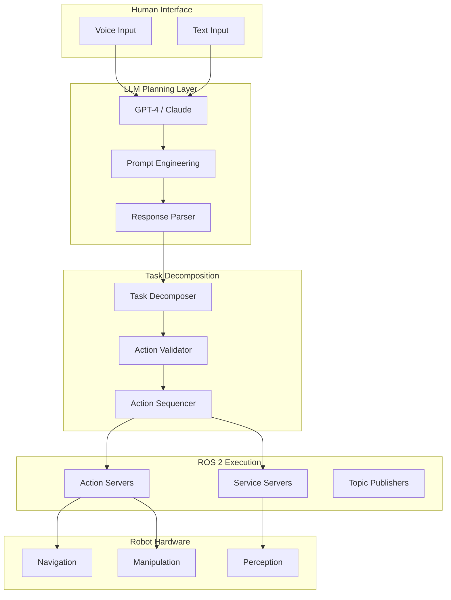

# Cognitive Planning with LLMs

## Introduction

**Large Language Models (LLMs)** like GPT-4 can transform natural language commands into structured robot action sequences. This chapter shows how to use LLMs for **cognitive planning** - translating high-level human intent ("Clean the room") into executable robot behaviors using ROS 2 actions.

## Architecture Overview



---

## Why LLMs for Robot Planning?

### Traditional Approach:
```python
# Hardcoded task logic
if command == "clean room":
    navigate_to("room")
    detect_objects()
    for obj in objects:
        if obj.type == "trash":
            pick(obj)
            navigate_to("bin")
            place(obj)
```

**Problems:**
- Brittle to variations
- Requires programming for every task
- No generalization

### LLM Approach:
```python
# Flexible, natural language understanding
command = "Clean the room and organize the books"
plan = llm.generate_plan(command, context=robot_state)
execute_plan(plan)
```

**Benefits:**
- Handles variations naturally
- Generalizes to new tasks
- Understands context and intent

---

## Complete LLM Planning System

```python
#!/usr/bin/env python3
"""
LLM-based cognitive planner for humanoid robots
"""

import rclpy
from rclpy.node import Node
from rclpy.action import ActionClient
from std_msgs.msg import String
from geometry_msgs.msg import PoseStamped
import openai
import json
from typing import List, Dict, Any

class CognitivePlanner(Node):
    """
    Uses LLM to convert natural language to robot action sequences.
    """
    
    def __init__(self):
        super().__init__('cognitive_planner')
        
        # Parameters
        self.declare_parameter('openai_api_key', '')
        self.declare_parameter('model', 'gpt-4-turbo-preview')
        self.declare_parameter('temperature', 0.3)
        
        api_key = self.get_parameter('openai_api_key').value
        self.model = self.get_parameter('model').value
        self.temperature = self.get_parameter('temperature').value
        
        # Initialize OpenAI client
        self.client = openai.Client(api_key=api_key)
        
        # Robot capabilities (for LLM context)
        self.capabilities = {
            "actions": [
                {
                    "name": "navigate",
                    "description": "Move to a location",
                    "parameters": {"x": "float", "y": "float", "theta": "float"}
                },
                {
                    "name": "pick",
                    "description": "Pick up an object",
                    "parameters": {"object_name": "string"}
                },
                {
                    "name": "place",
                    "description": "Place held object at location",
                    "parameters": {"x": "float", "y": "float"}
                },
                {
                    "name": "scan",
                    "description": "Scan environment for objects",
                    "parameters": {}
                },
                {
                    "name": "wait",
                    "description": "Wait for specified duration",
                    "parameters": {"duration": "float"}
                }
            ],
            "known_locations": {
                "kitchen": {"x": 5.0, "y": 2.0},
                "living_room": {"x": 0.0, "y": 0.0},
                "bedroom": {"x": -3.0, "y": 4.0},
                "charging_station": {"x": 0.0, "y": -2.0}
            }
        }
        
        # Subscribe to commands
        self.command_sub = self.create_subscription(
            String,
            'task_command',
            self.command_callback,
            10
        )
        
        # Publish plan status
        self.status_pub = self.create_publisher(
            String,
            'plan_status',
            10
        )
        
        # Action clients
        self.setup_action_clients()
        
        self.get_logger().info('Cognitive Planner initialized')
    
    def setup_action_clients(self):
        """Setup action clients for robot control"""
        # Navigation action client
        self.nav_client = ActionClient(
            self,
            NavigateToPoint,
            'navigate_to_point'
        )
        
        # Manipulation action client
        self.manip_client = ActionClient(
            self,
            PickPlace,
            'pick_place'
        )
    
    def command_callback(self, msg):
        """Process incoming task command"""
        command = msg.data
        self.get_logger().info(f'Received command: "{command}"')
        
        # Generate plan using LLM
        plan = self.generate_plan(command)
        
        if plan:
            self.get_logger().info(f'Generated plan with {len(plan["steps"])} steps')
            self.execute_plan(plan)
        else:
            self.get_logger().error('Failed to generate valid plan')
    
    def generate_plan(self, command: str) -> Dict[str, Any]:
        """
        Use LLM to generate action plan from natural language.
        
        Args:
            command: Natural language task description
            
        Returns:
            dict: Structured action plan
        """
        # Construct system prompt
        system_prompt = self.build_system_prompt()
        
        # Construct user prompt with context
        user_prompt = f"""
Task: {command}

Current robot state:
- Location: living_room
- Battery: 85%
- Holding: nothing

Generate a step-by-step plan to complete this task.
"""
        
        try:
            response = self.client.chat.completions.create(
                model=self.model,
                messages=[
                    {"role": "system", "content": system_prompt},
                    {"role": "user", "content": user_prompt}
                ],
                temperature=self.temperature,
                response_format={"type": "json_object"}
            )
            
            # Parse response
            plan_json = response.choices[0].message.content
            plan = json.loads(plan_json)
            
            # Validate plan
            if self.validate_plan(plan):
                return plan
            else:
                self.get_logger().error('Generated plan failed validation')
                return None
                
        except Exception as e:
            self.get_logger().error(f'LLM error: {str(e)}')
            return None
    
    def build_system_prompt(self) -> str:
        """Build system prompt with robot capabilities"""
        prompt = """You are a robot task planner. Convert natural language commands into structured action sequences.

Available actions:
"""
        for action in self.capabilities["actions"]:
            prompt += f"\n- {action['name']}: {action['description']}"
            prompt += f"\n  Parameters: {action['parameters']}"
        
        prompt += "\n\nKnown locations:\n"
        for loc, coords in self.capabilities["known_locations"].items():
            prompt += f"- {loc}: ({coords['x']}, {coords['y']})\n"
        
        prompt += """
Respond with JSON in this format:
{
  "task_summary": "Brief description of the task",
  "steps": [
    {
      "step": 1,
      "action": "action_name",
      "parameters": {...},
      "reasoning": "Why this step is needed"
    }
  ],
  "estimated_duration": "time in seconds"
}

Important:
1. Break complex tasks into simple actions
2. Include navigation between locations
3. Scan for objects before manipulation
4. Validate object availability
5. Handle edge cases (e.g., object not found)
"""
        return prompt
    
    def validate_plan(self, plan: Dict[str, Any]) -> bool:
        """
        Validate that plan is executable.
        
        Args:
            plan: Generated plan dictionary
            
        Returns:
            bool: True if valid, False otherwise
        """
        if "steps" not in plan:
            self.get_logger().error('Plan missing "steps" field')
            return False
        
        # Validate each step
        for step in plan["steps"]:
            if "action" not in step:
                self.get_logger().error(f'Step {step.get("step", "?")} missing action')
                return False
            
            action_name = step["action"]
            
            # Check if action exists
            valid_actions = [a["name"] for a in self.capabilities["actions"]]
            if action_name not in valid_actions:
                self.get_logger().error(f'Unknown action: {action_name}')
                return False
            
            # Validate parameters
            # (Add more sophisticated validation here)
        
        return True
    
    def execute_plan(self, plan: Dict[str, Any]):
        """
        Execute the generated plan.
        
        Args:
            plan: Validated action plan
        """
        self.publish_status(f"Executing plan: {plan.get('task_summary', 'Unknown task')}")
        
        for step in plan["steps"]:
            step_num = step["step"]
            action = step["action"]
            params = step.get("parameters", {})
            reasoning = step.get("reasoning", "")
            
            self.get_logger().info(
                f"Step {step_num}: {action} - {reasoning}"
            )
            
            # Execute action
            success = self.execute_action(action, params)
            
            if not success:
                self.get_logger().error(f'Step {step_num} failed')
                self.publish_status(f"Plan failed at step {step_num}")
                return
            
            self.publish_status(f"Completed step {step_num}/{len(plan['steps'])}")
        
        self.get_logger().info('Plan execution completed successfully')
        self.publish_status("Task completed successfully")
    
    def execute_action(self, action: str, params: Dict[str, Any]) -> bool:
        """
        Execute a single action.
        
        Args:
            action: Action name
            params: Action parameters
            
        Returns:
            bool: True if successful
        """
        if action == "navigate":
            return self.execute_navigate(params)
        elif action == "pick":
            return self.execute_pick(params)
        elif action == "place":
            return self.execute_place(params)
        elif action == "scan":
            return self.execute_scan(params)
        elif action == "wait":
            return self.execute_wait(params)
        else:
            self.get_logger().error(f'Unknown action: {action}')
            return False
    
    def execute_navigate(self, params: Dict[str, Any]) -> bool:
        """Execute navigation action"""
        x = params.get('x', 0.0)
        y = params.get('y', 0.0)
        theta = params.get('theta', 0.0)
        
        self.get_logger().info(f'Navigating to ({x}, {y}, {theta})')
        
        # Send goal to navigation action server
        goal = NavigateToPoint.Goal()
        goal.target_x = x
        goal.target_y = y
        goal.target_theta = theta
        
        future = self.nav_client.send_goal_async(goal)
        rclpy.spin_until_future_complete(self, future)
        
        goal_handle = future.result()
        if not goal_handle.accepted:
            self.get_logger().error('Navigation goal rejected')
            return False
        
        # Wait for result
        result_future = goal_handle.get_result_async()
        rclpy.spin_until_future_complete(self, result_future)
        
        result = result_future.result().result
        return result.success
    
    def execute_pick(self, params: Dict[str, Any]) -> bool:
        """Execute pick action"""
        object_name = params.get('object_name', '')
        self.get_logger().info(f'Picking object: {object_name}')
        
        # Implementation: call manipulation action server
        # ...
        return True
    
    def execute_place(self, params: Dict[str, Any]) -> bool:
        """Execute place action"""
        x = params.get('x', 0.0)
        y = params.get('y', 0.0)
        self.get_logger().info(f'Placing object at ({x}, {y})')
        
        # Implementation: call manipulation action server
        # ...
        return True
    
    def execute_scan(self, params: Dict[str, Any]) -> bool:
        """Execute environment scan"""
        self.get_logger().info('Scanning environment')
        
        # Implementation: trigger perception pipeline
        # ...
        return True
    
    def execute_wait(self, params: Dict[str, Any]) -> bool:
        """Execute wait action"""
        duration = params.get('duration', 1.0)
        self.get_logger().info(f'Waiting for {duration} seconds')
        
        import time
        time.sleep(duration)
        return True
    
    def publish_status(self, status: str):
        """Publish plan execution status"""
        msg = String()
        msg.data = status
        self.status_pub.publish(msg)

def main(args=None):
    rclpy.init(args=args)
    planner = CognitivePlanner()
    
    try:
        rclpy.spin(planner)
    except KeyboardInterrupt:
        pass
    finally:
        planner.destroy_node()
        rclpy.shutdown()

if __name__ == '__main__':
    main()
```

---

## Prompt Engineering for Robotics

### Key Principles

1. **Be Specific About Capabilities**
   - List all available actions
   - Specify parameter types and ranges
   - Include constraints

2. **Provide Context**
   - Current robot state
   - Environment information
   - Known locations and objects

3. **Request Structured Output**
   - Use JSON format
   - Define schema clearly
   - Include reasoning fields

4. **Handle Uncertainty**
   - Ask for confidence scores
   - Request alternative plans
   - Include error handling

### Example Prompts

**Basic Task:**
```
Task: Go to the kitchen and bring me a cup

Current state:
- Location: living_room
- Holding: nothing
- Battery: 90%

Known objects:
- cup: kitchen_counter
- plate: kitchen_counter
- book: living_room_table

Generate a plan.
```

**Complex Task with Constraints:**
```
Task: Clean the living room but avoid the area near the TV

Constraints:
- Do not approach within 1 meter of TV (at x=2.0, y=3.0)
- Only pick up objects classified as "trash"
- Return to charging station if battery < 20%

Current state:
- Location: charging_station
- Battery: 85%
- Holding: nothing

Generate a plan with safety considerations.
```

---

## Advanced: Multi-Turn Planning

```python
class MultiTurnPlanner(Node):
    """
    Maintains conversation history for iterative planning.
    """
    
    def __init__(self):
        super().__init__('multi_turn_planner')
        self.conversation_history = []
        self.current_plan = None
    
    def generate_plan_with_history(self, command: str):
        """Generate plan considering conversation history"""
        # Add user command to history
        self.conversation_history.append({
            "role": "user",
            "content": command
        })
        
        # Generate plan
        response = self.client.chat.completions.create(
            model=self.model,
            messages=[
                {"role": "system", "content": self.system_prompt},
                *self.conversation_history
            ]
        )
        
        # Add assistant response to history
        self.conversation_history.append({
            "role": "assistant",
            "content": response.choices[0].message.content
        })
        
        return json.loads(response.choices[0].message.content)
    
    def handle_clarification(self, user_response: str):
        """Handle user clarification or modification"""
        self.conversation_history.append({
            "role": "user",
            "content": user_response
        })
        
        # Regenerate plan with clarification
        return self.generate_plan_with_history("Update the plan based on my feedback")
```

**Example Conversation:**
```
User: "Clean the room"
Robot: "I found 3 items. Should I throw away the paper on the floor?"
User: "No, that's important. Just throw away the plastic bottles."
Robot: "Understood. Updating plan to only remove plastic bottles."
```

---

## Error Handling and Recovery

```python
def execute_plan_with_recovery(self, plan):
    """Execute plan with error recovery"""
    for step in plan["steps"]:
        max_retries = 3
        retry_count = 0
        
        while retry_count < max_retries:
            success = self.execute_action(step["action"], step["parameters"])
            
            if success:
                break
            else:
                retry_count += 1
                self.get_logger().warn(f'Step failed, retry {retry_count}/{max_retries}')
                
                if retry_count >= max_retries:
                    # Ask LLM for recovery plan
                    recovery_plan = self.generate_recovery_plan(step, plan)
                    if recovery_plan:
                        self.execute_plan(recovery_plan)
                    else:
                        return False
    
    return True

def generate_recovery_plan(self, failed_step, original_plan):
    """Ask LLM to generate recovery plan"""
    prompt = f"""
The following step failed:
{json.dumps(failed_step, indent=2)}

Original plan:
{json.dumps(original_plan, indent=2)}

Generate a recovery plan to either:
1. Retry with different parameters
2. Skip this step and continue
3. Abort and return to safe state

Consider what might have gone wrong and how to recover.
"""
    
    # Call LLM for recovery plan
    # ...
```

---

## Best Practices

### ✅ DO:

1. **Validate LLM Output**
   - Check JSON structure
   - Verify action names
   - Validate parameters

2. **Provide Rich Context**
   - Current robot state
   - Environment information
   - Previous actions

3. **Use Low Temperature**
   - 0.2-0.4 for deterministic planning
   - Higher for creative tasks

4. **Implement Timeouts**
   - LLM calls can be slow
   - Have fallback behaviors

5. **Log Everything**
   - Save prompts and responses
   - Useful for debugging and improvement

### ❌ DON'T:

1. **Don't Trust Blindly**
   - Always validate LLM output
   - Implement safety checks

2. **Don't Expose Sensitive Info**
   - Be careful with API keys
   - Don't send private data to LLM

3. **Don't Ignore Failures**
   - Handle LLM errors gracefully
   - Have fallback strategies

---

## Summary

- LLMs enable natural language robot control
- Prompt engineering is critical for success
- Structured output (JSON) is essential
- Validation and safety checks are mandatory
- Multi-turn conversations enable refinement
- Error recovery improves robustness

LLM-based cognitive planning transforms how humans interact with robots, enabling intuitive, flexible task specification.

---

## Further Reading

- [OpenAI API Documentation](https://platform.openai.com/docs)
- [Prompt Engineering Guide](https://www.promptingguide.ai/)
- [SayCan: Grounding Language in Robotic Affordances](https://say-can.github.io/)
- [Code as Policies](https://code-as-policies.github.io/)
