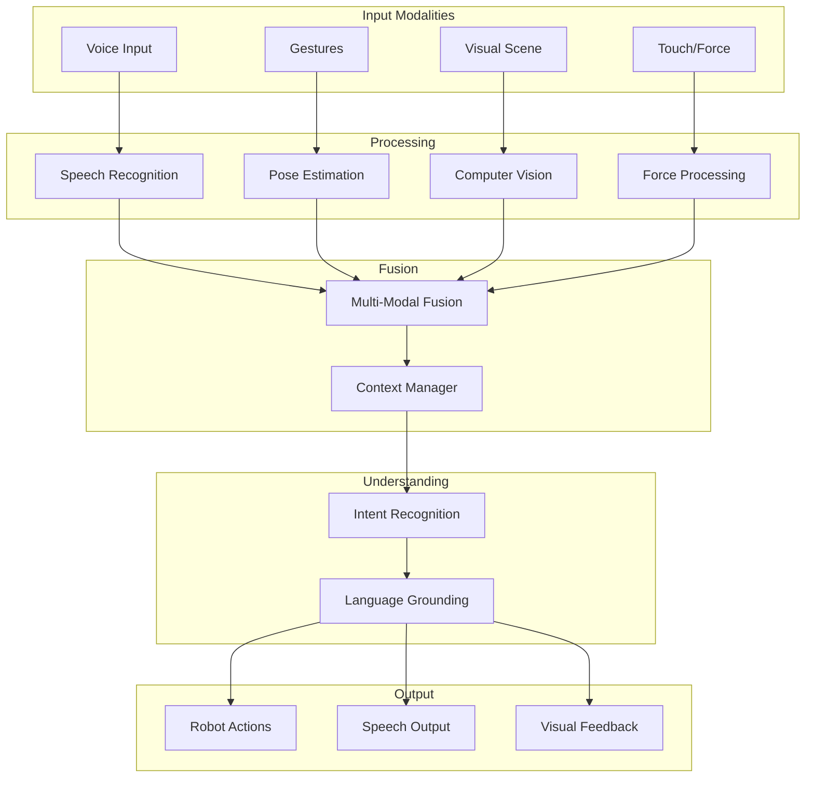

# Multi-Modal Interaction

## Introduction

**Multi-modal interaction** combines vision, language, and action to enable natural human-robot communication. This chapter covers integrating multiple sensory modalities for richer robot understanding and interaction.

## Multi-Modal Architecture



---

## Complete Multi-Modal System

```python
#!/usr/bin/env python3
"""
Multi-modal interaction system for humanoid robots.
"""

import rclpy
from rclpy.node import Node
from sensor_msgs.msg import Image, JointState
from std_msgs.msg import String
from geometry_msgs.msg import PoseStamped
import openai
import cv2
from cv_bridge import CvBridge
import numpy as np
import whisper
from transformers import pipeline

class MultiModalInteraction(Node):
    """
    Integrates vision, language, and action for natural interaction.
    """
    
    def __init__(self):
        super().__init__('multi_modal_interaction')
        
        # Initialize AI models
        self.setup_ai_models()
        
        # State
        self.current_scene = None
        self.detected_objects = []
        self.user_pose = None
        self.conversation_history = []
        
        # ROS interfaces
        self.setup_ros_interfaces()
        
        self.get_logger().info('Multi-Modal Interaction initialized')
    
    def setup_ai_models(self):
        """Initialize AI models"""
        # Speech recognition
        self.whisper_model = whisper.load_model("base")
        
        # Vision model (CLIP for image understanding)
        self.vision_model = pipeline(
            "zero-shot-image-classification",
            model="openai/clip-vit-base-patch32"
        )
        
        # LLM for reasoning
        self.llm_client = openai.Client(api_key=os.getenv('OPENAI_API_KEY'))
        
        # Pose estimation
        self.pose_detector = cv2.dnn.readNetFromTensorflow('pose_model.pb')
    
    def setup_ros_interfaces(self):
        """Setup ROS publishers and subscribers"""
        # Subscribe to camera
        self.image_sub = self.create_subscription(
            Image, '/camera/image_raw', self.image_callback, 10
        )
        
        # Subscribe to audio
        self.audio_sub = self.create_subscription(
            String, '/audio/transcription', self.audio_callback, 10
        )
        
        # Publish robot actions
        self.action_pub = self.create_publisher(
            String, '/robot/action_command', 10
        )
        
        # Publish speech
        self.speech_pub = self.create_publisher(
            String, '/robot/speech', 10
        )
        
        # CV Bridge
        self.bridge = CvBridge()
    
    def image_callback(self, msg):
        """Process visual input"""
        # Convert to OpenCV
        cv_image = self.bridge.imgmsg_to_cv2(msg, 'bgr8')
        
        # Detect objects
        self.detected_objects = self.detect_objects(cv_image)
        
        # Detect human pose
        self.user_pose = self.detect_human_pose(cv_image)
        
        # Store current scene
        self.current_scene = cv_image
    
    def audio_callback(self, msg):
        """Process voice input"""
        user_speech = msg.data
        
        # Process multi-modal command
        self.process_multi_modal_command(user_speech)
    
    def detect_objects(self, image):
        """
        Detect objects in image using CLIP.
        
        Args:
            image: OpenCV image
            
        Returns:
            list: Detected objects with labels and confidence
        """
        # Convert to PIL
        from PIL import Image as PILImage
        pil_image = PILImage.fromarray(cv2.cvtColor(image, cv2.COLOR_BGR2RGB))
        
        # Candidate labels
        candidate_labels = [
            "cup", "bottle", "book", "phone", "laptop",
            "chair", "table", "person", "door", "window"
        ]
        
        # Classify
        results = self.vision_model(pil_image, candidate_labels=candidate_labels)
        
        # Filter by confidence
        objects = [r for r in results if r['score'] > 0.3]
        
        return objects
    
    def detect_human_pose(self, image):
        """
        Detect human pose for gesture recognition.
        
        Args:
            image: OpenCV image
            
        Returns:
            dict: Pose keypoints
        """
        # Preprocess
        blob = cv2.dnn.blobFromImage(
            image, 1.0, (368, 368),
            (127.5, 127.5, 127.5), swapRB=True, crop=False
        )
        
        # Inference
        self.pose_detector.setInput(blob)
        output = self.pose_detector.forward()
        
        # Extract keypoints
        keypoints = self.extract_keypoints(output)
        
        # Recognize gesture
        gesture = self.recognize_gesture(keypoints)
        
        return {'keypoints': keypoints, 'gesture': gesture}
    
    def recognize_gesture(self, keypoints):
        """
        Recognize gesture from pose keypoints.
        
        Args:
            keypoints: Pose keypoints
            
        Returns:
            str: Gesture name
        """
        # Simple gesture recognition
        if keypoints is None:
            return None
        
        # Check for pointing gesture
        if self.is_pointing(keypoints):
            return 'pointing'
        
        # Check for waving
        if self.is_waving(keypoints):
            return 'waving'
        
        # Check for beckoning
        if self.is_beckoning(keypoints):
            return 'beckoning'
        
        return None
    
    def is_pointing(self, keypoints):
        """Check if user is pointing"""
        # Simplified: check if arm is extended
        # Real implementation would be more sophisticated
        return False  # Placeholder
    
    def process_multi_modal_command(self, speech):
        """
        Process command using speech, vision, and gestures.
        
        Args:
            speech: User's spoken command
        """
        # Build multi-modal context
        context = self.build_context(speech)
        
        # Get LLM interpretation
        interpretation = self.interpret_with_llm(context)
        
        # Execute action
        self.execute_interpreted_action(interpretation)
    
    def build_context(self, speech):
        """
        Build multi-modal context.
        
        Args:
            speech: User speech
            
        Returns:
            dict: Multi-modal context
        """
        context = {
            'speech': speech,
            'visible_objects': [obj['label'] for obj in self.detected_objects],
            'user_gesture': self.user_pose['gesture'] if self.user_pose else None,
            'conversation_history': self.conversation_history[-5:]  # Last 5 turns
        }
        
        return context
    
    def interpret_with_llm(self, context):
        """
        Use LLM to interpret multi-modal input.
        
        Args:
            context: Multi-modal context
            
        Returns:
            dict: Interpreted action
        """
        prompt = f"""
You are a humanoid robot assistant. Interpret the user's multi-modal command.

User said: "{context['speech']}"
Visible objects: {context['visible_objects']}
User gesture: {context['user_gesture']}

Previous conversation:
{self.format_conversation_history(context['conversation_history'])}

Determine:
1. What object is the user referring to?
2. What action should the robot take?
3. Any clarification needed?

Respond in JSON format:
{{
  "target_object": "object name or null",
  "action": "action to take",
  "clarification_needed": "question to ask or null",
  "reasoning": "explanation"
}}
"""
        
        response = self.llm_client.chat.completions.create(
            model='gpt-4',
            messages=[
                {'role': 'system', 'content': 'You are a helpful robot assistant.'},
                {'role': 'user', 'content': prompt}
            ],
            response_format={'type': 'json_object'}
        )
        
        import json
        interpretation = json.loads(response.choices[0].message.content)
        
        return interpretation
    
    def execute_interpreted_action(self, interpretation):
        """
        Execute action based on interpretation.
        
        Args:
            interpretation: LLM interpretation
        """
        # Check if clarification needed
        if interpretation['clarification_needed']:
            self.speak(interpretation['clarification_needed'])
            return
        
        # Execute action
        action = interpretation['action']
        target = interpretation['target_object']
        
        self.get_logger().info(f'Executing: {action} on {target}')
        
        # Publish action command
        cmd_msg = String()
        cmd_msg.data = f"{action}:{target}"
        self.action_pub.publish(cmd_msg)
        
        # Provide feedback
        self.speak(f"I will {action} the {target}.")
        
        # Update conversation history
        self.conversation_history.append({
            'user': interpretation['speech'],
            'robot': f"I will {action} the {target}."
        })
    
    def speak(self, text):
        """
        Make robot speak.
        
        Args:
            text: Text to speak
        """
        msg = String()
        msg.data = text
        self.speech_pub.publish(msg)
        
        self.get_logger().info(f'Robot says: {text}')
    
    def format_conversation_history(self, history):
        """Format conversation history for LLM"""
        formatted = []
        for turn in history:
            formatted.append(f"User: {turn['user']}")
            formatted.append(f"Robot: {turn['robot']}")
        return '\n'.join(formatted)

def main(args=None):
    rclpy.init(args=args)
    interaction = MultiModalInteraction()
    
    try:
        rclpy.spin(interaction)
    except KeyboardInterrupt:
        pass
    finally:
        interaction.destroy_node()
        rclpy.shutdown()

if __name__ == '__main__':
    main()
```

---

## Gesture Recognition

```python
class GestureRecognizer:
    """
    Recognizes common gestures from pose keypoints.
    """
    
    def __init__(self):
        self.gesture_templates = {
            'pointing': self.check_pointing,
            'waving': self.check_waving,
            'thumbs_up': self.check_thumbs_up,
            'stop': self.check_stop_gesture
        }
    
    def recognize(self, keypoints):
        """
        Recognize gesture from keypoints.
        
        Args:
            keypoints: Pose keypoints
            
        Returns:
            str: Gesture name or None
        """
        for gesture_name, check_func in self.gesture_templates.items():
            if check_func(keypoints):
                return gesture_name
        
        return None
    
    def check_pointing(self, keypoints):
        """Check for pointing gesture"""
        # Get relevant keypoints
        shoulder = keypoints['right_shoulder']
        elbow = keypoints['right_elbow']
        wrist = keypoints['right_wrist']
        
        # Check if arm is extended
        arm_angle = self.calculate_angle(shoulder, elbow, wrist)
        
        # Pointing: arm mostly straight (angle > 150°)
        return arm_angle > 150
    
    def check_waving(self, keypoints):
        """Check for waving gesture"""
        # Detect periodic hand motion
        # (requires temporal information)
        pass
    
    def calculate_angle(self, p1, p2, p3):
        """Calculate angle between three points"""
        import math
        
        v1 = np.array([p1['x'] - p2['x'], p1['y'] - p2['y']])
        v2 = np.array([p3['x'] - p2['x'], p3['y'] - p2['y']])
        
        cos_angle = np.dot(v1, v2) / (np.linalg.norm(v1) * np.linalg.norm(v2))
        angle = math.acos(np.clip(cos_angle, -1.0, 1.0))
        
        return math.degrees(angle)
```

---

## Visual Grounding

```python
class VisualGrounding:
    """
    Grounds language references to visual objects.
    """
    
    def ground_reference(self, text, detected_objects, user_pose):
        """
        Ground linguistic reference to object.
        
        Args:
            text: User's reference (e.g., "that cup", "the red one")
            detected_objects: List of detected objects
            user_pose: User's pose (for pointing direction)
            
        Returns:
            Object that user is referring to
        """
        # Extract referring expression
        if 'that' in text or 'this' in text:
            # Use pointing gesture
            if user_pose and user_pose['gesture'] == 'pointing':
                return self.get_pointed_object(user_pose, detected_objects)
        
        # Use color/attribute
        if 'red' in text:
            return self.find_by_color(detected_objects, 'red')
        
        # Use spatial relation
        if 'left' in text:
            return self.find_leftmost(detected_objects)
        
        # Default: closest object
        return self.find_closest(detected_objects)
```

---

## Summary

- **Multi-modal interaction** combines vision, language, and gestures
- **Context fusion** integrates multiple input modalities
- **Visual grounding** connects language to perceived objects
- **Gesture recognition** enables non-verbal communication
- **LLMs** interpret multi-modal context

Multi-modal interaction enables more natural and intuitive human-robot communication.

---

## Further Reading

- [CLIP: Connecting Text and Images](https://openai.com/research/clip)
- [Multi-Modal Learning](https://arxiv.org/abs/2206.06488)
- [Visual Grounding](https://arxiv.org/abs/1808.08089)
- [Gesture Recognition](https://arxiv.org/abs/2004.00433)
