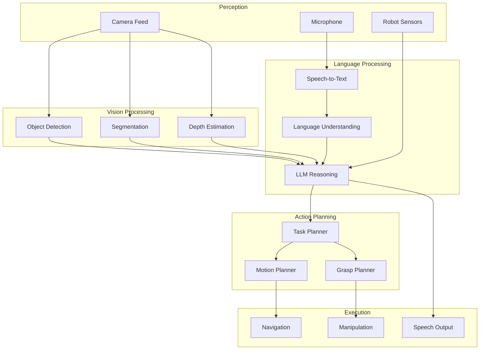

# End-to-End VLA Implementation

## Introduction

This chapter brings together **Vision**, **Language**, and **Action** into a complete system. You'll build an end-to-end VLA pipeline that enables a humanoid robot to understand visual scenes, process natural language commands, and execute physical actions.

## Complete VLA Architecture



---

## Complete VLA System Implementation

```python
#!/usr/bin/env python3
"""
Complete end-to-end VLA system for humanoid robots.
"""

import rclpy
from rclpy.node import Node
from rclpy.action import ActionClient
from sensor_msgs.msg import Image, JointState
from std_msgs.msg import String
from geometry_msgs.msg import PoseStamped
import openai
import cv2
from cv_bridge import CvBridge
import numpy as np
from ultralytics import YOLO
import whisper

class EndToEndVLA(Node):
    """
    Complete Vision-Language-Action system.
    """
    
    def __init__(self):
        super().__init__('end_to_end_vla')
        
        # Initialize AI models
        self.setup_models()
        
        # Scene understanding
        self.scene_graph = {}
        self.detected_objects = []
        
        # Task state
        self.current_task = None
        self.task_queue = []
        
        # ROS interfaces
        self.setup_ros_interfaces()
        
        self.get_logger().info('End-to-End VLA System initialized')
    
    def setup_models(self):
        """Initialize all AI models"""
        # Vision: YOLO for object detection
        self.yolo_model = YOLO('yolov8n.pt')
        
        # Language: Whisper for speech recognition
        self.whisper_model = whisper.load_model('base')
        
        # Reasoning: GPT-4 for task planning
        self.llm_client = openai.Client(api_key=os.getenv('OPENAI_API_KEY'))
        
        self.get_logger().info('AI models loaded')
    
    def setup_ros_interfaces(self):
        """Setup ROS publishers, subscribers, action clients"""
        # Subscribers
        self.image_sub = self.create_subscription(
            Image, '/camera/rgb/image_raw', self.image_callback, 10
        )
        
        self.depth_sub = self.create_subscription(
            Image, '/camera/depth/image_raw', self.depth_callback, 10
        )
        
        self.audio_sub = self.create_subscription(
            String, '/voice_command', self.voice_callback, 10
        )
        
        # Publishers
        self.speech_pub = self.create_publisher(String, '/robot/speech', 10)
        self.status_pub = self.create_publisher(String, '/robot/status', 10)
        
        # Action clients
        self.nav_client = ActionClient(self, NavigateToPoint, 'navigate')
        self.grasp_client = ActionClient(self, GraspObject, 'grasp')
        
        # CV Bridge
        self.bridge = CvBridge()
        
        # State
        self.current_rgb = None
        self.current_depth = None
    
    def image_callback(self, msg):
        """Process RGB image"""
        self.current_rgb = self.bridge.imgmsg_to_cv2(msg, 'bgr8')
        
        # Run object detection
        self.detect_objects()
    
    def depth_callback(self, msg):
        """Process depth image"""
        self.current_depth = self.bridge.imgmsg_to_cv2(msg, 'passthrough')
    
    def voice_callback(self, msg):
        """Process voice command"""
        command = msg.data
        self.get_logger().info(f'Received command: {command}')
        
        # Process VLA pipeline
        self.process_vla_command(command)
    
    def detect_objects(self):
        """Detect objects in current scene"""
        if self.current_rgb is None:
            return
        
        # Run YOLO
        results = self.yolo_model(self.current_rgb)
        
        # Extract detections
        self.detected_objects = []
        
        for r in results:
            boxes = r.boxes
            for box in boxes:
                # Get box coordinates
                x1, y1, x2, y2 = box.xyxy[0].cpu().numpy()
                
                # Get class and confidence
                cls = int(box.cls[0])
                conf = float(box.conf[0])
                label = self.yolo_model.names[cls]
                
                # Get 3D position from depth
                center_x = int((x1 + x2) / 2)
                center_y = int((y1 + y2) / 2)
                
                if self.current_depth is not None:
                    depth = self.current_depth[center_y, center_x]
                    position_3d = self.pixel_to_3d(center_x, center_y, depth)
                else:
                    position_3d = None
                
                self.detected_objects.append({
                    'label': label,
                    'confidence': conf,
                    'bbox': (x1, y1, x2, y2),
                    'position_3d': position_3d
                })
    
    def pixel_to_3d(self, u, v, depth):
        """Convert pixel coordinates to 3D position"""
        # Camera intrinsics (example values)
        fx, fy = 525.0, 525.0
        cx, cy = 319.5, 239.5
        
        # Calculate 3D position
        z = depth / 1000.0  # Convert mm to meters
        x = (u - cx) * z / fx
        y = (v - cy) * z / fy
        
        return (x, y, z)
    
    def process_vla_command(self, command):
        """
        Process complete VLA pipeline.
        
        Args:
            command: Natural language command
        """
        self.speak("I'm processing your request...")
        
        # 1. Build scene understanding
        scene_description = self.build_scene_description()
        
        # 2. Use LLM to plan task
        task_plan = self.plan_task_with_llm(command, scene_description)
        
        # 3. Execute task plan
        self.execute_task_plan(task_plan)
    
    def build_scene_description(self):
        """
        Build textual description of current scene.
        
        Returns:
            str: Scene description
        """
        if not self.detected_objects:
            return "I don't see any objects in the scene."
        
        # Group objects by type
        object_counts = {}
        for obj in self.detected_objects:
            label = obj['label']
            object_counts[label] = object_counts.get(label, 0) + 1
        
        # Build description
        description = "I can see: "
        items = []
        for label, count in object_counts.items():
            if count == 1:
                items.append(f"a {label}")
            else:
                items.append(f"{count} {label}s")
        
        description += ", ".join(items)
        
        return description
    
    def plan_task_with_llm(self, command, scene_description):
        """
        Use LLM to plan task execution.
        
        Args:
            command: User command
            scene_description: Current scene
            
        Returns:
            dict: Task plan
        """
        prompt = f"""
You are a humanoid robot. Plan how to execute the user's command.

User command: "{command}"
Current scene: {scene_description}

Available actions:
- navigate(x, y, z): Move to position
- grasp(object_name): Pick up object
- place(x, y, z): Place held object
- speak(text): Say something

Detected objects with 3D positions:
{self.format_detected_objects()}

Generate a step-by-step plan in JSON format:
{{
  "task_summary": "brief description",
  "steps": [
    {{"action": "action_name", "parameters": {{...}}, "reasoning": "why"}}
  ]
}}
"""
        
        response = self.llm_client.chat.completions.create(
            model='gpt-4',
            messages=[
                {'role': 'system', 'content': 'You are a helpful robot assistant.'},
                {'role': 'user', 'content': prompt}
            ],
            response_format={'type': 'json_object'}
        )
        
        import json
        plan = json.loads(response.choices[0].message.content)
        
        self.get_logger().info(f'Generated plan: {plan["task_summary"]}')
        
        return plan
    
    def format_detected_objects(self):
        """Format detected objects for LLM"""
        formatted = []
        for obj in self.detected_objects:
            if obj['position_3d']:
                x, y, z = obj['position_3d']
                formatted.append(
                    f"- {obj['label']} at position ({x:.2f}, {y:.2f}, {z:.2f}m)"
                )
        return '\n'.join(formatted)
    
    def execute_task_plan(self, plan):
        """
        Execute the generated task plan.
        
        Args:
            plan: Task plan from LLM
        """
        self.speak(f"I will {plan['task_summary']}")
        
        for step in plan['steps']:
            action = step['action']
            params = step['parameters']
            
            self.get_logger().info(f"Executing: {action} with {params}")
            
            # Execute action
            if action == 'navigate':
                self.execute_navigate(params)
            elif action == 'grasp':
                self.execute_grasp(params)
            elif action == 'place':
                self.execute_place(params)
            elif action == 'speak':
                self.speak(params['text'])
            
            # Brief pause between steps
            time.sleep(0.5)
        
        self.speak("Task completed!")
    
    def execute_navigate(self, params):
        """Execute navigation action"""
        goal = NavigateToPoint.Goal()
        goal.target_x = params['x']
        goal.target_y = params['y']
        goal.target_z = params.get('z', 0.0)
        
        self.get_logger().info(f'Navigating to ({goal.target_x}, {goal.target_y})')
        
        future = self.nav_client.send_goal_async(goal)
        rclpy.spin_until_future_complete(self, future)
        
        goal_handle = future.result()
        if goal_handle.accepted:
            result_future = goal_handle.get_result_async()
            rclpy.spin_until_future_complete(self, result_future)
    
    def execute_grasp(self, params):
        """Execute grasp action"""
        object_name = params['object_name']
        
        # Find object in detected objects
        target_obj = None
        for obj in self.detected_objects:
            if obj['label'] == object_name:
                target_obj = obj
                break
        
        if not target_obj:
            self.speak(f"I cannot find the {object_name}")
            return
        
        # Send grasp goal
        goal = GraspObject.Goal()
        goal.object_name = object_name
        
        if target_obj['position_3d']:
            x, y, z = target_obj['position_3d']
            goal.target_pose.position.x = x
            goal.target_pose.position.y = y
            goal.target_pose.position.z = z
        
        self.get_logger().info(f'Grasping {object_name}')
        
        future = self.grasp_client.send_goal_async(goal)
        rclpy.spin_until_future_complete(self, future)
    
    def execute_place(self, params):
        """Execute place action"""
        self.get_logger().info(f'Placing object at ({params["x"]}, {params["y"]})')
        # Implementation...
    
    def speak(self, text):
        """Make robot speak"""
        msg = String()
        msg.data = text
        self.speech_pub.publish(msg)
        
        self.get_logger().info(f'Robot says: {text}')

def main(args=None):
    rclpy.init(args=args)
    vla = EndToEndVLA()
    
    try:
        rclpy.spin(vla)
    except KeyboardInterrupt:
        pass
    finally:
        vla.destroy_node()
        rclpy.shutdown()

if __name__ == '__main__':
    main()
```

---

## Example Interaction

**User:** "Bring me the cup on the table"

**VLA Processing:**

1. **Vision:** Detects cup at (1.2, 0.5, 0.8m), table at (1.0, 0.0, 0.0m)
2. **Language:** Understands "bring" = navigate + grasp + navigate + place
3. **Action Plan:**
   ```json
   {
     "task_summary": "bring the cup to the user",
     "steps": [
       {"action": "navigate", "parameters": {"x": 1.2, "y": 0.5}},
       {"action": "grasp", "parameters": {"object_name": "cup"}},
       {"action": "navigate", "parameters": {"x": 0.0, "y": 0.0}},
       {"action": "place", "parameters": {"x": 0.0, "y": 0.5}}
     ]
   }
   ```
4. **Execution:** Robot navigates, grasps cup, returns, places cup

---

## Performance Optimization

```python
class OptimizedVLA(EndToEndVLA):
    """
    Optimized VLA with caching and parallel processing.
    """
    
    def __init__(self):
        super().__init__()
        
        # Caching
        self.scene_cache = None
        self.cache_timestamp = None
        
        # Parallel processing
        from concurrent.futures import ThreadPoolExecutor
        self.executor = ThreadPoolExecutor(max_workers=3)
    
    def process_vla_command_optimized(self, command):
        """Optimized VLA processing with parallelization"""
        # Run vision and language processing in parallel
        vision_future = self.executor.submit(self.build_scene_description)
        
        # Wait for vision
        scene_description = vision_future.result()
        
        # Plan and execute
        task_plan = self.plan_task_with_llm(command, scene_description)
        self.execute_task_plan(task_plan)
```

---

## Summary

- **End-to-end VLA** integrates vision, language, and action
- **YOLO** for object detection
- **Whisper** for speech recognition
- **GPT-4** for task planning
- **ROS 2 actions** for execution

This complete system demonstrates the power of combining modern AI with robotics to create truly intelligent, interactive humanoid robots.

---

## Further Reading

- [RT-2: Vision-Language-Action Models](https://robotics-transformer2.github.io/)
- [PaLM-E: Embodied Multimodal Language Model](https://palm-e.github.io/)
- [SayCan: Grounding Language in Robotic Affordances](https://say-can.github.io/)
- [CLIP: Connecting Text and Images](https://openai.com/research/clip)
