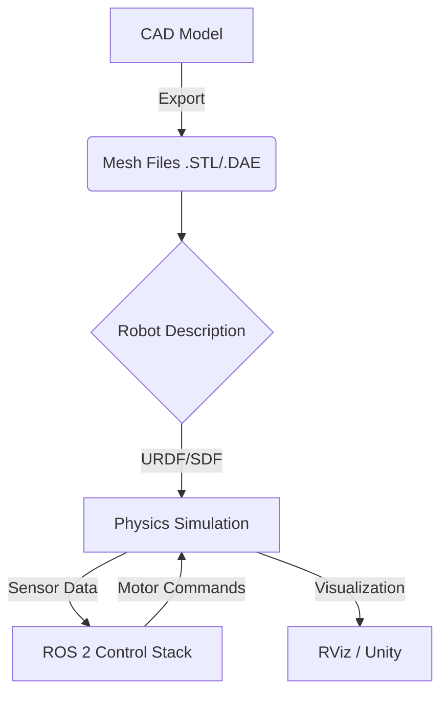

# Module 2: The Digital Twin (Gazebo & Unity)

## Focus: Physics simulation and environment building.

This module covers physics simulation and environment building using Gazebo and Unity. Students will learn to create "Digital Twins"—virtual replicas of physical robots and environments—to safely train and test AI agents before real-world deployment.

> **Analogy:** Just as pilots train in flight simulators before flying real jets, Physical AI agents train in Digital Twins to learn without risking expensive hardware or safety.

## Why Simulation Matters for Physical AI

Simulation is not just a testing tool; it's a fundamental pillar of modern robotics:
- **Safety**: Crash a robot 1,000 times in simulation with zero cost.
- **Speed**: Train faster than real-time (e.g., 100 days of experience in 1 day).
- **Scalability**: Train thousands of robots in parallel in the cloud.
- **Data Generation**: Generate infinite labeled training data for AI models.

**The Sim-to-Real Gap:**
The challenge of transferring policies learned in simulation to the real world. This module teaches techniques like **Domain Randomization** to bridge this gap.

## Learning Objectives

By the end of this module, you will be able to:

### Conceptual Understanding
- **Explain** the physics engine pipeline (collision detection, constraint solving, integration)
- **Differentiate** between visual meshes (rendering) and collision meshes (physics)
- **Understand** the URDF and SDF robot description formats
- **Describe** the concept of Domain Randomization for robust Sim-to-Real transfer

### Practical Skills
- **Build** complex simulation environments in Gazebo and Unity
- **Create** accurate robot models with joints, links, and inertia properties
- **Simulate** sensors: LiDAR, Depth Cameras, IMUs, and RGB cameras
- **Write** Gazebo plugins to control simulation logic
- **Import** CAD models into simulation environments

### Advanced Application
- **Implement** a closed-loop control system in simulation
- **Generate** synthetic datasets for computer vision training
- **Design** a "Digital Twin" of a real-world test arena
- **Debug** physics stability issues (exploding robots, jitter)

## Module Structure

This 3-week module (Weeks 6-8) is organized into three progressive topics:

### Week 6: Gazebo Simulation Fundamentals
**Learning Focus:** Physics-based simulation for robotics

**Topics:**
1. **Introduction to Gazebo**
   - Physics engines (ODE, Bullet, Dart)
   - World files and environment building
   - Model editor and building editor

2. **Robot Modeling (URDF/SDF)**
   - Links, joints, and kinematic chains
   - Inertia tensors and physical properties
   - Visual vs. Collision geometry

**Deliverables:**
- Custom Gazebo world
- Mobile robot simulation model

### Week 7: Sensors and Plugins
**Learning Focus:** Making the robot "see" and "feel"

**Topics:**
1. **Sensor Simulation**
   - Adding LiDAR, Camera, and IMU to models
   - Visualizing sensor data in RViz
   - Noise models and realism

2. **Gazebo Plugins**
   - Model plugins for control
   - World plugins for environment logic
   - Sensor plugins for custom data

**Deliverables:**
- Robot with full sensor suite
- Custom control plugin

### Week 8: Unity for High-Fidelity Simulation
**Learning Focus:** Photorealistic rendering and human interaction

**Topics:**
1. **Unity Robotics Hub**
   - URDF Importer
   - ROS-TCP Connector
   - Setting up Unity scenes

2. **Sim-to-Real Techniques**
   - Domain Randomization (lighting, textures, physics)
   - Synthetic data generation
   - Physics calibration

**Deliverables:**
- Unity scene with imported robot
- **Module Project**: Autonomous Navigation in Digital Twin

## Simulation Workflow

The standard workflow for building a Digital Twin:



## Prerequisites

### Required Knowledge

**Robotics:**
- ✓ **ROS 2 Basics**: Topics, nodes, launch files (from Module 1)
- ✓ **Kinematics**: Basic understanding of joints and frames
- ✓ **3D Math**: Vectors, quaternions, coordinate transforms

**Software:**
- **Blender** (optional but recommended for mesh editing)
- **VS Code** with XML/URDF extensions

### Required Software

**Simulation Tools:**
- **Gazebo Classic** (v11) or **Gazebo Ignition/Fortress**
- **Unity Hub** & **Unity 2022.3 LTS**
- **ROS-TCP-Endpoint** package

**Hardware:**
- Dedicated GPU recommended (NVIDIA GTX 1060+) for Unity
- 16GB RAM recommended for complex worlds

## Assessment and Projects

### Weekly Assessments (40%)

| Week | Assessment | Weight | Type |
|------|------------|--------|------|
| **Week 6** | Robot Modeling Lab | 15% | URDF creation |
| **Week 7** | Sensor Integration | 15% | Gazebo simulation |
| **Week 8** | Unity Scene Setup | 10% | Unity project |

### Module Project: The Digital Obstacle Course (40%)

Create a comprehensive simulation environment:
1. **Environment**: A walled arena with static and dynamic obstacles
2. **Robot**: A differential drive robot with Lidar and Camera
3. **Task**: Robot must navigate from Start to Goal without collision
4. **Realism**: Add sensor noise and physics friction

**Evaluation Criteria:**
- Physics fidelity (correct inertia, collisions) (30%)
- Sensor implementation (working Lidar/Camera) (30%)
- Environment complexity (20%)
- Documentation and reproducibility (20%)

### Participation and Labs (20%)

- Simulation challenges
- Debugging sessions
- Peer model reviews

## Key Tools and Commands

**Gazebo:**
```bash
gazebo --verbose              # Run Gazebo with logs
ros2 launch gazebo_ros gazebo.launch.py  # Launch with ROS
```

**URDF Tools:**
```bash
check_urdf my_robot.urdf      # Verify syntax
urdf_to_graphiz my_robot.urdf # Visualize link tree
```

**Unity:**
- **Play Mode**: Test simulation
- **Inspector**: Modify properties
- **Package Manager**: Install Robotics Hub

## Learning Resources

### Official Documentation
- Gazebo Tutorials: [http://gazebosim.org/tutorials](http://gazebosim.org/tutorials)
- Unity Robotics Hub: [https://github.com/Unity-Technologies/Unity-Robotics-Hub](https://github.com/Unity-Technologies/Unity-Robotics-Hub)
- URDF XML Specification: [http://wiki.ros.org/urdf/XML](http://wiki.ros.org/urdf/XML)

### Recommended Reading
- **"Programming Robots with ROS"** - Chapter on Simulation
- **"Mastering ROS for Robotics Programming"** - Advanced Gazebo

### Video Tutorials
- The Construct: Gazebo 101
- Unity: Robotics tutorials series

## Getting Started

### Week 6 Preparation Checklist
- [ ] Install Gazebo (`sudo apt install gazebo11 ros-humble-gazebo-ros-pkgs`)
- [ ] Install Unity Hub and Unity Editor
- [ ] Install Blender (optional)
- [ ] Clone the course simulation repository

## Module Roadmap

```
Week 6: Physics & Modeling
  ↓ Build the body and world
Week 7: Sensors & Logic
  ↓ Give it eyes and ears
Week 8: High-Fidelity & Unity
  ↓ Make it look real
Module Project: Digital Twin
  ↓ Put it all together
Ready for Module 3: The AI Brain!
```

## Summary

The Digital Twin is your robot's training ground. By mastering simulation, you unlock the ability to iterate rapidly, test safely, and generate the massive datasets needed for modern Physical AI. This module bridges the gap between code and the physical world.

---

**Next:** Begin with [Introduction to Gazebo Simulation](./Gazebo-Simulation/introduction-to-gazebo.md) to start building your first world.