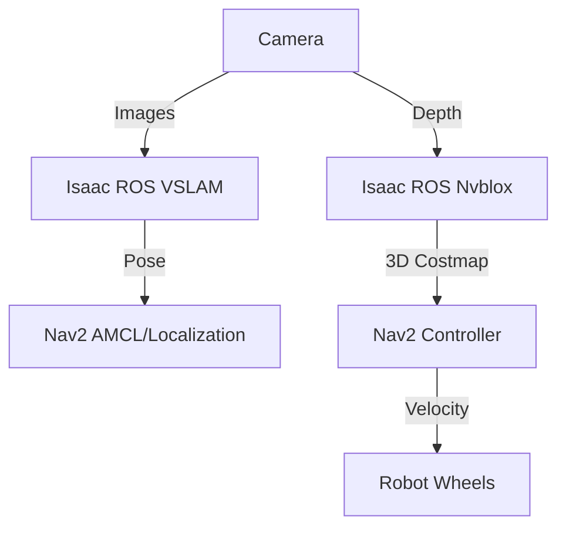

# NVIDIA Jetson Platform and Isaac Navigation

The **NVIDIA Jetson** is the brain of your robot. It brings server-class AI performance to the edge. In this chapter, we deploy our Isaac ROS stack to a Jetson Orin and integrate it with **Nav2** for autonomous navigation.

## The Jetson Orin Family

| Model | AI Performance | Memory | Power | Best For |
|-------|----------------|--------|-------|----------|
| **Orin Nano** | 40 TOPS | 8GB | 7-15W | Entry-level, Basic VSLAM |
| **Orin NX** | 100 TOPS | 16GB | 10-25W | Advanced Perception, Mobile Robots |
| **AGX Orin** | 275 TOPS | 64GB | 15-60W | Humanoids, Full Autonomy |

**Architecture**:
- **Ampere GPU**: For CUDA/TensorRT acceleration.
- **ARM Cortex CPU**: For general ROS nodes.
- **DLA (Deep Learning Accelerator)**: Dedicated hardware for inference.

## Setting Up Your Jetson

### Step 1: Flash JetPack 6.0
JetPack includes Linux (Ubuntu 22.04), CUDA, TensorRT, and ROS 2 drivers.
1. Download **NVIDIA SDK Manager** on a host PC.
2. Connect Jetson via USB-C.
3. Select **JetPack 6.0** and flash.

### Step 2: Install Isaac ROS
(Same as previous chapter, but on the Jetson).
```bash
# Maximize performance
sudo jetson_clocks
```

## The Navigation Pipeline (Nav2)

**Nav2** is the standard navigation stack for ROS 2. We will power it with Isaac ROS.



### 1. Localization (VSLAM)
Instead of using a Lidar and a pre-made map (AMCL), we use **Visual SLAM**.
- The robot wakes up, looks around, and knows where it is.
- It builds a map of features (sparse map) as it moves.

### 2. Mapping (Nvblox)
Nvblox creates a high-resolution 3D map of obstacles in real-time.
- Unlike 2D Costmaps (flat), Nvblox sees overhangs (tables) and complex geometry.
- This is critical for humanoids to avoid bumping their heads or tripping.

## Configuring Nav2 for Humanoids

Humanoids are not differential drive robots. They walk.

### Footstep Planning
We need a custom planner that understands stepping.

**Behavior Tree Configuration**:
```xml
<root main_tree_to_execute="MainTree">
  <BehaviorTree ID="MainTree">
    <PipelineSequence name="NavigateWithReplanning">
      <RateController hz="1.0">
        <ComputePathToPose goal="{goal}" path="{path}" planner_id="GridBased"/>
      </RateController>
      <FollowPath path="{path}" controller_id="FollowPath"/>
    </PipelineSequence>
  </BehaviorTree>
</root>
```

### Controller Tuning
In `nav2_params.yaml`:
```yaml
controller_server:
  ros__parameters:
    FollowPath:
      plugin: "dwb_core::DWBLocalPlanner"
      max_vel_x: 0.5  # Walking speed
      max_vel_theta: 0.5 # Turning speed
      # Humanoids can't spin in place instantly
      min_speed_xy: 0.0
```

## Hands-On: Autonomous Navigation

### 1. Launch the Stack
```bash
# On Jetson
ros2 launch isaac_ros_examples mobile_robot_nav.launch.py
```

### 2. Send a Goal
1. Open RViz.
2. Click **2D Nav Goal**.
3. Click a point on the map.

**What happens:**
1. **Global Planner** finds a path from A to B.
2. **Local Planner** generates velocity commands (`cmd_vel`) to follow the path while avoiding dynamic obstacles (people).
3. **Isaac ROS** provides the map and pose updates at 60Hz.

## Summary

You have now built a complete "Brain" for your robot:
- **Isaac Sim**: Trained the mind in the Matrix.
- **Isaac ROS**: Gave it super-human perception.
- **Jetson**: Put the brain in a body.
- **Nav2**: Taught it how to move.

---

**Module 3 Complete!** The robot can see and think. Now, let's give it a voice and higher-level reasoning in [Module 4: Vision-Language-Action (VLA)](../../Module-4-Vision-Language-Action/index.md).