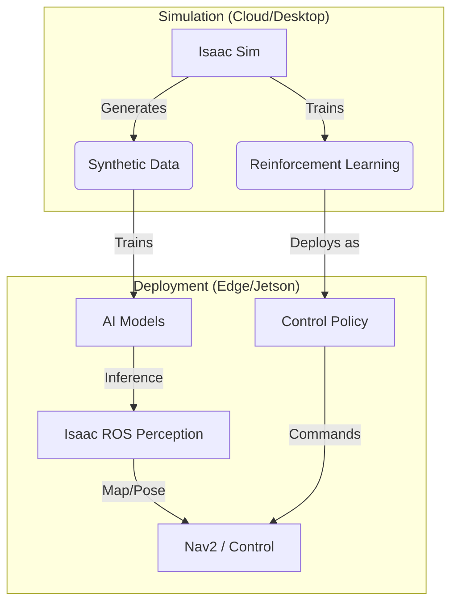

# Module 3: The AI-Robot Brain (NVIDIA Isaac™)

## Focus: Advanced perception, simulation, and AI training.

This module focuses on the **NVIDIA Isaac™** ecosystem, the industry-standard platform for Physical AI. Students will move beyond basic physics simulation to photorealistic "Digital Twins" (Isaac Sim) and hardware-accelerated perception (Isaac ROS). You will learn to train AI agents in simulation and deploy them to edge devices like the Jetson Orin.

> **Analogy:** If ROS 2 is the nervous system, NVIDIA Isaac is the **Visual Cortex** (Perception) and the **Cerebellum** (Motor Control), powered by massive parallel processing (GPUs).

## Why NVIDIA Isaac Matters for Physical AI

Modern robots need to "see" and "understand" the world, not just blindly follow trajectories. NVIDIA Isaac provides:
- **Photorealism**: Ray-traced simulation for accurate camera training.
- **Physics Accuracy**: PhysX 5.0 for stable grasping and manipulation.
- **Synthetic Data**: Generating millions of labeled images for AI training.
- **Hardware Acceleration**: Running VSLAM and DNNs at 60+ FPS on edge GPUs.

## Learning Objectives

By the end of this module, you will be able to:

### Conceptual Understanding
- **Explain** the "Sim-to-Real" workflow using Omniverse and Isaac Sim
- **Understand** the USD (Universal Scene Description) file format
- **Describe** how GPU acceleration optimizes perception pipelines (GEMs)
- **Identify** the components of the Isaac ROS stack (VSLAM, Nvblox, Proximity)

### Practical Skills
- **Install** and configure Isaac Sim and Isaac ROS on Ubuntu
- **Import** robots and assets into Omniverse using USD
- **Generate** synthetic datasets with domain randomization
- **Implement** Visual SLAM (VSLAM) for GPS-denied navigation
- **Deploy** a complete navigation stack on NVIDIA Jetson hardware

### Advanced Application
- **Train** a reinforcement learning policy in Isaac Gym
- **Optimize** deep learning models using TensorRT
- **Design** a photorealistic simulation environment for a specific use case
- **Integrate** Isaac ROS perception with Nav2 for humanoid navigation

## Module Structure

This 3-week module (Weeks 9-11) is organized into three progressive topics:

### Week 9: Photorealistic Simulation (Isaac Sim)
**Learning Focus:** Building the "Matrix" for robots

**Topics:**
1. **Introduction to Omniverse**
   - USD file format
   - Nucleus server
   - Isaac Sim interface

2. **Robot Assets and Simulation**
   - Importing URDF to USD
   - Rigging robots for physics
   - Python scripting in Isaac Sim

**Deliverables:**
- Photorealistic warehouse environment
- Imported mobile manipulator robot

### Week 10: Synthetic Data & Training
**Learning Focus:** Generating data to train the brain

**Topics:**
1. **Synthetic Data Generation (SDG)**
   - Replicator API
   - Domain Randomization (lights, textures, poses)
   - Auto-labeling (segmentation, bounding boxes)

2. **Isaac Gym (Preview)**
   - Massively parallel reinforcement learning
   - Training a walking policy

**Deliverables:**
- Dataset of 10,000 labeled images
- Trained object detection model

### Week 11: Hardware-Accelerated Perception (Isaac ROS)
**Learning Focus:** Deploying the brain to the edge

**Topics:**
1. **Isaac ROS Overview**
   - NITROS (NVIDIA Isaac Transport for ROS)
   - Hardware acceleration (CUDA, TensorRT)

2. **Perception & Navigation**
   - Visual SLAM (VSLAM)
   - Nvblox (3D reconstruction)
   - Nav2 integration

**Deliverables:**
- Working VSLAM pipeline
- **Module Project**: Autonomous Navigation with VSLAM

## NVIDIA Isaac Ecosystem

Understanding how the pieces fit together:



## Prerequisites

### Required Knowledge
- ✓ **Module 1 & 2**: ROS 2 and basic simulation concepts
- ✓ **Docker**: Essential for running Isaac ROS containers
- ✓ **Python**: Intermediate level (numpy, pytorch basics helpful)

### Required Hardware
**For Isaac Sim (Workstation):**
- **GPU**: NVIDIA RTX 2070 or higher (RTX 30/40 series recommended)
- **RAM**: 32GB+ recommended
- **OS**: Ubuntu 20.04/22.04 or Windows 10/11

**For Isaac ROS (Edge):**
- **Platform**: NVIDIA Jetson Orin (Nano, NX, or AGX)
- **Alternative**: x86 PC with NVIDIA GPU (for testing)

## Assessment and Projects

### Weekly Assessments (40%)

| Week | Assessment | Weight | Type |
|------|------------|--------|------|
| **Week 9** | Isaac Sim Scene | 15% | USD Environment |
| **Week 10** | Synthetic Dataset | 15% | Generated Data |
| **Week 11** | VSLAM Demo | 10% | ROS 2 Bag/Video |

### Module Project: The "Perception" Challenge (40%)

Deploy a complete perception stack:
1. **Simulate**: Create a photorealistic environment in Isaac Sim.
2. **Generate**: Create a dataset of "hazardous objects" (cones, holes).
3. **Train**: Train a YOLO model to detect them.
4. **Deploy**: Run Isaac ROS VSLAM + Object Detection to navigate safely.

**Evaluation Criteria:**
- Simulation fidelity (30%)
- Detection accuracy (30%)
- Navigation performance (20%)
- System integration (20%)

## Key Tools and Commands

**Isaac Sim:**
```bash
./isaac-sim.sh                # Launch Simulator
./python.sh my_script.py      # Run Python script in Sim context
```

**Isaac ROS (Docker):**
```bash
cd ${ISAAC_ROS_WS}/src/isaac_ros_common
./scripts/run_dev.sh          # Enter Docker container
ros2 launch isaac_ros_visual_slam isaac_ros_visual_slam.launch.py
```

## Learning Resources

### Official Documentation
- Isaac Sim Docs: [https://docs.omniverse.nvidia.com/app_isaacsim](https://docs.omniverse.nvidia.com/app_isaacsim)
- Isaac ROS Docs: [https://nvidia-isaac-ros.github.io/](https://nvidia-isaac-ros.github.io/)
- NVIDIA Developer Zone: [https://developer.nvidia.com/isaac](https://developer.nvidia.com/isaac)

### Recommended Courses
- NVIDIA DLI: "Building Metaverse Applications with Omniverse"
- NVIDIA DLI: "Jetson AI Fundamentals"

## Getting Started

### Week 9 Preparation Checklist
- [ ] Create NVIDIA Developer Account
- [ ] Install NVIDIA Omniverse Launcher
- [ ] Install Isaac Sim (via Launcher)
- [ ] Verify GPU drivers (nvidia-smi)

## Module Roadmap

```
Week 9: The Matrix (Sim)
  ↓ Build the world
Week 10: The Training
  ↓ Teach the brain
Week 11: The Edge (ROS)
  ↓ Deploy to body
Module Project: Perception
  ↓ Prove it works
Ready for Module 4: VLA!
```

## Summary

NVIDIA Isaac represents the state-of-the-art in robotics. By mastering this ecosystem, you gain the ability to leverage the full power of AI and simulation, moving from "coding behavior" to "training intelligence."

---

**Next:** Begin your journey into the Omniverse with [Introduction to Isaac Sim](./NVIDIA-Isaac-Sim/introduction-to-isaac-sim.md).