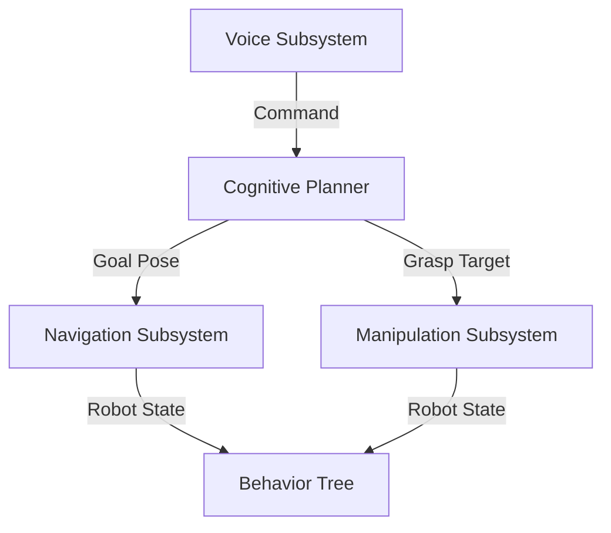
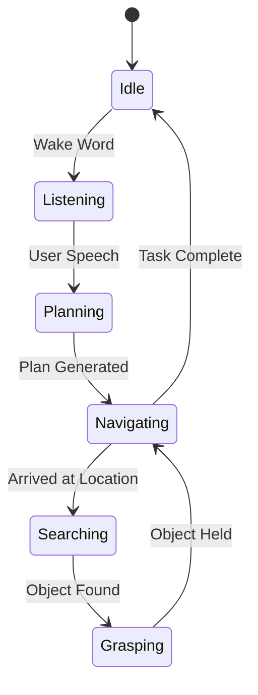

# Project Planning and Design

Before writing code, we must design the system. A robot without a plan is just a pile of twitching servos.

## 1. System Decomposition

We break the "Butler" robot into 5 distinct subsystems:



### Subsystem Responsibilities

| Subsystem | Node Name | Responsibility |
|-----------|-----------|----------------|
| **Voice** | `voice_commander` | Listen for wake word, transcribe audio, publish text. |
| **Planner** | `llm_planner` | Convert text to JSON plan, manage high-level state. |
| **Navigation** | `nav2_client` | Send goals to Nav2, monitor progress. |
| **Perception** | `object_detector` | Find objects (YOLO), publish 3D pose. |
| **Manipulation** | `arm_controller` | Plan arm trajectories (MoveIt), execute grasp. |

## 2. State Machine Design

The robot is a **Finite State Machine (FSM)**. It can only be in one state at a time.



### Failure Modes
- **Planning Failed**: "I didn't understand that." -> Return to **Listening**.
- **Navigation Failed**: "Path blocked." -> Return to **Planning** (Re-plan).
- **Grasping Failed**: "Object slipped." -> Return to **Searching** (Try again).

## 3. Interface Specifications (ROS 2)

We define clear interfaces so teams can work in parallel.

### Topics
- `/voice/command` (`std_msgs/String`): Raw text from user.
- `/perception/detections` (`vision_msgs/Detection3DArray`): Detected objects.

### Services
- `/planner/generate_plan` (Custom): Input: Text, Output: JSON Plan.
- `/manipulation/grasp` (Custom): Input: Object Name, Output: Success/Fail.

## 4. Cognitive Planning Strategy

The LLM is the "Cognitive Planner." We need to design its **System Prompt** carefully.

**Prompt Strategy:**
1. **Role**: "You are a robot home assistant."
2. **Context**: "You are in a house with a Kitchen (x=5, y=5) and Living Room (x=0, y=0)."
3. **Capabilities**: "You can NAVIGATE, LOOK, and PICK."
4. **Constraint**: "You cannot pick up heavy objects like 'Fridge'."

**Example Prompt:**
```text
System: You are a robot.
Map: Kitchen: (5, 5), Living Room: (0, 0).
Tools:
- navigate(x, y)
- look_for(object)
- pick(object)

User: "Get me a soda."
Plan:
1. navigate(5, 5) # Kitchen
2. look_for("soda")
3. pick("soda")
4. navigate(0, 0) # Return to user
```

## 5. Risk Mitigation

| Risk | Mitigation |
|------|------------|
| **Latency** | Run Whisper locally (medium accuracy) or Async API calls. |
| **Safety** | Limit arm velocity to 10%. Keep base stable during grasping. |
| **Hallucination** | Validate LLM output against a whitelist of allowed actions. |

---

**Next:** Time to build it. Proceed to [Implementation and Evaluation](./implementation-and-evaluation.md).