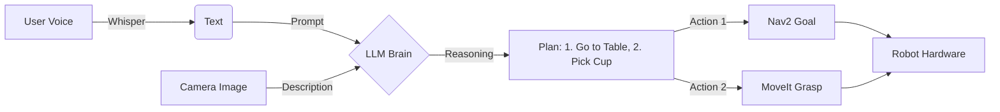

# Module 4: Vision-Language-Action (VLA)

## Focus: The convergence of LLMs and Robotics.

This capstone module focuses on the cutting-edge field of **Vision-Language-Action (VLA)** models. You will learn to integrate Large Language Models (like GPT-4 and Llama 3) with robotic control systems, enabling robots to understand natural language commands, reason about their environment, and execute complex tasks.

> **Analogy:** If ROS 2 is the nervous system and Isaac is the brain's visual cortex, VLA is the **Frontal Lobe**—responsible for language, reasoning, and planning.

## Why VLA Matters for Physical AI

Traditional robots require explicit code for every action. VLA robots can:
- **Understand Intent**: "Clean up the kitchen" instead of `move_to(x,y); grasp(z);`.
- **Reason**: "The cup is hot, so I should pick it up by the handle."
- **Generalize**: Perform tasks they weren't explicitly programmed for.

## Learning Objectives

By the end of this module, you will be able to:

### Conceptual Understanding
- **Explain** the architecture of VLA models (RT-2, PaLM-E)
- **Understand** the concept of "Grounding" language in physical reality
- **Describe** the role of Prompt Engineering in robotic control
- **Differentiate** between high-level planning (LLM) and low-level control (ROS 2)

### Practical Skills
- **Implement** voice recognition using OpenAI Whisper
- **Integrate** GPT-4/Llama 3 with ROS 2 nodes
- **Design** a "Cognitive Controller" that translates text to ROS actions
- **Build** a multimodal feedback loop (Robot sees -> Describes -> Decides -> Acts)

### Advanced Application
- **Create** a robust error recovery system using LLM reasoning
- **Develop** a "Chain of Thought" planner for complex multi-step tasks
- **Deploy** the complete Physical AI stack on a humanoid robot

## Module Structure

This 3-week module (Weeks 12-14) is organized into three progressive topics:

### Week 12: Voice to Action
**Learning Focus:** Giving the robot ears and a voice

**Topics:**
1. **Speech Recognition (STT)**
   - OpenAI Whisper integration
   - Real-time wake word detection

2. **Natural Language Understanding (NLU)**
   - Intent classification with LLMs
   - Slot filling (extracting "cup" and "kitchen" from commands)

**Deliverables:**
- Voice-controlled ROS 2 turtle
- "Chat with Robot" interface

### Week 13: Cognitive Planning
**Learning Focus:** Giving the robot a mind

**Topics:**
1. **Task Decomposition**
   - Breaking "Make breakfast" into "Go to kitchen", "Find toaster", etc.
   - Chain-of-Thought prompting for robotics

2. **Code Generation**
   - Using LLMs to write Python code for ROS 2 on the fly
   - Safety guardrails and sandboxing

**Deliverables:**
- LLM-based Task Planner node
- Error recovery system

### Week 14: The Capstone Project
**Learning Focus:** The Final Integration

**Topics:**
1. **System Integration**
   - Combining Perception (Isaac), Planning (VLA), and Control (ROS 2)
   - Latency optimization

2. **Final Demo**
   - Execution of a complex, multi-stage task in a dynamic environment

**Deliverables:**
- **Capstone Project**: The Autonomous Humanoid

## The VLA Pipeline

How we turn speech into motion:



## Prerequisites

### Required Knowledge
- ✓ **Modules 1-3**: Full stack robotics knowledge
- ✓ **API Usage**: Experience with REST APIs (OpenAI, HuggingFace)
- ✓ **Python**: Advanced scripting

### Required Hardware/Software
- **OpenAI API Key** (or local LLM via Ollama)
- **Microphone**
- **Speaker**

## Assessment and Projects

### Weekly Assessments (40%)

| Week | Assessment | Weight | Type |
|------|------------|--------|------|
| **Week 12** | Voice Command Node | 15% | ROS 2 Node |
| **Week 13** | LLM Planner | 15% | Python Script |
| **Week 14** | System Integration | 10% | Full Stack |

### Capstone Project: The "Butler" Test (40%)

**Scenario:** The robot is in a kitchen environment (Sim or Real).
**Command:** "I'm thirsty, can you get me something to drink?"
**Success Criteria:**
1. Robot understands "thirsty" -> needs drink.
2. Robot searches for drink objects (water, juice).
3. Robot navigates to the object.
4. Robot grasps and brings it to the user.

**Evaluation:**
- **Autonomy**: 0 human interventions (40%)
- **Speed**: Completion time (20%)
- **Robustness**: Handling obstacles (20%)
- **Interaction**: Natural voice feedback (20%)

## Key Tools and Commands

**Voice Stack:**
```bash
pip install openai-whisper sounddevice
ros2 run vla_voice voice_commander
```

**LLM Integration:**
```python
response = client.chat.completions.create(
    model="gpt-4",
    messages=[{"role": "system", "content": "You are a robot planner..."}]
)
```

## Learning Resources

### Research Papers
- **RT-2**: Robotic Transformer 2 (Google DeepMind)
- **PaLM-E**: An Embodied Multimodal Language Model
- **VoxPoser**: Composable 3D Value Maps

### Libraries
- **LangChain**: For chaining LLM reasoning
- **Ollama**: For running local LLMs

## Getting Started

### Week 12 Preparation Checklist
- [ ] Get OpenAI API Key
- [ ] Install PyAudio and Whisper
- [ ] Test microphone in Linux

## Module Roadmap

```
Week 12: Hear & Speak
  ↓ Voice Interface
Week 13: Think & Plan
  ↓ LLM Reasoning
Week 14: Act & Solve
  ↓ Full Autonomy
Capstone: The Butler
  ↓ Graduation!
Physical AI Engineer
```

## Summary

This is it. The final frontier. By combining the body (ROS 2), the environment (Isaac), and the mind (VLA), you are building a truly intelligent machine. Good luck.

---

**Next:** Give your robot a voice in [Voice Recognition and NLP](./Voice-to-Action/voice-recognition-nlp.md).